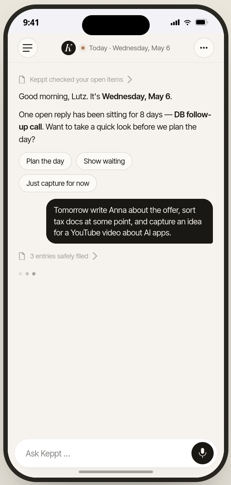
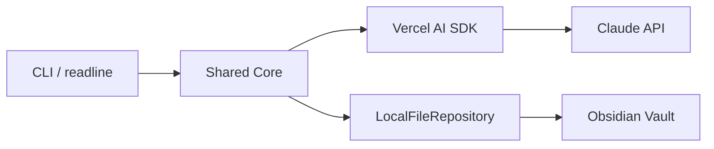

# keppt-app

> **GTD that maintains itself.** You talk, the system files. Chat is the only surface; GTD runs in the engine room; voice is the default input.

[**Live demo → getkeppt.com**](https://getkeppt.com) · [Architecture](docs/specs/architecture.md) · [Product spec](docs/specs/context/product.md) · [Build log](docs/task-log/) · [Dev.to blog](https://dev.to/lutz_leonhardt)

<p align="center">
  <a href="https://getkeppt.com">
    
  </a>
  <br>
  <em>Try it interactively → <a href="https://getkeppt.com">getkeppt.com</a></em>
</p>

---

## Why this exists

For months I stopped maintaining my GTD system. And since then, for the first time, it actually works.

For years the same pattern: read the book, install the app, build the inbox folder, schedule the weekly review. Three weeks of discipline, then the system decays faster than I can fill it. The method was never the problem. The maintenance was the problem.

The fix wasn't a new tool. It was: hand off the maintenance.

My setup today is absurdly simple. An Obsidian vault with a GTD folder structure. Claude Cowork on top with a few rules about what goes where. Then I just talk.

> *"What's on for tomorrow?"*
> *"Push that to Friday."*
> *"New task: quote for Siemens."*
> *"It's Friday — time for the weekly review?"*

Claude moves the files, keeps the daily notes in sync, checks for inconsistencies, reminds me about the review. I don't maintain anything anymore. I just talk. The system runs without me ever feeling I have to stay on top of it.

**The catch:** Cowork is a developer tool. Without a Claude Code setup you can't reproduce it. That's the gap this project closes — chat as the only surface, GTD in the engine room, voice as the default input. For everyone who tried GTD and bailed on the maintenance overhead.

I'm documenting the build process publicly: architecture, prompts, Capacitor + Angular + Claude API, and what breaks along the way.

## What it is

- **One chat interface.** No forms, no drag-and-drop, no field selection.
- **Voice or text.** Whichever has less friction in the moment.
- **GTD as autopilot.** Inbox triage, daily plan, weekly review, consistency checks — all maintained by the LLM, not by you.
- **Open Markdown data.** Your tasks live as plain `.md` files. The LLM reads and writes; you can always open the vault yourself.

Full pitch and market context: [`docs/specs/product.md`](docs/specs/context/product.md).

## Build status

I'm building this in public. The roadmap is split into small, validated phases — each phase ends on a real validation checkpoint, not on a calendar date.

| Phase | Goal | Status |
|---|---|---|
| **[Phase 1: CLI](docs/plans/phase-1-cli.md)** | Prove the prompts and the tool loop against a real Obsidian vault. | 🟡 **In progress** — Task 1 ✅ · Task 2 ✅ · Tasks 3–6 ⏳ |
| [Phase 2a: Backend + Angular](docs/specs/architecture.md#phase-2a-backend--angular--it-chats-in-the-app) | Express server + Angular/Capacitor shell + Supabase. Chat works end-to-end. | ⚪ Not started |
| [Phase 2b: Features + Trust](docs/specs/architecture.md#phase-2b-features--trust--the-app-is-complete) | Hashbrown Generative UI, file browser, history, settings. Beta-ready. | ⚪ Not started |
| [Phase 2c: Monetization + Distribution](docs/specs/architecture.md#phase-2c-monetization--distribution--its-a-product) | Stripe, RevenueCat, App Store. | ⚪ Not started |
| [Phase 3: Extensions](docs/specs/architecture.md#phase-3-extensions-when-demand-justifies-it) | Android, more LLM providers, self-hosted, export. | ⚪ Only when demand justifies it |

Live progress lives in [`docs/task-log/`](docs/task-log/) — one file per task, with what was done, what surprised me, and what I'd do differently.

## Architecture at a glance — Phase 1



Single process, no server, no Supabase, no auth. The same `Core` that the CLI uses in Phase 1 will sit behind an Express server in Phase 2a — only the entrypoint and the `FileRepository` implementation change. Full design: [`docs/specs/architecture.md`](docs/specs/architecture.md).

## How I'm building this — the Skill Kit Adjutant Workflow

Every task in this repo is shipped through the same agentic workflow I've been documenting publicly:

- 📄 **Paper:** [lutzleonhardt.de/paper.html](https://lutzleonhardt.de/paper.html)
- 🛠 **Toolkit:** [github.com/lutzleonhardt/skill-kit-agentic-workflow](https://github.com/lutzleonhardt/skill-kit-agentic-workflow)

In short: a spec is broken into single-commit-sized tasks; each task has a plan, a wrap-up, and a structured task log. The artifacts in [`docs/specs/`](docs/specs/), [`docs/plans/`](docs/plans/), and [`docs/task-log/`](docs/task-log/) are the workflow's output, unedited. If you want to see the workflow in action on a real, non-trivial project — this repo is it.

## Devlog

Long-form writeups go on Dev.to: **[dev.to/lutz_leonhardt](https://dev.to/lutz_leonhardt)**. Architecture decisions, prompt iterations, things that broke, what I'd do differently.

Want updates without checking? Beta list on [getkeppt.com](https://getkeppt.com).

## Tech stack

| Layer | Phase 1 (now) | Target (Phase 2+) |
|---|---|---|
| Language / runtime | TypeScript, Node ≥ 20 | same |
| LLM | Anthropic, DeepSeek, or OpenAI via Vercel AI SDK | same, provider-agnostic |
| Storage | `LocalFileRepository` → Obsidian vault | `SupabaseFileRepository` (PostgreSQL + RLS) |
| UI | CLI (readline) | Angular 19 + Capacitor + Hashbrown Generative UI |
| Voice | — | Capacitor Speech Recognition + Whisper fallback |
| Backend | — | Node.js + Express/Fastify, SSE streaming |
| Auth | — | Supabase Auth (Apple/Google/Email) |

## Run it locally (Phase 1)

Prerequisites: Node ≥ 20 (`.nvmrc` pins 20), pnpm.

```sh
pnpm install
pnpm -r build
pnpm -r test
```

To run the CLI against a vault, set `VAULT_PATH` plus the API key for the
selected provider. Anthropic remains the default. Use `GTD_PROVIDER=openai`
with `OPENAI_API_KEY` to run GPT 5.4 mini (`gpt-5.4-mini`), or override any
provider default with `GTD_MODEL`.

```sh
VAULT_PATH=/path/to/vault \
GTD_PROVIDER=openai \
OPENAI_API_KEY=... \
pnpm --filter @gtd/cli dev
```

## Repository layout

```
apps/cli/             # CLI entrypoint (Phase 1)
packages/core/        # Shared core: file repository, history log, (later) prompts, tools, sessions
docs/specs/           # Architecture & product specs
docs/plans/           # Phase plans, broken into single-commit tasks
docs/task-log/        # Per-task wrap-ups (the build log)
assets/               # README assets
```

## Stay in the loop

- **Try the demo** → [getkeppt.com](https://getkeppt.com)
- **Read the build log** → [`docs/task-log/`](docs/task-log/)
- **Long-form writeups** → [dev.to/lutz_leonhardt](https://dev.to/lutz_leonhardt)
- **The workflow behind it** → [Skill Kit Adjutant Workflow](https://github.com/lutzleonhardt/skill-kit-agentic-workflow)
