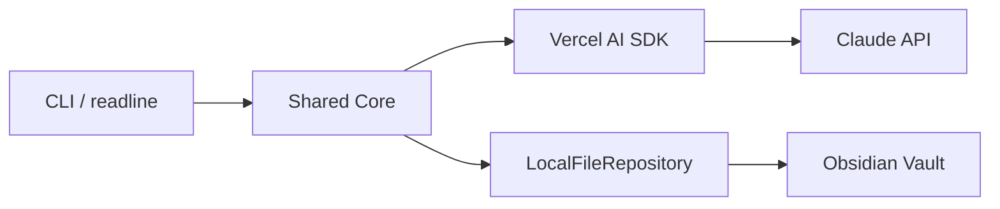
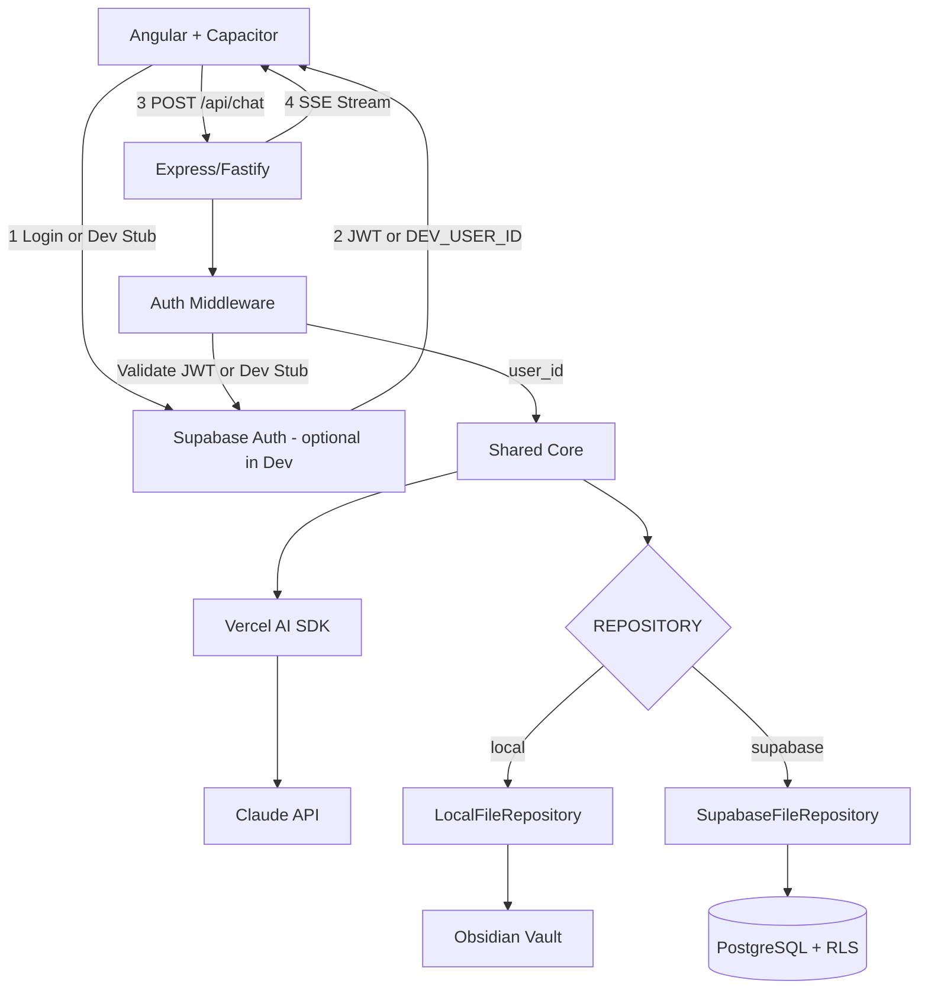
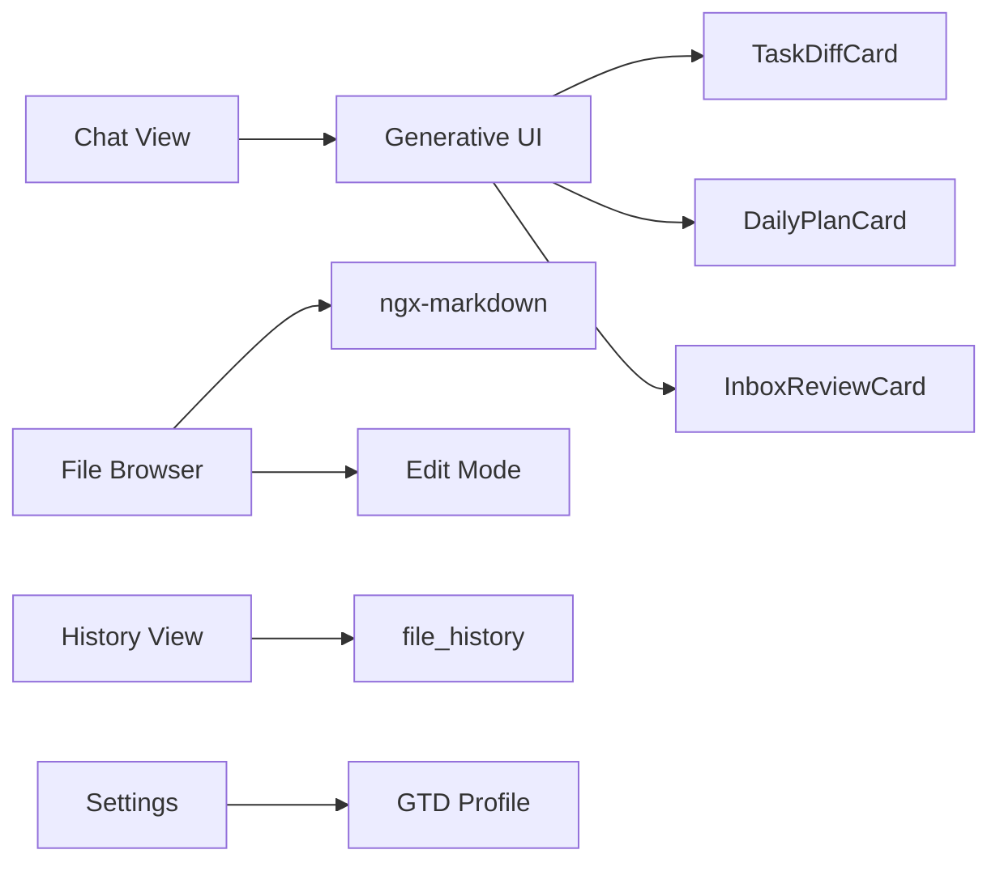
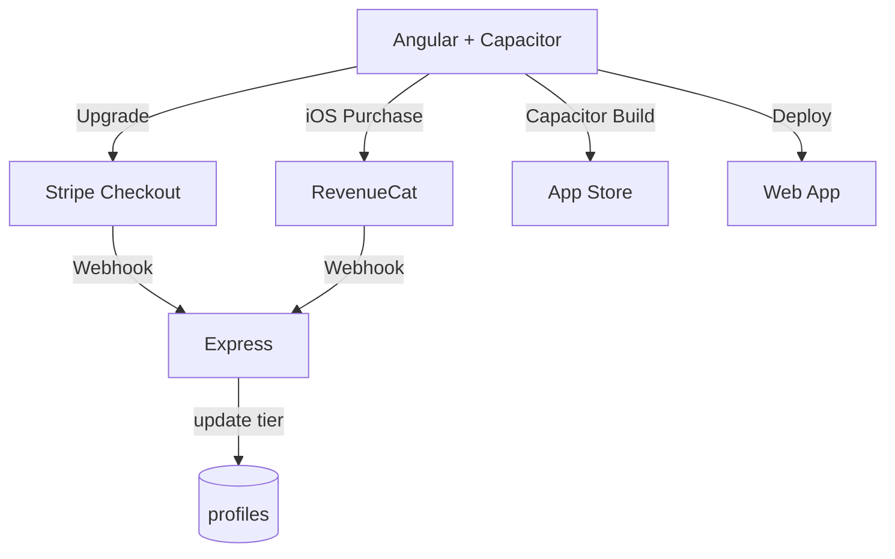
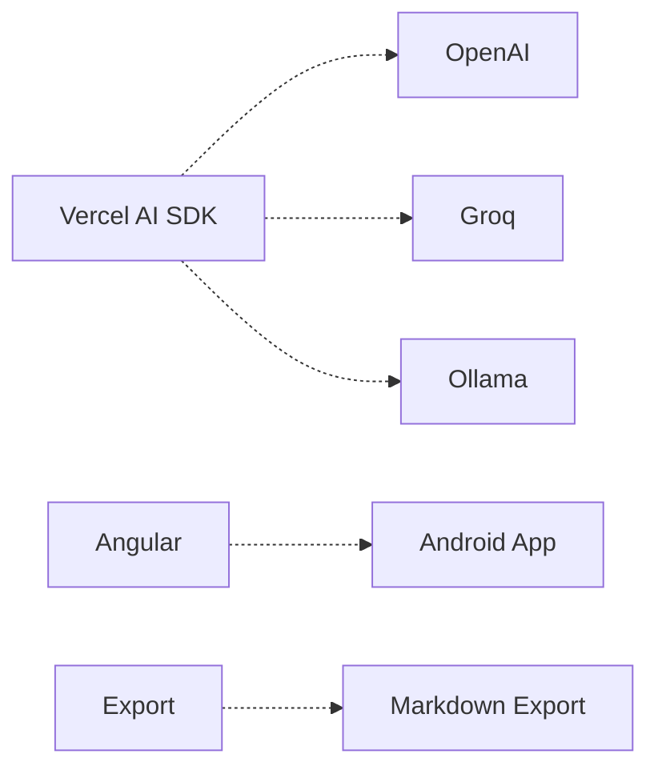
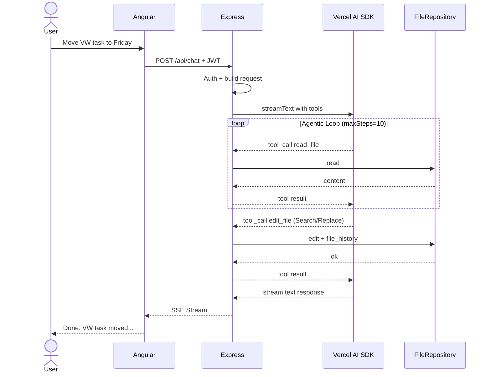

# keppt-app — Architecture & Design Spec

> Product Vision & Requirements: [[keppt-app]]

## Diagrams

### Phase 1: CLI (local, no server)



Everything in a single process on the dev machine. No server, no Supabase, no Auth.

### Phase 2a: Backend + Angular (chat works)



No payment, no App Store. Chat works end-to-end — dev primarily against the vault (`REPOSITORY=local`), Supabase checkpoint as a second dev path (`REPOSITORY=supabase`). See "Dev vs. Prod Setup".

### Phase 2b: Features + Trust (app is complete)



All views, Generative UI Cards, file browser, history. Ready for beta testers.

### Phase 2c: Monetization + Distribution



Stripe + RevenueCat + paywall + App Store submission. Only once the app is validated.

### Phase 3: Extensions



Additional providers, Android, data export. Only if demand justifies it.

### Request Flow: Agentic Loop



## Tech Stack

**Frontend**: Angular 19+ (standalone components, signals)
**Chat UI / Generative UI**: Hashbrown (by Manfred Steyer / angulararchitects.io)
**Native Shell**: Capacitor — gives native APIs for Voice (Speech Recognition plugin), Push Notifications, In-App Purchase (for subscriptions), and App Store deployment
**Backend Service**: Node.js + Express/Fastify (own process, no Serverless/Edge Functions)
**LLM Abstraction**: Vercel AI SDK (`ai` npm package) — provider-agnostic (Anthropic, OpenAI, Google, Groq, Ollama)
**LLM Models (MVP)**: Claude Haiku (simple ops) + Claude Sonnet (planning/review) — smart routing invisible to user
**Voice Input**: Capacitor Speech Recognition plugin (native iOS/Android speech-to-text) + Whisper API as fallback
**LLM Streaming**: SSE from the backend service → Angular HttpClient with `provideHttpClient(withFetch())` + Signals + RxJS
**Database**: Supabase (PostgreSQL + Auth + RLS)
**Deployment Backend**: Railway, Render or similar container platform
**Payments**: RevenueCat or native StoreKit via Capacitor plugin for App Store subscriptions

## Chat UI: Hashbrown + Generative UI

**Hashbrown** (by Manfred Steyer, angulararchitects.io) is the key UI enabler. It allows the LLM to not just respond with text, but to select and render Angular components directly in the chat — via Structured Output and Tool Calling.

**Why this matters for keppt-app:**

The LLM doesn't just say "I moved 3 tasks" as text. It can render rich interactive cards in the chat:

- A **TaskDiffCard** showing what moved where, with checkmarks and before/after state
- A **DailyPlanCard** showing tomorrow's proposed schedule, with tap-to-confirm/reject buttons
- An **InboxReviewCard** listing items with swipe-to-categorize gestures
- A **ConsistencyReportCard** showing the cross-check results with expandable details

This is Generative UI — the LLM decides which component to show based on the conversation context. The user gets a visual, interactive response instead of a wall of text. This is the difference between a chatbot and a proper app experience.

**How it works technically:**

```typescript
chat = uiChatResource({
  model: 'claude-sonnet',
  system: `You are a GTD task assistant...`,
  tools: [
    moveTaskTool,
    checkOffTaskTool,
    planDayTool,
    reviewInboxTool,
  ],
  components: [
    taskDiffWidget,
    dailyPlanWidget,
    inboxReviewWidget,
    consistencyReportWidget,
    messageWidget,  // fallback for plain text responses
  ],
});
```

Each component is described via schema so the LLM knows when to use which widget. The LLM picks the component, provides the data, and Angular renders it in the chat stream.

**Strategic bonus:** Hashbrown is Manfred Steyer's project. The Manfred Steyer interview (April 2026) covers Native Federation at Siemens Energy and GenAI for Angular. Using Hashbrown in this app creates a direct narrative connection: "I interviewed Manfred about Generative UI for Angular, then I used his library to build a production app." Perfect for YouTube content, LinkedIn posts, and workshop storytelling.

## LLM Streaming in Angular

Angular 19+ with `provideHttpClient(withFetch())` supports Server-Sent Events natively. Combined with Signals for chat state management:

- User sends message → Angular client sends POST to backend service
- Backend service assembles the LLM request (system prompt + profile + files + history)
- Backend service streams the LLM response via SSE to the client
- Each chunk updates the assistant message Signal → UI re-renders progressively
- On tool calls: backend executes tool, sends result back to the LLM, continues streaming (Agentic Loop)
- Stream completes → final message stored in Supabase `messages` table

No third-party streaming library needed. Angular's built-in HttpClient + Signals + RxJS handles the entire client-side flow. The LLM orchestration (Agentic Loop, tool calls) runs entirely server-side.

## Why Supabase

All-in-one package — one service replaces five:

- **PostgreSQL** — SQL is king. The data is relational: users have files, files have versions, versions have summaries. Fits SQL perfectly.
- **Auth** — Login, Apple Sign-In, Google Sign-In out of the box. No custom auth system.
- **Row-Level Security** — User A can never see User B's files. Enforced at the database level, not in app logic. One policy, done.
- **Realtime Subscriptions** — if we later want live-sync between devices, it's already there.
- **Free tier** — generous enough to build and test with real users before spending money.
- **Open Source** — no vendor lock-in. Can migrate to self-hosted PostgreSQL anytime.
- **Supabase JS client** — works in Angular, works in Capacitor, works on web. One SDK everywhere.

Why not MongoDB/NoSQL: the data is relational, not document-shaped. Users → Files → Versions is a natural SQL schema. And Row-Level Security in Supabase gives us user isolation for free — in MongoDB, you'd enforce that in application code.

Why not Firebase: proprietary Google lock-in, NoSQL (Firestore), pricing gets expensive with many reads, and the data model is a poor fit for versioned text files.

## Authentication: Supabase Auth → JWT → Express

**No custom OAuth2/OpenID flow.** Supabase Auth handles all authentication — we don't maintain our own identity provider.

### Auth Flow

```
1. User opens app → Angular client shows login screen
2. User chooses login method (Apple, Google, Email/Password, Magic Link)
3. Angular client → Supabase Auth SDK → OAuth2 flow or email verification
4. Supabase Auth returns JWT → client stores token
5. On each request: client sends JWT as Bearer Token to Express server
6. Express Auth Middleware → validates JWT against Supabase → extracts user_id
7. user_id flows into SupabaseFileRepository → RLS kicks in automatically
```

**Why no custom auth server:**
Supabase Auth supports out of the box: Apple Sign-In (mandatory for iOS App Store), Google Sign-In, Email/Password, Magic Links. Everything we need for MVP and beyond. Maintaining a custom OAuth2/OIDC flow would be pure overhead.

**JWT validation in the Express server:**
The Supabase JWT contains the `user_id` as the `sub` claim. The Express server validates the token with the Supabase JWT secret (environment variable, never in the client) and extracts the `user_id`. No custom user table needed for identification — `auth.users` is Supabase-managed.

```typescript
// Auth Middleware (Express)
import { createClient } from '@supabase/supabase-js';

const supabase = createClient(SUPABASE_URL, SUPABASE_SERVICE_KEY);

async function authMiddleware(req, res, next) {
  const token = req.headers.authorization?.replace('Bearer ', '');
  if (!token) return res.status(401).json({ error: 'No token' });

  const { data: { user }, error } = await supabase.auth.getUser(token);
  if (error || !user) return res.status(401).json({ error: 'Invalid token' });

  // user.id is the user_id for RLS + usage tracking
  req.userId = user.id;
  req.userEmail = user.email;
  next();
}
```

### Login Methods (MVP)

| Method | Platform | Why |
|--------|----------|-----|
| **Apple Sign-In** | iOS | Mandatory for App Store when other social logins are offered |
| **Google Sign-In** | Android + Web | Largest reach |
| **Email / Password** | All | Fallback for users without social accounts |
| **Magic Link** | All | Passwordless, lower barrier than Email/Password |

All methods are natively supported by Supabase Auth. In the Angular client: `supabase.auth.signInWithOAuth({ provider: 'apple' })` etc.

## Payment & Subscription Management

### Architecture

**Two payment providers for two platforms:**
- **RevenueCat** for App Store subscriptions (iOS/Android) — handles StoreKit/Google Play Billing, normalizes the APIs
- **Stripe** for web subscriptions — the standard for SaaS payments on the web

RevenueCat can use Stripe as backend, i.e. there is **one** central place for subscription status: Stripe. RevenueCat syncs App Store purchases to Stripe.

### Subscription Status in the System

The Express server needs the user's current tier for:
- **Model routing:** Free → Haiku only, Premium → Sonnet for planning
- **Rate limiting:** Free 5/day, Standard 100/day, Premium 300/day
- **Feature gating:** Free no crosscheck, Standard basic, Premium full

**Where does subscription status live?** In the `profiles` table (already exists in the schema):

```sql
-- Extension of the profiles table
ALTER TABLE profiles ADD COLUMN subscription_tier text DEFAULT 'free'
  CHECK (subscription_tier IN ('free', 'standard', 'premium'));
ALTER TABLE profiles ADD COLUMN stripe_customer_id text;
ALTER TABLE profiles ADD COLUMN subscription_valid_until timestamptz;
```

**Webhook flow (Stripe events the server processes):**

| Stripe Event | Action in the server |
|---|---|
| `checkout.session.completed` | New customer: set `stripe_customer_id` + `subscription_tier` in profiles |
| `customer.subscription.updated` | Upgrade/downgrade: adjust `subscription_tier`, update `subscription_valid_until` |
| `customer.subscription.deleted` | Subscription expired: set `subscription_tier = 'free'` |
| `invoice.payment_failed` | Payment failed: notify user (in-app hint), don't change tier yet (Stripe has retry logic) |
| `invoice.paid` | Renewal successful: set `subscription_valid_until` to new period end |

**Cancellation in detail:**
On cancellation, Stripe sets `cancel_at_period_end: true` — the subscription continues until the paid period end. The server only changes the tier on the `customer.subscription.deleted` event (at period end). No custom countdown logic needed.

**Proration on upgrade/downgrade:**
Stripe automatically calculates the prorated price. Example: user is on Standard ($7/month) on the 15th of the month and upgrades to Premium ($15/month) → Stripe charges the remainder for the remaining 15 days. The server only reacts to the webhook and updates the tier.

**No real-time check on every request:** The tier is read from `profiles` (cached for the session), not checked against Stripe on every request. Webhooks keep the status current enough — a delay of seconds is acceptable.

**Webhook security:** Stripe signs every webhook with a secret. The Express server validates the signature before processing the event — prevents forged webhooks.

```typescript
// Webhook handler (Express)
import Stripe from 'stripe';
const stripe = new Stripe(STRIPE_SECRET_KEY);

app.post('/api/webhooks/stripe', express.raw({ type: 'application/json' }), async (req, res) => {
  const sig = req.headers['stripe-signature'];
  const event = stripe.webhooks.constructEvent(req.body, sig, WEBHOOK_SECRET);

  switch (event.type) {
    case 'checkout.session.completed':
      const session = event.data.object;
      await updateProfile(session.client_reference_id, {
        stripe_customer_id: session.customer,
        subscription_tier: 'standard', // or from metadata
        subscription_valid_until: new Date(session.subscription.current_period_end * 1000),
      });
      break;
    case 'customer.subscription.deleted':
      await updateProfile(customerId, { subscription_tier: 'free' });
      break;
    // ... more events
  }
  res.json({ received: true });
});
```

### Why no custom user table

`auth.users` (Supabase-managed) + `profiles` (app-managed) are sufficient:
- `auth.users` → identity, email, auth provider (managed by Supabase, read-only for us)
- `profiles` → subscription tier, Stripe customer ID, goals, preferences, context (managed by our app)
- Linkage: `profiles.user_id REFERENCES auth.users(id)`, 1:1 relationship

A separate `users` table would be redundant to `auth.users` + `profiles`.

## LLM API Key Strategy & Usage Tracking

### Shared API Key (MVP)

**One API key for all users.** All LLM calls go through our Anthropic API key. This is the standard for AI SaaS apps (same as ChatGPT, Notion AI, Cursor).

**Risk at scale:** Anthropic has rate limits per API key (requests/minute, tokens/minute). With a few hundred users, no problem. With thousands of concurrent users, it gets tight.

### Scaling Stages

| User count | Strategy |
|------------|----------|
| **< 500** | One API key is enough |
| **500 - 5,000** | Multiple API keys with round-robin rotation in the Express server |
| **> 5,000** | Anthropic Enterprise Tier (higher limits) or multi-provider routing (overflow to OpenAI/Groq) |

### Per-User Usage Tracking

Every LLM call is attributed to the user — **before** the call goes out, not retroactively. The Express server:

1. Checks before the LLM call: has the user not yet used up their daily budget?
2. Executes the call
3. Writes input tokens + output tokens to the `usage` table (already exists in the schema)

```typescript
// Simplified flow in the Express server
async function handleChat(req, res) {
  const userId = req.userId; // from auth middleware
  const tier = await getSubscriptionTier(userId); // from profiles

  // 1. Check budget
  const todayUsage = await getUsage(userId, today());
  if (todayUsage.request_count >= TIER_LIMITS[tier].maxRequestsPerDay) {
    return res.status(429).json({ error: 'Daily limit reached' });
  }

  // 2. Model selection (Phase 2a+; routing strategy is an open question —
  //    see "LLM Provider Architecture: Vercel AI SDK" → "Smart routing".
  //    The signature below is illustrative, not a contract.)
  const model = selectModel({ tier, message: req.body.message });

  // 3. LLM call with Vercel AI SDK
  const result = streamText({ model, ... });

  // 4. Track usage (after completion)
  result.onFinish(({ usage }) => {
    trackUsage(userId, usage.promptTokens, usage.completionTokens);
  });

  // 5. Stream to client
  result.pipeDataStreamToResponse(res);
}
```

### Cost Attribution

The `usage` table enables:
- **Per-user cost analysis:** What does user X cost per day/month?
- **Tier profitability check:** Are Standard users profitable on average?
- **Anomaly detection:** Which user consumes 10x the average?
- **Billing basis:** In case usage-based pricing is desired later

## Backend Architecture: Custom Node.js Service

**No serverless, no edge functions.** LLM orchestration is too complex for serverless constraints (execution time limits, cold starts, limited debugging). Instead: a custom Node.js process as a container on Railway, Render or similar.

### Why a Custom Server

- **Agentic Loop:** A single LLM request can trigger multiple tool calls (crosscheck = read_file × 5-6, then edit_file × 2-3, possibly with retry on search ambiguity). That's a multi-step loop with 30-60s runtime — serverless limits (typically 10-60s) get tight quickly.
- **Streaming:** SSE streams must be kept open while tool calls run in the background. A persistent process handles this naturally.
- **Shared Core with CLI:** CLI (Phase 1) and server (Phase 2) share the same core logic — only the entrypoint differs. With serverless, the deployment model would be incompatible.
- **Full control:** Timeouts, connection pooling, caching, logging — all configurable.

### Tech Stack Backend

```
Express/Fastify (HTTP layer)
    ↓
Vercel AI SDK (LLM abstraction + streaming + tool calls)
    ↓
Shared Core (request builder, tool handler, FileRepository)
    ↓
Supabase Client (DB + auth validation)
```

**Express or Fastify** as HTTP layer. The service has few endpoints — the choice is not critical. Fastify is somewhat more modern (built-in schema validation, plugin system), Express has more community support. Both work.

**No NestJS, no .NET:** NestJS brings too much overhead for 3-4 endpoints (modules, guards, pipes, decorator system). .NET would bring a second language into the stack — the core (LLMService, FileRepository, request builder, tool handler) would have to be rewritten in C# instead of living as a shared package in the TypeScript monorepo.

### Vercel AI SDK as the LLM Layer

The Vercel AI SDK (`ai` npm package) replaces the manual `LLMService` abstraction. It offers provider-agnostic LLM calls with built-in streaming and tool-call handling:

```typescript
import { streamText } from 'ai';
import { anthropic } from '@ai-sdk/anthropic';
import { openai } from '@ai-sdk/openai';

// Provider switch = one import swap
const model = tier === 'premium'
  ? anthropic('claude-sonnet-4-20250514')
  : anthropic('claude-haiku-4-5-20251001');

const result = streamText({
  model,
  system: buildSystemPrompt(currentDate),
  messages: prunePastToolResults(conversationHistory),  // tool-result pruning
  tools: {
    read_file: readFileTool,
    edit_file: editFileTool,    // primary write path (Search/Replace)
    write_file: writeFileTool,  // fallback for create / full rewrite
    list_files: listFilesTool,
    search_files: searchFilesTool,
  },
  maxSteps: 10,  // Agentic Loop: up to 10 tool calls per request
});

// Forward SSE stream to the client
result.pipeDataStreamToResponse(res);
```

**Supported providers (via Vercel AI SDK):**
- `@ai-sdk/anthropic` — Claude (MVP)
- `@ai-sdk/openai` — OpenAI / GPT (v2)
- `@ai-sdk/google` — Gemini (v2)
- `@ai-sdk/groq` — open-source models via Groq (v2, budget tier)
- Community providers for Ollama (v3, self-hosted)

A provider switch requires no code rewrite — only a new import and possibly prompt adjustments.

### Agentic Loop (Server-Side)

The most critical part of the backend. A single user request can trigger a multi-step conversation with the LLM:

```
User: "Move the VW task to Friday"
  ↓
LLM: tool_call → read_file("tasks/next-actions.md")
  ↓ Server executes, sends result back
LLM: tool_call → read_file("tasks/focus.md")
  ↓ Server executes, sends result back
LLM: tool_call → read_file("daily/2026-04-18.md")
  ↓ Server executes, sends result back
LLM: tool_call → edit_file("tasks/next-actions.md",
                   [{ search: "- [ ] Write VW offer",
                      replace: "- [ ] Write VW offer (Fri 4/18)" }],
                   "VW task moved to Fri")
  ↓ Server executes (search matches exactly 1×), sends ok back
LLM: tool_call → edit_file("daily/2026-04-18.md",
                   [{ search: "## Plan\n",
                      replace: "## Plan\n- [ ] Write VW offer\n" }],
                   "VW task added to Friday plan")
  ↓ Server executes, sends ok back
LLM: text → "Done. VW task moved to Friday. ⚠️ VW followup call has been in Waiting for 8 days..."
  ↓ Streamed via SSE to the client
```

The Vercel AI SDK handles this loop with `maxSteps` — every tool call is a step, and after each step the LLM decides whether to continue or give a text response.

**During the Agentic Loop:** The SSE stream stays open. The client optionally sees intermediate status (tool calls as UI events), the final text response is streamed progressively.

### Shared Core: CLI + Server from One Codebase

```
packages/
├── core/                    # Shared Core (CLI + Server import this)
│   ├── request-builder.ts   # System prompt + profile + files + history → LLM request
│   ├── tool-handlers.ts     # read_file, edit_file, write_file, list_files, search_files implementation
│   ├── file-repository.ts   # FileRepository interface + implementations
│   └── system-prompt.ts     # System prompt template (R1-R13)
│   # (model routing deferred — see "LLM Provider Architecture" → "Smart routing")
├── server/                  # Express/Fastify entrypoint (Phase 2)
│   ├── index.ts             # HTTP server + SSE endpoints
│   ├── auth-middleware.ts   # Supabase Auth token validation
│   └── rate-limiter.ts      # Per-user rate limiting
└── cli/                     # CLI entrypoint (Phase 1)
    └── index.ts             # readline + core logic
```

**Phase 1 (CLI):** `cli/index.ts` imports core, uses `LocalFileRepository`, readline as UI.
**Phase 2 (Server):** `server/index.ts` imports the same core, Express as HTTP layer. The concrete `FileRepository` implementation is chosen via config/DI (`REPOSITORY=local|supabase`) — not hard-coupled to "Server = Supabase". Dev runs primarily against `LocalFileRepository` (vault), prod against `SupabaseFileRepository`, self-hosted again against `LocalFileRepository`.
**Tests:** Import core, use `InMemoryFileRepository` + mock LLM provider.

A change to the system prompt, the tool logic, or the crosscheck → change once in the core, CLI and server both benefit.

### Dev vs. Prod Setup

`FileRepository` is swappable via config/DI — not via deployment target. The server can run against `LocalFileRepository` (Obsidian vault as storage) just as well as against `SupabaseFileRepository`. We use this consistently: **during the dev phase, the server runs primarily against the real dogfooding vault**, and the switch to Supabase is then a deliberate late decision, not coupled to a project phase.

| Aspect | Dev (Phase 1 / CLI) | Dev (Phase 2a / Server — primary path) | Dev (Phase 2a / Server — Supabase checkpoint) | Prod |
|--------|---------------------|------------------------------------------|-----------------------------------------------|------|
| **FileRepository** | `LocalFileRepository` (Obsidian vault) | `LocalFileRepository` against the same Obsidian vault | `SupabaseFileRepository` against local or dev Supabase | `SupabaseFileRepository` (hosted Supabase + RLS) |
| **Purpose** | Validate prompt hypothesis | Test the real HTTP/SSE/Agentic-Loop code path + Angular client, still against dogfooding data | Validate Supabase integration + RLS + migration before going to prod | Live operation |
| **LLM Provider** | Real Claude API (Haiku) | Real Claude API (Haiku + Sonnet) | Real Claude API (Haiku + Sonnet) | Real Claude API (Haiku + Sonnet) |
| **Auth** | None (single user) | Stubbed (fixed dev `user_id` that `LocalFileRepository` ignores) — or Supabase Auth locally | Supabase Auth (local instance) | Supabase Auth (hosted) |
| **Subscription Tier** | Not relevant | Not relevant (no tier check on this dev path) | `'unlimited'` in own `profiles` row | Stripe/RevenueCat webhooks |
| **Payment (Stripe)** | Not needed | Not needed | Not needed (tier hardcoded) | Stripe Checkout + webhooks |
| **History** | JSON log file | JSON log file (same as CLI) | local `file_history` table | Supabase `file_history` table |
| **Tests** | `InMemoryFileRepository` + mock LLM | Same | Same | Same |

**Why two dev variants in Phase 2a:**
- The **primary dev path** (server + `LocalFileRepository`) is the standard environment during Phase 2a development. You test real HTTP server code, real SSE stream, real Agentic Loop, real Angular integration — but the persistence layer remains the real vault. That means: dogfooding continues, every day produces real data, no migration needed as long as you use this path.
- The **Supabase checkpoint** is a deliberate, time-bounded validation step: set up once, test RLS policies, walk through the auth flow, verify migration. Does **not** have to be a Phase-2a-long permanent setup.

**Migration vault → Supabase — no real pain:**
The files are blobs in the repo. A ~20-line script reads the 5–10 `*.md` files from the vault and `INSERT`s them into the `files` table. `file_history` can stay empty or optionally be seeded with a single "Initial import from local vault" entry per file. No schema transformation, no risk of data loss. The moment of switching is therefore trivial and can fall late — when auth + RLS + rate limiting really need to be tested or the app is actually to be deployed.

**Auth handling on the `LocalFileRepository` dev path:**
The auth middleware still runs, but in dev a fixed `user_id` is injected (environment variable `DEV_USER_ID`). `LocalFileRepository` ignores the `user_id` or maps it to a vault subfolder (for multi-user tests). No multi-tenancy test coverage on this path — that's what the Supabase checkpoint is for.

**Dev bypass for subscription:**
In Phase 1 (CLI) there is no tier check — everything is allowed. In Phase 2 (server development) the own Supabase account is set to `subscription_tier = 'unlimited'` during the seed migration. No Stripe setup needed for development.

```sql
-- Seed migration: dev account as unlimited
INSERT INTO profiles (user_id, subscription_tier, content)
VALUES ('your-supabase-user-id', 'unlimited', 'Dev Account');
```

The tier check in the server treats `'unlimited'` like Premium without any limits:

```typescript
const TIER_LIMITS = {
  trial:     { maxPerDay: 300, models: ['haiku', 'sonnet'] },
  free:      { maxPerDay: 3,   models: ['haiku'] },
  standard:  { maxPerDay: 100, models: ['haiku'] },
  premium:   { maxPerDay: 300, models: ['haiku', 'sonnet'] },
  unlimited: { maxPerDay: Infinity, models: ['haiku', 'sonnet'] }, // Dev only
};
```

**No LLM mocking in development.** API costs with Haiku are negligible (~$0.001-0.002 per interaction). Mocking for dev would be more effort than benefit. Only in unit/integration tests is the LLM provider mocked, to test deterministic tool-call chains.

### Endpoints (MVP)

```
# Core (all authenticated via auth middleware)
POST /api/chat              # User message → SSE stream (Agentic Loop)
GET  /api/files/:path       # Direct file access (for markdown editor in client)
PUT  /api/files/:path       # Manual file edit (user edits directly, not via LLM)
GET  /api/history            # file_history for changelog view

# Auth & Profile
GET  /api/profile            # Read user profile + subscription tier
PUT  /api/profile            # Update profile (goals, preferences)

# Billing
GET  /api/billing/portal     # Generate Stripe Customer Portal link (→ redirect)
POST /api/billing/checkout   # Create Stripe Checkout session (→ redirect)

# Webhooks (not via JWT, but validated via webhook secret)
POST /api/webhooks/stripe    # Stripe subscription events (tier changed, cancelled)
POST /api/webhooks/revenuecat # RevenueCat App Store events

# Infra
GET  /api/health             # Health check for Railway/Render
```

### Settings Screen (Angular Client)

Minimal screen, no custom billing UI — Stripe Customer Portal handles subscription management.

**Sections:**

**Account**
- Show email + login provider (read-only, from Supabase Auth)
- Profile picture (Gravatar or provider avatar)

**Subscription**
- Show current tier as a badge ("Trial — 8 days left" / "Standard" / "Premium")
- Trial users: "Upgrade" button → `POST /api/billing/checkout` → redirect to Stripe Checkout
- Paying users: "Manage subscription" button → `GET /api/billing/portal` → redirect to Stripe Customer Portal (there: cancel, change payment method, view invoices)
- Free users (trial expired): "Subscribe now" button → Stripe Checkout

**GTD Profile**
- Edit goals and context (the `profiles.content` field, which is included in the LLM context)
- "Tell me about your goals" — free text or voice input, structured by the LLM

**Data (v2)**
- Export data (ZIP with all markdown files)
- Delete account

**No custom billing UI:**
No credit card forms, no invoice list, no cancellation flows in the client. Stripe Customer Portal does it all — hosted, PCI-compliant, multilingual, maintained. The client only generates the portal link and redirects.

```typescript
// Angular client: manage subscription
async manageBilling() {
  const { url } = await this.http.get('/api/billing/portal').toPromise();
  window.location.href = url; // Redirect to Stripe Customer Portal
}

// Angular client: start upgrade
async startCheckout(tier: 'standard' | 'premium') {
  const { url } = await this.http.post('/api/billing/checkout', { tier }).toPromise();
  window.location.href = url; // Redirect to Stripe Checkout
}
```

The `/api/chat` endpoint is the core — it takes the user message, builds the LLM request, runs the Agentic Loop, and streams the response back. The webhook endpoints are called by Stripe/RevenueCat and update the subscription tier in the `profiles` table.

## Database Schema

```sql
-- User's GTD files (current state)
files
  id          uuid PRIMARY KEY
  user_id     uuid REFERENCES auth.users
  file_path   text        -- e.g. "tasks/inbox.md", "daily/2026-04-15.md"
  content     text        -- full Markdown content
  updated_at  timestamptz
  UNIQUE(user_id, file_path)

-- Append-only version history (every change is recorded)
file_history
  id              uuid PRIMARY KEY
  user_id         uuid REFERENCES auth.users  -- redundant to files.user_id, but needed for standalone RLS
  file_id         uuid REFERENCES files
  content         text        -- full content at this point in time
  change_summary  text        -- LLM-generated: "Moved 'VW Angebot' from Inbox to Next Actions"
  changed_at      timestamptz
  changed_by      text        -- 'llm' or 'user' (for future manual edits)

-- Chat sessions (one per day, auto-created)
sessions
  id          uuid PRIMARY KEY
  user_id     uuid REFERENCES auth.users
  date        date            -- one session per day
  created_at  timestamptz
  updated_at  timestamptz
  UNIQUE(user_id, date)
  -- Note: no summary field anymore. Tool-result pruning replaces summary compaction
  -- (see "Context Management: Tool-Result Pruning").

-- Chat messages within sessions
messages
  id          uuid PRIMARY KEY
  user_id     uuid REFERENCES auth.users  -- redundant to sessions.user_id, but needed for standalone RLS
  session_id  uuid REFERENCES sessions
  role        text        -- 'user' or 'assistant'
  content     text        -- contains text blocks, tool calls, tool results (AI-SDK message format)
  in_context  boolean     -- true = normally in context; false = beyond hard limit (>100 msgs) → not in request at all
                          -- Tool-result pruning (stub replacement) happens on-the-fly in the request builder,
                          -- not as a persistent state change in this table.
  created_at  timestamptz

-- User profile (goals, context, preferences)
profiles
  id                      uuid PRIMARY KEY
  user_id                 uuid REFERENCES auth.users UNIQUE
  content                 text          -- Markdown: goals, context, preferences (in LLM context)
  subscription_tier       text DEFAULT 'trial'  -- 'trial', 'free', 'standard', 'premium', 'unlimited' (dev)
  stripe_customer_id      text          -- Stripe Customer ID (nullable, set after first purchase)
  revenuecat_app_user_id  text          -- RevenueCat User ID (nullable, for App Store subs)
  subscription_valid_until timestamptz  -- Expiry date of the active subscription
  updated_at              timestamptz
```

## Multi-Tenancy: User Isolation Through All Layers

The app is multi-tenant — each user has their own, fully isolated GTD state. Isolation is enforced at the **database level** (Supabase Row-Level Security), not in app logic. Even a bug in the code cannot cause cross-user leaks.

**How `userId` flows through the layers:**

| Layer | Isolation | Mechanism |
|-------|-----------|-----------|
| **Supabase RLS** | Every query is automatically filtered on `auth.uid() = user_id` | RLS policy on `files`, `sessions`, `profiles`, `usage` |
| **FileRepository** | `SupabaseFileRepository` uses the Supabase client carrying the authenticated user token → RLS kicks in automatically | No manual `WHERE user_id = ?` needed in app code |
| **LLM Tools** | `read_file`, `edit_file`, `write_file` etc. delegate to `FileRepository` → isolation is transitive | Tools themselves are user-agnostic |
| **LLM Context** | System prompt is identical for all users. Files in the context come from the user-scoped `FileRepository` | Request builder only loads files of the authenticated user |
| **Sessions/Messages** | Both tables have their own `user_id` column + own RLS policy | `auth.uid() = user_id` on `sessions` AND `messages` separately |
| **file_history** | Own `user_id` column + own RLS policy (not transitive via `file_id`) | `auth.uid() = user_id` directly on `file_history` |
| **Usage/Rate Limiting** | `usage.user_id` + RLS | Each user has their own token budget |

**Special case LocalFileRepository (dev + self-hosted):**
With the filesystem backend there is no multi-tenancy — one vault, one user. The `userId` is ignored or optionally mapped to a vault subfolder. That's acceptable in dev (Phase 1 and Phase 2a primary path) and in the official self-hosted deployment mode (see Phase 3): whoever self-hosts typically operates a single-user installation and doesn't need multi-tenancy. For multi-user prod, `SupabaseFileRepository` + RLS remains the only path.

**Special case profile:**
Each user has exactly one `profiles` entry. The profile is included in the LLM context (goals, preferences, context). No user can read or influence another user's profile.

**No sharing, no teams (MVP):**
The app is a single-user tool. No shared lists, no team features, no delegation. This greatly simplifies isolation — each user is a completely independent instance. Team features would be a v3 topic and would require an explicit permission model.

### RLS Architecture Rules

**Rule 1: `user_id` as a mandatory field in every table.**
Every table carries its own `user_id` column — even when membership could theoretically be derived via JOINs (e.g. `messages` → `sessions` → `user_id`). The redundancy is intentional: each table protects itself, independent of relations. A missing JOIN or a bug in a relation cannot cause cross-user leaks.

**Why no composite primary key:**
`user_id` is not a PK component, but a normal column with index + RLS policy. A composite PK of `(id, user_id)` would only be needed if `id` were not globally unique (e.g. sequential numbers per tenant). With UUIDs (`gen_random_uuid()`) global uniqueness is given — the PK remains `id` alone. Domain uniqueness (e.g. a user has no two files with the same path) is solved via `UNIQUE` constraints: `UNIQUE(user_id, file_path)`.

**Rule 2: Uniform RLS policy pattern per table.**

```sql
-- Schema pattern (applied to each table)
ALTER TABLE {table} ENABLE ROW LEVEL SECURITY;

CREATE POLICY "user_isolation" ON {table}
  FOR ALL USING (auth.uid() = user_id);

CREATE INDEX idx_{table}_user_id ON {table}(user_id);
```

Concretely for all tables:

```sql
-- files
ALTER TABLE files ENABLE ROW LEVEL SECURITY;
CREATE POLICY "user_isolation" ON files FOR ALL USING (auth.uid() = user_id);
CREATE INDEX idx_files_user_id ON files(user_id);

-- file_history
ALTER TABLE file_history ENABLE ROW LEVEL SECURITY;
CREATE POLICY "user_isolation" ON file_history FOR ALL USING (auth.uid() = user_id);
CREATE INDEX idx_file_history_user_id ON file_history(user_id);

-- sessions
ALTER TABLE sessions ENABLE ROW LEVEL SECURITY;
CREATE POLICY "user_isolation" ON sessions FOR ALL USING (auth.uid() = user_id);
CREATE INDEX idx_sessions_user_id ON sessions(user_id);

-- messages
ALTER TABLE messages ENABLE ROW LEVEL SECURITY;
CREATE POLICY "user_isolation" ON messages FOR ALL USING (auth.uid() = user_id);
CREATE INDEX idx_messages_user_id ON messages(user_id);

-- profiles
ALTER TABLE profiles ENABLE ROW LEVEL SECURITY;
CREATE POLICY "user_isolation" ON profiles FOR ALL USING (auth.uid() = user_id);

-- usage
ALTER TABLE usage ENABLE ROW LEVEL SECURITY;
CREATE POLICY "user_isolation" ON usage FOR ALL USING (auth.uid() = user_id);
CREATE INDEX idx_usage_user_id ON usage(user_id);
```

**Rule 3: No JOIN-based policies.**
RLS policies must **not** rely on JOINs or subqueries to other tables. Every policy checks only `auth.uid() = user_id` on its own table. This is faster (no JOIN per row check), safer (no error potential through forgotten relations) and easier to audit.

**Rule 4: Defense in depth — RLS as the last line of defense.**
The app logic (FileRepository, LLM tools) already operates in user scope. RLS is the additional security layer that kicks in when a bug in app logic loses scope. Especially with LLM agents that generate SQL or tool calls, this redundancy is essential.

## Operational Logging & Error Surfaces

Operational logging is separate from the product audit trail. `file_history`
answers "what changed in the user's GTD files?" Operational logs answer "why
did the CLI, backend, stream, client, tool loop, or provider call fail?" These
two streams have different audiences, retention rules, and privacy constraints.

The shared core must not import or call runtime-specific logging APIs:

- no `console.*` in `packages/core`
- no Pino imports in `packages/core`
- no Sentry/OpenTelemetry imports in `packages/core`
- no browser or Capacitor logging APIs in `packages/core`

Instead, the shared layer defines a small logging contract that every runtime
can implement:

```ts
interface Logger {
  debug(event: LogEvent): void;
  info(event: LogEvent): void;
  warn(event: LogEvent): void;
  error(event: LogEvent): void;
}

interface LogEvent {
  message: string;
  code?: string;
  phase?: string;
  requestId?: string;
  userId?: string;
  sessionId?: string;
  err?: unknown;
  meta?: Record<string, unknown>;
}
```

The concrete logger belongs to the entrypoint:

| Runtime | Logger implementation | Output |
|---------|-----------------------|--------|
| CLI | `CliLogger` | short terminal messages + vault-local `.keppt/logs/*.jsonl` diagnostics |
| Backend | `BackendLogger` | Pino JSON logs to stdout/stderr; optional Sentry error sink |
| Web/Capacitor app | `FrontendLogger` | dev console in development; Sentry client events in production |
| Tests | `NoopLogger` / `MemoryLogger` | no output or in-memory assertions |

User-facing output is a separate concern from logging. The CLI terminal stream,
the backend SSE stream, and the Angular chat UI should use runtime-specific
output sinks. They are not operational loggers. This prevents terminal concepts
from leaking into the web app and prevents frontend UI events from being treated
as server diagnostics.

### Backend Logging

The backend wraps Pino behind `BackendLogger`. In production it writes
structured JSON to stdout/stderr so the container platform can collect, rotate,
and retain logs. It should not write long-lived log files inside the container.
Local development may optionally pretty-print logs or write local diagnostics
when running against `LocalFileRepository`.

Every request receives a `requestId` at the HTTP boundary. Auth middleware adds
`userId` after validating the Supabase JWT or applying the `DEV_USER_ID` stub in
the local-vault server path. For the MVP, the real internal user ID may be
included in operational metadata; hashing can be revisited when the privacy
policy demands it.

Every backend log event should include the relevant subset of:

- `requestId`
- `userId`
- `sessionId`
- route
- phase (`auth`, `request_builder`, `provider_stream`, `tool_call`, `sse`)
- provider and model
- status code
- retryability
- duration
- stable error code

Pino is the normal operational log. Sentry is not a logger replacement; it is an
error/incident sink. The backend logger may forward redacted `error` events and
selected high-value `warn` events to Sentry.

### Frontend/App Logging

The Angular/Capacitor app uses the same `Logger` shape but a different
implementation. It captures:

- Angular `ErrorHandler` failures
- unhandled promise/runtime errors
- network failures
- SSE stream aborts and structured stream errors
- app version, platform, environment, `userId`, and `requestId` when available

The app must not send chat text, prompts, GTD file contents, or full server
responses to Sentry. If the backend returns a structured error containing a
`requestId`, the client attaches that ID to its own frontend event and may show
it as a support/debug ID.

### API and SSE Error Contract

HTTP API errors return a stable shape:

```json
{
  "error": {
    "code": "provider_unavailable",
    "message": "The AI provider is temporarily unavailable.",
    "requestId": "..."
  }
}
```

SSE chat streams emit a structured error event before closing whenever possible:

```json
{
  "type": "error",
  "error": {
    "code": "provider_unavailable",
    "message": "The AI provider is temporarily unavailable.",
    "requestId": "..."
  }
}
```

The client displays the stable message and keeps the `requestId` for support.
It never receives stack traces, provider request bodies, provider response
bodies, API keys, cookies, or raw tool payloads.

### Cloud Redaction Rules

Cloud logs and Sentry events are metadata-only by default. The following values
must not be sent to cloud logging or observability tools:

- API keys, bearer tokens, cookies, session headers, Supabase JWTs
- OAuth provider tokens
- Stripe/RevenueCat secrets
- full prompt/message bodies
- GTD file contents and user profile contents
- tool-result payloads that contain file content
- provider request bodies and response bodies

Allowed metadata includes model ID, provider name, status code, retryability,
request ID, route/phase, tool name, non-sensitive file path, token counts,
duration, and user ID for the MVP.

## Operational Observability MVP Tasks

Observability is added in layers, not as one large production-hardening task:

**Phase 1 follow-up: shared logging abstraction**
- Add `Logger`/`LogEvent` to the shared layer.
- Add `NoopLogger`/`MemoryLogger` for tests.
- Move CLI console/error handling behind `CliLogger` and terminal output sinks.
- Keep the existing vault-local `.keppt/logs/cli-errors.jsonl` behavior.
- Ensure `packages/core` has no direct `console.*` usage.

**Phase 2a.0: backend operational logging foundation**
- Add request ID middleware.
- Add `BackendLogger` wrapping Pino.
- Attach `userId` to logger context after auth.
- Emit structured metadata-only logs to stdout/stderr.
- Define stable API/SSE error response shape.
- Add tests for redaction helpers and server error shapes.

**Phase 2a.x: Sentry integration**
- Add a redacted backend Sentry sink for exceptions.
- Add Angular/Capacitor `FrontendLogger` and `ErrorHandler` integration.
- Attach release, environment, platform, `userId`, and `requestId`.
- Correlate frontend and backend failures via `requestId`.

## Archive Layout & Lifecycle

> **Amended after planning** (future-dailies). The original "exactly one active daily note" rule was relaxed: `daily/` now holds today's note **plus zero or more pre-planned future drafts** (`date >= today`). Driven by the GTD ruleset, which both (a) lets the LLM extend "today's/tomorrow's Daily Note plan" when an urgent task lands in Focus, and (b) requires Weekly-Review step 8 to "prepare the next workday's Daily Note". The rollover criterion in the readiness step (Task 5.5) becomes `date < today` so future drafts survive idle days; once a future date *becomes* today, the same `< today` comparison archives the previous note via the existing pipeline — no special-case code. Also closes a latent `search_files` gap: future dailies previously fell through both `isInActiveScope` and `isInArchiveScope`, so even `scope: "all"` could not surface them. See `docs/plans/phase-1-cli.md` Task 5.6.

"Archive" in this app means: **outside the active LLM routine context, but accessible on demand**. Nothing is deleted (except completed tasks — see below), but it is moved out of the active path into an archive directory so that the daily context stays lean.

### Three Lifecycle Classes

**1. Task lists (Inbox, Focus, Next Actions, Waiting, Someday/Maybe)** — **no archive, only deletion.**
Completed tasks are removed from the lists during crosscheck / weekly review. No separate archive file. The complete audit trail lives in **two sources**:
- `file_history` (DB) — every write to `tasks/*.md` writes a snapshot with `change_summary`. This makes it reconstructable when a task was completed/deleted.
- The respective day's daily note log — here the human context is captured ("14:32 sent VW offer").
Double bookkeeping (a separate archive folder for completed tasks) is deliberately avoided — `file_history` is the trail.

**2. Daily Notes** — **automatically moved to the archive on day rollover.**
`daily/` holds **today's note plus zero or more pre-planned future drafts** (`date >= today`). When the user opens the app on a new day, the readiness step (see "Vault Readiness on Turn Start") archives every `daily/YYYY-MM-DD.md` whose date is `< today`:
- Each stale file is moved to `archive/daily/YYYY-MM-DD.md`.
- Today's note is created lazily on the LLM's first `write_file` (or already exists if the user pre-planned it as a future draft that has now become today).
- The move is recorded as a `file_history` entry with `change_summary = "Archived daily note YYYY-MM-DD"`.

The LLM never needs to guess which note is "active" — the per-turn `today` string identifies it directly. Future drafts in `daily/` are visible to the LLM (read/write/list/search), so the user can pre-plan tomorrow's vet appointment and the assistant can edit that file by name. Archived notes are in `archive/daily/` and are only read on demand (e.g. "What did I do last Tuesday?" → `read_file("archive/daily/2026-04-14.md")`).

**3. Chat sessions** — **exactly one per day, old sessions remain accessible and writable.**
Sessions live in the DB, not as files. On day rollover a new `sessions` row for the new day is automatically created; the old session is **not** deleted and **not** moved — it stays exactly where it is. "Archived" here only means: standard context from now on is today's session; the old one is reachable on demand.

**Session switching:** From the History view the user can open a past session and **continue chatting** there — new messages are appended to the original session, not to today's. This is unproblematic because the files (source of truth) are always loaded fresh: even if the user continues chatting in the session from April 10, the LLM operates on today's state. The session is only the conversational thread, not the data state.

### File Layout (per user)

```
tasks/
  inbox.md
  focus.md
  next-actions.md
  waiting.md
  someday-maybe.md
daily/
  2026-04-17.md              ← today
  2026-04-19.md              ← optional pre-planned future draft (date >= today)
archive/
  daily/
    2026-04-16.md
    2026-04-15.md
    ... (all past daily notes)
```

**What deliberately doesn't exist:**
- No `projects/` directory. Projects are **not** separate files. The structure of Next Actions is two-level in **one** file `tasks/next-actions.md`: top-level categories (Work, House & Garden, Finances, Personal) and below that optional subheadings for groups/project blocks. See R6.
- No `archive/tasks/`. Completed tasks are deleted (see above), not moved.
- No `archive/sessions/`. Chat sessions remain in the DB, archiving is implicit via `sessions.date`.

### Scope Rules for the LLM

| Area | In routine context? | Accessible on demand? |
|------|---------------------|-----------------------|
| `tasks/*.md` | Yes, always | — |
| `daily/*.md` (today + future drafts, `date >= today`) | Yes | — |
| `archive/daily/*.md` | No | Yes, via `read_file` or `search_files(scope: "archive")` |
| `sessions` today's + `messages` of today's session | Yes | — |
| past `sessions` + their `messages` | No (only when the user explicitly switches over) | Yes, via session switching in the UI |
| `file_history` | No | Yes, via `search_files` or History view |

**`search_files(scope)` behavior:**
- `"active"` (default) → `tasks/*.md` + every `daily/YYYY-MM-DD.md` with `date >= today` (today + future drafts)
- `"archive"` → `archive/daily/*.md`
- `"all"` → everything together. Invariant: `active ∪ archive` covers every path `read_file` would accept; nothing falls between the two scopes.

### Enforcement of the Scope Rules (Two-Layer Model)

The scope rules are deliberately **not** enforced in the `FileRepository`, but in the **LLM tool layer** (see "LLM Tool Definitions"). Reason: the repository is used not only by the LLM, but also by the server-side lifecycle (day rollover/archive move, see next section). A repository-side whitelist of GTD paths would block the lifecycle, because it specifically needs write access to `archive/daily/`.

**Layer 1 — `FileRepository` (low-level):**
- Accepts arbitrary paths within the `basePath` / `user_id` scope.
- Only check: **path safety** (no `..` segments, no absolute paths, no symlink escapes). Violation is a bug, not a user error → exception.
- No knowledge of the GTD structure (`tasks/`, `daily/`, `archive/`).

**Layer 2 — LLM tool layer (the 5 tools):**
- Enforces the scope rules from the table above. Concretely:
  - `read_file`: `tasks/*.md`, `daily/YYYY-MM-DD.md` with `date >= today` (today + future drafts), `archive/daily/*.md`
  - `write_file` / `edit_file`: `tasks/*.md`, `daily/YYYY-MM-DD.md` with `date >= today` — **not** `archive/daily/` (lifecycle-managed)
  - `list_files`: prefix must be `tasks/`, `daily/` or `archive/daily/`
  - `search_files`: scope parameter as in the table
- Violation → structured error as tool result (like `EditResult { ok: false, ... }`), no throw. The LLM receives feedback and can react in the next step.

This way the repository abstraction stays cleanly swappable (Local/Supabase/InMemory) and the GTD semantics live where they belong: at the boundary to the LLM.

### Vault Readiness on Turn Start (Server-Side)

> **Amended after planning** (replaces the original "Automatic Day Rollover" section). First-run task-file initialization and day rollover were originally treated as separate concerns. They share the same trigger (turn start), the same single-clock-per-turn invariant, and the same audit-trail requirement, so they are now one **vault-readiness** step. See `docs/plans/phase-1-cli.md` Task 5.5.

A single, idempotent server-side step runs **before every LLM request** (not just at app start), using the per-turn `today` value the system prompt and the `canRead`/`canWrite` gate already share. Long idle gaps (user away for days) are the exact reason this can't be an app-startup-only hook.

**What the readiness step does, in order:**

1. **First-run task-file init.** Ensure each of the 5 GTD task files exists (`tasks/inbox.md`, `tasks/focus.md`, `tasks/next-actions.md`, `tasks/waiting.md`, `tasks/someday-maybe.md`). Missing → create as empty (no heading, no frontmatter — the LLM adds structure on first write). Existing files are untouched.
2. **Day rollover for daily notes.** For each `daily/YYYY-MM-DD.md` whose date < today: open `- [ ]` checkbox lines are removed, a log line `- Archived on <today>: open items removed (→ replan manually)` is appended if any were removed, and the file is moved to `archive/daily/<that-date>.md`. Recorded as a `file_history` entry with `change_summary = "Archived daily note YYYY-MM-DD"`. Non-date entries in `daily/` (e.g. `daily/notes.md` someone manually dropped) are skipped.
3. **No pre-create of today's daily note.** `daily/<today>.md` is created lazily by the LLM's first `write_file`. Days the user never opens the app leave no empty archive entry — keeping `archive/daily/` truthful as a record of days actually used.
4. **Session.** Phase 2+ (Supabase): `INSERT INTO sessions (user_id, date = today)` if no session exists for today. Phase 1 (CLI): equivalent local-file session row in `.keppt/sessions/<today>.json`.

**Properties:**

- **Idempotent.** A second call within the same turn (or a concurrent CLI session) is a no-op. Archive moves skip when the target already exists.
- **System-actor audit trail.** All mutations the readiness step performs are logged with `changedBy: 'system'`, never `'llm'` or `'user'`. The audit trail makes the boundary between LLM-driven and lifecycle-driven changes explicit.
- **Single-clock invariant.** The same `today` value flows into the readiness step, the system prompt, the `canRead`/`canWrite`/`isInActiveScope` predicates in the LLM tool layer, and `FileRepository.search`'s scope filter. Capturing it once per turn is what prevents UTC-midnight drift between "what the prompt told the LLM" and "what the gate enforces."
- **Server-side, not LLM-side.** The LLM never archives or initializes — it always sees a clean day state and a complete set of task files. The "create a new daily note" example listed under `write_file` is the one place where the LLM may also write `daily/<today>.md`, but only as the lazy first-write of today's note.

## How File Versioning Works (No Git Needed)

**On every LLM file operation:**

1. LLM reads current content from `files`
2. LLM generates new content
3. Old content is copied to `file_history` with a change_summary
4. New content is written to `files`
5. LLM reports the diff in the chat response

**Rollback:** Load any previous version from `file_history`, write it back to `files`, log the rollback as a new history entry. Simple.

**Diff display (v2 feature):** Compare two `file_history` entries, render diff in the UI. Standard text-diff algorithm, no Git plumbing needed.

**Storage cost (revised 2026-05-18):** The earlier napkin estimate
("50 files × 100 versions = 5,000 rows, never a scaling problem") was
based on the wrong unit of work. The realistic shape is:

- **Daily notes dominate.** A daily-driver user produces 20–50 edits per
  day on `daily/<today>.md`. Over a year that is 7,300–18,250 versions
  for *one file*, not 100.
- **Each entry stores content twice.** `appendHistoryEntry` writes both
  `contentBefore` and `contentAfter`. `contentAfter` of version N equals
  the on-disk state until version N+1 lands, i.e. it is redundant with
  either the next entry's `contentBefore` or the live `files` row.
- **Daily notes grow over the day.** Later versions of the same daily
  note are larger; the duplication tax compounds with size.

Rough estimate for a daily-driver user: 365 dailies × ~30 edits/day ×
~2 KB average content × 2 (before+after) ≈ **44 MB/year of audit text
per user**, before any other writes. At 100 users that is ~4.4 GB/year
purely for daily-note history; Supabase row storage handles this, but
egress and backup costs are no longer "negligible," and the growth is
linear in users × retention, not bounded.

**Therefore, do NOT carry the verbatim `contentBefore TEXT + contentAfter
TEXT` row shape from the Phase-1 JSONL straight into the Supabase
`file_history` table.** The migration is the place to pick one of:

1. **Delta storage** — store a unified diff against the parent version.
   Cheap for the incremental-edit case (`edit_file` produces small
   diffs by design), expensive only on `write_file` rewrites.
2. **Content-addressed blob storage** — hash each unique content
   snapshot, dedupe in a `content_blobs` table, store `content_sha`
   pointers in `file_history`. Best when the same content appears
   across many history entries (rollbacks, no-op saves, etc.).
3. **Retention policy** — full snapshots for the last N days, hashes /
   diffs / archival blob storage before that. Acceptable trade against
   rollback fidelity for old versions if the product wants it.
4. **Drop `contentAfter` entirely.** Reconstructable from
   `contentBefore` of the next entry or from the live `files` row.
   Halves storage at zero rollback cost. The cheapest fix.

Inline reference in code: `packages/core/src/local-file-repository.ts`
`commit()` comment.

**What Capacitor gives us for free:**

- One Angular codebase → iOS app, Android app, and Web app (Phase 1-3 from one source)
- Native app performance and App Store presence
- Access to native device APIs (microphone, haptics, notifications)
- No Swift/Kotlin knowledge needed
- Hot reload during development

## LLM Tool Definitions

The LLM interacts with the data **exclusively** through 5 tools. No filesystem, no bash, no shell. The tools operate on a **`FileRepository` interface** — the implementation behind it is swappable.

### FileRepository Interface (Open-Closed Principle)

Same pattern as `LLMService` and `SpeechService`: an abstract interface defines data access. The concrete implementation decides where the data comes from.

```typescript
// User scope does NOT come as a parameter, but from the auth layer.
// SupabaseFileRepository receives the authenticated Supabase client
// injected → RLS enforces user_id automatically.
// LocalFileRepository receives the basePath injected → one vault, one user.

interface FileRepository {
  read(filePath: string): Promise<string>;
  write(filePath: string, content: string, changeSummary: string): Promise<void>;
  edit(filePath: string, edits: SearchReplaceEdit[], changeSummary: string): Promise<EditResult>;
  list(prefix?: string): Promise<string[]>;
  search(query: string, scope?: 'active' | 'archive' | 'all'): Promise<SearchResult[]>;
}

interface SearchReplaceEdit {
  search: string;   // exact text block to be replaced
  replace: string;  // new text block
}

interface EditResult {
  ok: boolean;
  // on error: which search pattern was not unique (0 or >1 matches)
  // and the current file content as feedback for the LLM
  error?: {
    failedSearch: string;
    matchCount: number;  // 0 = not found, >1 = ambiguous
    currentContent: string;
  };
}

interface SearchResult {
  filePath: string;
  snippet: string;
  line: number;
}
```

**Implementations:**

```typescript
// Phase 1 (CLI / Dev): local filesystem (Obsidian vault)
class LocalFileRepository implements FileRepository {
  // read() → fs.readFile(basePath + filePath)
  // write() → fs.writeFile() + JSON log as file_history substitute
  // edit() → read + Search/Replace application (atomically all edits or none) + write
  // list() → fs.readdir() with optional prefix filter
  // search() → ripgrep or simple string search over local files
  // Base path configurable: e.g. ~/Obsidian/Vault/
}

// Production: Supabase
class SupabaseFileRepository implements FileRepository {
  // read() → SELECT content FROM files WHERE file_path = ? AND user_id = ?
  // write() → INSERT INTO file_history + UPDATE files
  // edit() → SELECT content → Search/Replace in transaction → INSERT file_history + UPDATE files
  // list() → SELECT file_path FROM files WHERE file_path LIKE prefix%
  // search() → PostgreSQL Full-Text Search (to_tsvector / to_tsquery)
}
```

**Why this matters:**
- **Dev/dogfooding:** In Phase 1 you test the CLI against your real Obsidian vault. No Supabase setup needed, real data from day 1.
- **Production:** Switch to Supabase = a new class, no rewrite. DI token in Angular (`provide: FileRepository, useClass: SupabaseFileRepository`).
- **Tests:** An `InMemoryFileRepository` implementation for unit tests — no I/O, deterministic, fast.
- **Later export:** An `ExportFileRepository` implementation that writes to an Obsidian-compatible filesystem (v2/v3 feature).

### LLM Tool Definitions

The 5 tools the LLM calls. Each tool internally delegates to the `FileRepository` interface.

**`read_file(file_path: string): string`**
Reads the current content of a file. Returns the markdown content. If the file is missing, there is a defined error (not null/empty).
- Example: `read_file("tasks/next-actions.md")` → markdown content
- Called for the active GTD files on each request (no caching between requests)
- Internally: `fileRepository.read(filePath)`

**`edit_file(file_path: string, edits: SearchReplaceEdit[], change_summary: string): EditResult`** *(default for changes)*
Primary write tool. Applies one or more search/replace edits to an existing file. Inspired by Aider's SEARCH/REPLACE edit format (not unified diff with line numbers — LLMs notoriously generate those incorrectly; content-based blocks are more robust).
- Example (single edit):
  ```
  edit_file(
    file_path: "tasks/next-actions.md",
    edits: [{ search: "- [ ] Write VW offer", replace: "- [x] Write VW offer" }],
    change_summary: "VW offer marked as done"
  )
  ```
- Example (multi-edit, atomic — all or none): A weekly review cleanup that simultaneously removes 20 `[x]` entries from `next-actions.md` runs as a single `edit_file` call with 20 search/replace pairs.
- **Uniqueness is required:** Each `search` must occur **exactly once** in the current file content. Server side:
  - 1 match → `replace` is applied.
  - 0 matches or >1 matches → defined error returned to the LLM with the current file content + which `search` failed. The LLM then extends the search block by a few lines of context before/after and tries again. Just like Aider.
- **Atomic:** All edits are applied transactionally. If a search block in a multi-edit fails, none of the edits are written.
- **Retry budget (LLM policy, enforced by system prompt):** On `ok: false`, the LLM may attempt **max. 2 corrections** on the **same file within a user message** — typically by extending the search block with more context lines (Aider pattern). After the **3rd failure** on the same file: abort the tool loop for this file, present the user with the current file state + a concrete follow-up question ("I can't unambiguously place the change in the current state of the file — is it this line: `…`?"). **Do not** fall back to `write_file` — that would bring back the silent-drift risk that `edit_file` is precisely avoiding. Rationale: three attempts are signal enough that the file state looks different than the LLM thinks; further attempts only burn tokens and latency. Phase 1 enforces this purely on the prompt side (rule in the system prompt). If E2E testing shows the prompt alone doesn't reliably hold, an explicit counter is added in the tool handler (map `filePath → failedAttempts` per user message, the 4th call on the same file returns an error with `reason: "retry_budget_exhausted"` + current file content). The counter lives in the handler, not in the repository — the repository remains stateless per call.
- Automatically creates a history entry (Supabase: `file_history` table, local: JSON log).
- Internally: `fileRepository.edit(filePath, edits, changeSummary)`
- **Known limitation (`LocalFileRepository`, Phase 1):** `edit()` does perform a CAS recheck (re-read directly before commit, abort on mismatch), but between recheck and final `rename()` a race window of ~10ms remains (history append + temp write + rename). A perfectly timed external writer (Obsidian autosave, parallel tool call) in exactly this window will be overwritten. We accept this deliberately: `LocalFileRepository` is primarily a stepping stone for CLI dev and dogfooding server against the vault — production runs against `SupabaseFileRepository`, where row-level transactions eliminate the problem. Only address it when an actual collision occurs (per-path mutex + lockfile).

**`write_file(file_path: string, content: string, change_summary: string): void`** *(fallback for create / full rewrite)*
Writes the entire content of a file. Used **only** when `edit_file` doesn't fit:
- Create a new file that doesn't exist yet — most commonly today's `daily/YYYY-MM-DD.md` on the LLM's first daily-note write of the day. The server-side vault-readiness step (see "Vault Readiness on Turn Start") archives stale dailies but deliberately does **not** pre-create today's note, so the first `write_file` to `daily/<today>.md` is the LLM's responsibility.
- Complete rewrite that replaces the whole file anyway (e.g. weekly review cleanup of a very small file, structural reorganization of a file).
- Example: `write_file("daily/2026-04-18.md", "...", "Created daily note for 2026-04-18")`
- For incremental changes to existing files → use `edit_file`.
- Internally: `fileRepository.write(filePath, content, changeSummary)`

**`list_files(prefix?: string): string[]`**
Lists all of the user's file paths, optionally filtered by prefix.
- Example: `list_files("tasks/")` → `["tasks/inbox.md", "tasks/focus.md", "tasks/next-actions.md", ...]`
- Example: `list_files("daily/")` → `["daily/2026-04-16.md", "daily/2026-04-15.md", ...]`
- Internally: `fileRepository.list(prefix)`

**`search_files(query: string, scope?: "active" | "archive" | "all"): SearchResult[]`**
Full-text search across file contents. Default scope: `"active"` (only `tasks/*.md` + current `daily/YYYY-MM-DD.md`). For archive queries ("What did I do last week?") → `scope: "archive"` (only `archive/daily/*.md`) or `"all"` (both). See "Archive Layout & Lifecycle".
- Example: `search_files("VW Angebot")` → `[{ filePath: "tasks/next-actions.md", snippet: "...", line: 42 }]`
- Example: `search_files("DB Followup", scope: "archive")` → searches only past daily notes under `archive/daily/`
- Internally: `fileRepository.search(query, scope)` — Supabase uses PostgreSQL Full-Text Search, locally string search / ripgrep is sufficient

**Why `edit_file` is the default write tool (instead of full-text `write_file`):**
- **Token costs collapse.** Checking off a task goes from "2000 lines of output" to "~50 tokens of search/replace". At $3/MTok Haiku output, the difference is ~30x ($0.006 → $0.0002). Directly relevant for the pricing model — every task operation becomes dramatically cheaper, crosscheck writes only become economically viable this way.
- **Silent-drift risk disappears.** With full-text write, the LLM can accidentally rephrase a task formulation, change a character, flip the order — unnoticed. With `edit_file`, the unchanged part of the file **never** flows through LLM output. Massive for the trust thesis ("conservative bookkeeper").
- **Diff reporting is free.** The search/replace pair **is** the diff. No additional diff calculation needed for the chat response or the History view.
- **Cost:** Search ambiguity must be handled cleanly (see above). The retry loop minimally increases the average number of steps but remains orders of magnitude cheaper than full-text.

**Why `write_file` still remains:** For "file doesn't exist yet" and "structure is being completely rebuilt", search/replace is unsuitable — full-text write is clearer there. But: **90%+ of operations go through `edit_file`**, no longer through `write_file`.

**Why exactly 5 tools:**
- Each tool is a function call = latency + tokens. Fewer tools = faster responses.
- `read_file` + `edit_file` cover 95% of all operations.
- `write_file` is the exception for create/full rewrite.
- `list_files` is rarely needed (the system knows the GTD structure), but necessary for dynamic content (archive browse).
- `search_files` is the substitute for `grep` / bash search — essential for "Where is X?" and archive queries.
- **No delete_file tool.** Files are not deleted, but emptied or archived. Prevents data loss through LLM errors.

## Context-Aware Session Start (Onboarding + Daily Suggestion = one system)

When opening the app / starting a new day, the system reads the current state and generates **one** context-aware suggestion card (Generative UI via Hashbrown). Onboarding is not a separate flow — it is the special case "state is empty".

**Decision logic (driven by the system prompt):**

| State | Suggestion |
|-------|------------|
| **First start, empty state** | *"Hi! Just tell me what's on your mind — I'll take care of the rest."* No tutorial, no GTD explanation text. User types/speaks → system sorts. |
| **Second day, inbox filled** | *"You have 5 things in the inbox. Shall we sort them?"* |
| **After 2–3 days (optional)** | *"Want to briefly tell me what your most important goals are right now? Then I can prioritize better."* (Profile offer, no obligation) |
| **Normal morning, plan exists** | *"Good morning. Your plan for today: X, Y, Z. Sound good?"* |
| **Normal morning, no plan** | *"Nothing planned for today. From Focus, X and Y would be next — shall I propose a daily plan?"* |
| **Friday** | *"Weekly Review is due. There are 4 entries in the inbox, 2 Waiting items are overdue. Shall we go through them?"* |
| **Monday, Focus filled** | *"New week. In Focus: X, Y, Z. Plan for today?"* |
| **Several days break** | *"You've been away for 4 days. Shall I summarize what's open?"* |
| **Waiting items overdue** | *"3 Waiting items open for >7 days. Want to follow up?"* |

**Principles:**
- Always exactly **one** suggestion, not three. No overload.
- The user can react (confirm, adjust) or ignore and just start typing.
- No modal, no blocker, no obligation.
- The suggestion card is a Generative UI element (Hashbrown), not a static UI block.

**Implementation:** On session start an automatic LLM call with the current state (active files + metadata like weekday, last session, inbox size, waiting age). The response is rendered as a `SessionStartCard`.

## Session Architecture: One Chat Per Day (+ Switchable History)

**Core concept:** Each day gets exactly one session. Auto-created on day rollover. The default entry is always today's session — no session management, no "which session was that?" confusion in the normal case.

**Session switching into the past:** From the History view, the user can switch into a **past** session and continue chatting there. New messages are appended to that old session, not to today's.

**Why this is unproblematic:** The files are the source of truth and are loaded fresh on every request (R4 step 1). Even if the user continues chatting in the session from April 10, the LLM operates on today's state. The session is only the **conversational thread**, not the data state. A "retroactive addition" to the conversation from April 10 doesn't change the GTD state — it only adds messages to an old DB row.

**Why this works for GTD:**

- GTD has a natural daily rhythm: morning review, tasks throughout the day, evening planning
- The daily session maps 1:1 to the daily note — today's session IS today's conversation
- Yesterday is yesterday, today is today. Natural boundary, no user decision needed in the default flow
- History is scrollable, searchable and — if desired — writable

**User experience:**

- Open the app → land in today's session, always
- Scroll up → see earlier messages from today
- Tap "History" → browse previous days' sessions (default read-only view)
- Tap "Continue chatting in this session" → input focus jumps into this session; new messages go to this `session_id`
- Back to today → a button or app restart → automatically back in today's session
- Say "What did I do last week about the VW call?" → LLM reads daily notes and `file_history`, not the old chat logs

**Auto-creation:** On the first request of a new calendar day, a new session is automatically created (and the previous daily note is moved to the archive — see "Archive Layout & Lifecycle"). No button, no prompt, no user decision.

**Implication for context loading:** The server always loads the messages of the **currently active session** (the one the user is currently writing in) — regardless of whether that's today's or a past one. Tool-result pruning (see "Context Management") applies equally.

## Request Architecture: How Each Message Is Built

Every user message triggers a fresh LLM request with this structure:

```
┌─────────────────────────────────────────────┐
│ System Prompt (~1K tokens)                  │
│ - GTD logic, rules, persona                 │
│ - Consistency engine instructions           │
│ - Tool definitions (read/edit/write/list/   │
│   search)                                   │
├─────────────────────────────────────────────┤
│ User Profile (~500 tokens)                  │
│ - Goals, context, preferences               │
├─────────────────────────────────────────────┤
│ Conversation History (all text messages,    │
│ tool-calls preserved, old tool-results      │
│ pruned to stubs)                            │
│ - "Should I move it to Friday or Monday?"   │
│ - "Friday" ← must know context              │
│ - read_file("tasks/focus.md") tool-call     │
│ - [pruned read_file result — re-read]       │
│ - recent tool-results (last K msgs) intact  │
│   ← LLM's working snapshot of vault state   │
├─────────────────────────────────────────────┤
│ New User Message                            │
└─────────────────────────────────────────────┘
Total: ~3-5K input tokens at session start,
       grows with history (capped by pruning)
```

**Key insight:** The GTD files are the real state, not the chat history. The LLM reads them via tool calls (R4 step 1 → `read_file`); recent tool-results (within the K-window and not drift-invalidated) survive in the conversation history and serve as the LLM's working snapshot. Pruning forces re-reads when content drifts or the snapshot ages out, so the LLM cannot operate on stale data. The chat history holds conversational context (follow-up questions, confirmations) verbatim — text messages are preserved 1:1; only old tool-result blocks become stubs. See "Context Management: Tool-Result Pruning".

**Why no pre-loaded "current files" block:** An earlier draft pre-loaded the five task files + today's daily note as a leading message every turn. Removed because (a) it elevated user-editable vault content to system-role authority, opening a prompt-injection path against R1–R13 + tool rules; (b) it forced ~2–3K tokens of vault content into every turn outside the cache window, with no size cap; (c) it duplicated what `read_file` already does on demand, and the pruner already protects against stale snapshots in history. Pruning-only is strictly less surface for the same outcome — the LLM reads what it needs, snapshots survive K turns of working memory, and a drift or aged-out read forces a fresh tool call.

## Context Management: Tool-Result Pruning (instead of compaction)

**Problem with LLM summary compaction:** Classical compaction has an LLM call summarize the first N messages into a summary. That kills trust: when the user later asks "What did I say earlier about the VW call?", the answer lies in an LLM-generated summary instead of in the original wording. Exactly that "silent reinterpretation" risk that would undermine the trust thesis of the app.

**At the same time:** Files as source of truth are already established — the GTD files are read fresh from Supabase on **every** request (R4 step 1). Therefore: the historical file snapshots in the context are doubly present and on top of that potentially outdated. The LLM must not operate on old snapshots.

**Solution: tool-result pruning.** Instead of summarizing messages, old **tool-result blocks** are replaced with stubs. Text messages are kept 1:1 — the conversational context is complete.

**Mechanics (during request build in the shared core):**

1. Iterate over the message history.
2. For each `tool-result` block, stub it if **either** condition is true:
   - **Age cap (K):** the block is older than the last `K` messages (MVP: K=5, tunable). Protects long sessions from unbounded context growth.
   - **Version drift:** the file the block referenced has been modified since the block was produced — i.e. `file.updated_at > message.created_at`. Protects against stale snapshots when the user (or a later tool call in the conversation) changed the file outside the still-cached context. This is what catches the "user manually edits `inbox.md` in the web-app file editor between two chat messages" case.
3. Stub format: `[Previous read_file("tasks/next-actions.md") result — superseded by current state; re-read if needed]`. `toolCallId` and `toolName` are preserved so the LLM still sees the call shape.
4. Recent tool-results (within the last K messages **and** with no version drift) remain complete — relevant for ongoing multi-step operations and follow-up questions ("did I cover the milk task?").
5. No pre-loaded active-state block. The LLM reads vault files on demand via `read_file` (R4 step 1). The combination of "recent tool-results survive in history" + "old or drift-invalidated ones become stubs" is what gives the LLM a working snapshot without ever shipping a stale one. The first turn of a session pays one extra `read_file` round-trip; subsequent turns within K reuse the cached read for free.

**Why both conditions, not just one:**
- K alone leaves a window for stale snapshots when the user edits files between turns. The cached read survives the K-window and the LLM can quietly operate on outdated content.
- Version-drift alone breaks workflow continuity: the LLM reads files, asks a clarifying question, the user answers briefly — without a K-window every short follow-up forces a re-read of files that haven't changed. Multi-step agent workflows (Anthropic-style internal TODO lists in Phase 2) lose their working memory.
- Combined: cheap multi-step continuation when files are stable, hard invalidation when files actually changed. Granular per file: editing `focus.md` stubs only the focus-related tool-results, not the inbox ones.

**Looking up `file_path` per tool-result:** the path is in the **tool-call** (assistant message), not the tool-result. The pruner joins `tool-result.toolCallId → tool-call.input.file_path` from the previous assistant message. Tools without a single file path (`list_files`, `search_files`) fall under the K-window only — their results are cheap to recompute and don't carry file-snapshot risk.

**Source of `updated_at`:** the server has direct read access. In Phase 2 (Supabase) the `files` table already carries `updated_at` (see schema below); in Phase 1 CLI (LocalFileRepository) it's `fs.stat(path).mtime`. The `messages` table carries `created_at`. The pruner needs no new state tracking — just one extra read of `files.updated_at` per distinct file referenced in the history.

**What stays untouched:**
- All `user` and `assistant` text messages — no matter how old.
- `tool_call` blocks (the fact that a call happened stays visible — only the result is stubbed).
- `tool-error` parts — error info may remain relevant for the LLM.
- Follow-up question context ("Should I move it to Friday or Monday?" → "Friday") stays 100% preserved, because those are assistant and user text messages.

**Important invariant:** Only tool-result blocks are stubbed, never text messages.

**Implementation:** Message transformer in the shared core, runs before the `streamText` call. With the Vercel AI SDK this is a function that iterates over the `messages` array and replaces tool-result content parts. No architecture rebuild.

**Why this replaces the old compaction strategy:**
- **No trust killer:** No LLM-generated summaries in the context. Chat history stays literally readable.
- **Cheaper:** No additional LLM summary call per 30 messages. Pure string operation + a couple of `updated_at` reads.
- **Smaller context:** File contents (the most expensive tokens in the history) are replaced with ~30-token stubs. Context stays small even after 100+ messages.
- **Safer:** The LLM cannot operate on an outdated file snapshot — version-drift invalidation is explicit, the K-window is the size safety net, and the stub explicitly signals "re-read if needed".

**Messages table:**
The `in_context` field is reinterpreted: `false` no longer means "was summarized away", but "is so far back that not even the tool call/text is in context anymore" (hard limit at e.g. 100 messages as a hard upper bound). `sessions.summary` is dropped in MVP.

**Archive access unchanged:** When the user asks "What did I do last week about the VW call?", that triggers `search_files(..., scope: "archive")` or `read_file("archive/daily/2026-04-08.md")` — the archived daily notes and `file_history` are the source, not the chat messages.

### Open question: Per-file size budget on read_file / edit_file / write_file

Pruning bounds the **history** but does not bound any **single** tool round-trip. Three surfaces are currently unbounded:

- `read_file` returns the full file content verbatim.
- `edit_file` consumes the model-composed `edits[]` array (each `search`/`replace` is model-supplied) **and** — on match failure or retry-budget exhaustion — returns the full `currentContent` of the target file in the tool-result so the LLM can re-plan.
- `write_file` consumes the full new-content payload as model-supplied input.

A pathologically large daily note or task file (50K+ chars) makes every read or failed-edit round-trip proportionally expensive; a runaway model-composed payload (write_file or a giant edit_file edits[]) has no upper bound either. In Phase 1 the user owns their vault and the realistic worst case is a single expensive turn — not data loss. Not addressed in Phase 1; revisit when one of these triggers fires:

- **A real Phase-1 vault produces a `read_file` result or `edit_file` `currentContent` return over ~8K tokens** in operational logs (the tools would emit a structured size warning so this is observable).
- **Phase 2 backend lands**, where multi-user storage makes "user pastes huge file in editor" a routine input source.
- **A `write_file` or `edit_file` payload exceeds a sane threshold** (~16K chars) — likely a sign the LLM is composing instead of editing.

Sketch of the eventual design (not a commitment):

- **Read path — partial reads instead of cap-and-truncate.** Instead of returning a truncated head when a file is too large, expose richer read affordances similar to Claude Code's `grep` + `head`/`tail` pattern, but as first-class tools (not bash):
  - `read_file({ file_path, offset, limit })` — bounded slice read (line- or byte-based). Becomes the standard read with sensible defaults; full-file reads under the budget remain trivial.
  - `grep_file({ file_path, pattern, context })` — regex-scoped read returning only matching lines + N lines of context. Lets the LLM ask "find the `next-actions` items mentioning VW" against a 200KB file without ever materializing the whole thing in context.
  - When the underlying file exceeds the budget, `read_file` without `offset`/`limit` returns the first N chars plus an explicit `[truncated: file is X chars, showing first N — use offset/limit or grep_file to read the rest]` marker. The CLI surfaces a one-line user notice ("`tasks/inbox.md` is getting large — consider archiving completed items"). The LLM gets a usable head of the file and a structured signal that more exists.
  - This generalises beyond just "the file is too big": partial reads are also the cheap path for "show me the focus header" or "give me the last 20 lines of the daily note" — useful even for normally-sized files.
- **`edit_file` `currentContent` return.** Same head-cap + partial-read fallback. Important: the LLM uses `currentContent` to re-plan an edit, so the truncation marker must point it at `grep_file` or `read_file({ offset, limit })` for the region it actually needs — not just leave it stuck.
- **Write path — structured rejection, not silent truncation.** `edit_file` / `write_file` reject payloads above a hard cap with a structured error (`reason: "payload_too_large"`, includes the cap), so the LLM either edits smaller or asks the user before overwriting. No silent truncation on writes — that would be data loss.
- **User-facing.** Large-file notices ride the same surface as other operational warnings (Task-3.9 `cliLogger.warn` + a terse stderr line). Not a blocking error — the turn still completes.

Captured here rather than implemented now per the "deterministic safety net + acceptable worst-case bound → document, don't speculatively harden" pattern. The natural execution slot is Task 6 (hardening) or earlier if a trigger fires. New-tool additions (`grep_file`, `read_file` offset/limit) are also a small surface expansion to the system-prompt / tool-conventions block — that update lands with the same change.

## LLM Provider Architecture: Vercel AI SDK

**MVP: Claude only. Architecture: provider-agnostic via Vercel AI SDK.**

No custom `LLMService` interface needed — the Vercel AI SDK (`ai` npm package) **is** the abstraction. Provider switch = import swap, no code rewrite. Details on integration and code examples: see "Backend Architecture: Custom Node.js Service" above.

**Why Claude for MVP:**

- Best instruction-following for structured operations (task management needs precision, not creativity)
- Haiku is cheap enough for the Standard tier (~$0.001-0.002 per interaction)
- Sonnet for Premium tier planning/review sessions
- One provider = one prompt set = one test surface = manageable quality

**Provider roadmap:**
- **MVP:** `@ai-sdk/anthropic` (Claude Haiku + Sonnet)
- **v2:** `@ai-sdk/openai`, `@ai-sdk/google`, `@ai-sdk/groq` — for budget tier, alternative providers, "Bring your own API key"
- **v3:** Community providers for Ollama (self-hosted / local models)

No model picker in the UI. The user never chooses a provider — routing happens internally.

**Smart routing (internal, invisible to user) — open question:**

The product intent is two-tier routing: a small/cheap model handles trivial CRUD (`"Check off the LinkedIn post"`, `"New task: buy milk"`), a larger/reasoning model handles planning and judgment (`"Plan my tomorrow"`, `"Tidy up my inbox"`). The user does not choose a model; routing happens internally.

**What is deferred:** the *discriminator* and the *abstraction layer* are explicitly unresolved.

- **Abstraction:** the routing target must be provider-agnostic. Names like `haiku | sonnet` bake `@ai-sdk/anthropic` into the call sites and lose meaning the moment a v2/v3 provider (`@ai-sdk/openai`, `@ai-sdk/google`, BYOK Ollama) lands. The codebase should route to a semantic tier (`cheap | expensive`, `small | large`, `default | reasoning` — name TBD) and let one config layer map that tier to the active provider's model id.
- **Discriminator candidates (none chosen):**
  1. *Message content classification* — a real classifier (LLM-as-router, embedding similarity to labeled examples, or a small fine-tuned model). Rejected for MVP: a keyword/regex stub gives false confidence — `"plan"` matches `"complaint"`, `"important"` matches `"unimportant"`, and complexity rarely correlates with surface-level vocabulary. A green test on four phrases does not produce a reliable router.
  2. *User tier / budget* — Standard tier always cheap-model, Premium tier cheap-by-default with expensive-on-demand. Couples routing to billing state, which the backend already owns; trivial to implement; tracks the actual cost-attribution boundary from "Cost Model: Cross-Subsidization" above.
  3. *Explicit user opt-in* — slash command, UI toggle, or natural-language signal (`"plan tomorrow"` as an explicit user-typed intent, not a regex match). Lowest implementation cost; preserves user agency; loses the "invisible to the user" property.
  4. *Hybrid* — tier sets the default, opt-in escalates, classifier never enters the picture.

**Phase 1 stance:** the CLI is single-model (Haiku) — no router, no model picker, no classification surface. Phase 1's goal is to validate the GTD prompts under realistic conditions, and a one-model run isolates prompt quality from routing quality. The Phase-1 plan (`docs/plans/phase-1-cli.md`, Task 4) records the deferral and the reasoning so a future "let's just keyword-match it" pass does not silently re-land the rejected design.

**Revisit trigger:** once Phase 2a backend has a user-tier model wired (the obvious cheap discriminator) or Phase 1 smoke shows specific request classes where a single model is materially worse than two — whichever comes first. Until then, no `packages/core/model-router.ts` exists.

## Cost Model: Cross-Subsidization

**No per-user Claude subscriptions.** All LLM calls go through our API key. The business model relies on cross-subsidization: light users (5-10 interactions/day) are profitable, heavy users (50+/day) might cost more than they pay. The blend must be net-positive.

This is the standard SaaS model for AI-powered apps (same as ChatGPT, Notion AI, etc.): pricing is set so that the average user generates margin, even if individual power users are a cost center.

**Implications for pricing:**

- Free tier must be tightly capped (5 interactions/day) — enough to experience the value, not enough to cost real money
- Standard tier uses Haiku only — per-interaction costs are realistically below $0.002 **only thanks to `edit_file`**. With full-text writes, crosscheck operations (multiple writes per user message) would have been structurally unprofitable (~$0.005-0.01 per interaction with growing files). `edit_file` reduces output tokens by a factor of ~30 and is what makes the pricing model viable in the first place — see "LLM Tool Definitions" above.
- Premium tier uses Sonnet for planning/review — higher cost, but premium pricing ($12-15/mo) covers it
- Monitor cost-per-user closely from day one. If heavy users blow up costs, introduce soft throttling (e.g., "You've already done 80 interactions today — tomorrow you can continue at full power" for Standard tier)
- **Context size stable despite long sessions:** Tool-result pruning (see "Context Management") keeps the input token count nearly constant even after 100+ messages. No input-token explosion for power users.

## Abuse Protection & Rate Limiting

The app pays for every LLM call. One user pasting code, essays, or entire documents and using the system as a free Claude proxy can blow up costs. This must be prevented from day one.

**Input Validation (before the request hits the LLM):**

- **Max input length**: Hard cap at ~2000 characters per message. A normal task command is 10-50 words. Nobody needs 2000 characters to say "move the task to tomorrow." Anything beyond that is likely abuse or misuse.
- **Content heuristic**: If the input looks like code (brackets, semicolons, indentation patterns), a full document, or a long paste — reject with a friendly message: "That doesn't look like a task request. I'm your GTD assistant — what can I do for your tasks?"
- **File content stays server-side**: The LLM reads the user's GTD files from Supabase. The user never needs to paste file content into the chat.

**Rate Limiting (per user, per tier):**

|Tier|Messages/Day|Messages/Hour|Max Input Length|
|---|---|---|---|
|Free|5|5|500 chars|
|Standard|100|30|1500 chars|
|Premium|300|60|2000 chars|

**Escalation ladder when limits are hit:**

1. **Soft warning**: "You've already used 80 of 100 messages today. Tip: combine multiple tasks into one message."
2. **Tier downgrade**: When daily limit is reached, route remaining requests to Haiku only (even for Premium users). Cheap, still functional, but no expensive Sonnet calls.
3. **Hard stop**: After 2x the daily limit (emergency buffer), no more LLM calls until next day. "That's it for today. Continue tomorrow!"
4. **Account flagging**: Users who consistently hit 2x limits get flagged for review. Patterns like "pastes 2000 chars every request" trigger automatic investigation.

**Token budget per request (server-side enforcement):**

- Max output tokens capped at 2000 per response (a normal task operation response is 200-500 tokens)
- If the LLM somehow generates a novel instead of moving a task, the response is truncated
- Total token budget per user per day tracked in a `usage` table:

```sql
usage
  id          uuid PRIMARY KEY
  user_id     uuid REFERENCES auth.users
  date        date
  input_tokens    int DEFAULT 0
  output_tokens   int DEFAULT 0
  request_count   int DEFAULT 0
  UNIQUE(user_id, date)
```

**Cost alerting (internal, for the operator):**

- Daily job checks if any user's token usage exceeds 3x the average for their tier
- Alert via email/Slack when total daily API costs exceed budget threshold
- Dashboard showing cost-per-user distribution — identify whales early

**Philosophy:** Be generous with legitimate use, ruthless with abuse. A user who does 80 task operations in a productive day is a power user to celebrate. A user who pastes 2000 characters of Python code 50 times is an abuser to block.

## Voice Input Quality

Voice is the primary interface — if the transcription is bad, the whole product is broken. This is a critical dependency.

**MVP approach:**

- **Capacitor Speech Recognition plugin** — uses native iOS speech-to-text (Apple's on-device recognition). Free, fast, good quality for short commands. Works offline.
- Quality is sufficient for "Move the VW task to Friday" style commands

**v2 upgrade path:**

- **Whisper API** (OpenAI) or **Deepgram** for higher accuracy, especially for longer voice inputs (evening planning sessions, brain dumps)
- These cost per minute of audio but deliver significantly better transcription
- Could be a Premium-tier feature: "Enhanced voice recognition"

**Architecture:** Voice input is abstracted behind a `SpeechService` interface (same Open-Closed principle as the LLM layer). MVP uses native iOS STT, later swappable for Whisper/Deepgram without UI changes.

```typescript
interface SpeechService {
  startListening(): Observable<string>;
  stopListening(): void;
}

class NativeSpeechService implements SpeechService { ... }  // MVP: Capacitor plugin
class WhisperSpeechService implements SpeechService { ... } // v2: Whisper API
```

## Voice Output (deferred — Phase 3)

Voice **output** (TTS — the app speaks back) is **not in MVP** and not in Phase 2. It is captured here so the architecture leaves a clean slot rather than getting retrofitted later.

**Why deferred:**

- **Output is not yet TTS-shaped.** Current LLM responses are list-heavy with markdown, tool-call markers, and emoji ticks (see "History View" example below). Reading those aloud is unusable. A voice-output mode requires either a separate "speech-friendly answer mode" in the system prompt or a post-processor that flattens lists into prose. That's its own design effort, not a side-feature of TTS wiring.
- **Provider choice is non-trivial.** Native iOS/Android TTS (Capacitor TextToSpeech plugin) is free and on-device but robotic. OpenAI TTS / ElevenLabs sound natural but cost per character and add latency. Picking before there's user-feedback signal is a coin flip with real budget consequences.
- **Primary audience doesn't need it.** Knowledge workers don't ask for "read me my list" — they look at it. Voice output is a strong lever for adjacent audiences (ADHS, hands-busy contexts like commute/cooking), not for the MVP audience (see "Future Scaling" below).

**Architecture slot:** symmetric to `SpeechService` — a `TTSService` interface added when Phase 3 picks this up. Same Open-Closed pattern: a `NativeTTSService` (Capacitor) for free baseline, optionally `ElevenLabsTTSService` or `OpenAITTSService` for premium-tier quality.

```typescript
// Phase 3 — sketch only, do not implement before product signal
interface TTSService {
  speak(text: string): Promise<void>;
  stop(): void;
}
```

**Trigger to revisit:** explicit user demand from Phase 2c onwards, or when the ADHS sister-product (see "Future Scaling") is on the table — whichever comes first. Voice output is effectively a *prerequisite* for ADHS positioning, not optional there.

## History View: Changelog

A simple, read-only chronological view of all file changes. Not a diff viewer (that's v2), just a timeline.

**Data source:** The `file_history` table already stores every change with timestamps and LLM-generated summaries. The History View is just a paginated query on that table.

**UI concept:**

```
📅 April 15, 2026
  14:32  ✅ "VW Angebot schreiben" → completed (was in Next Actions)
  14:30  📥 "Steuererklärung" → moved from Inbox to Next Actions
  09:15  📝 Daily plan created: 4 tasks scheduled
  09:12  📥 "Milch kaufen" → added to Inbox via voice

📅 April 14, 2026
  21:05  📋 Tomorrow planned: 3 tasks from Next Actions
  18:30  ⏩ "DB Followup" → deferred to next week
  ...
```

**Architecture:** Already possible with current schema — no additional tables needed. Just a view component that reads `file_history` ordered by `changed_at DESC`.

**MVP or v2?** Could be MVP — it's architecturally free (data already exists) and adds significant trust value. The user can always verify what the system did. Lean toward including it.

## Markdown File Editing

The user should be able to view and edit their GTD files directly — not just through the chat.

**MVP approach: Toggle between View and Edit mode.**

- **View mode (default):** Rendered Markdown using `ngx-markdown` (MIT, actively maintained, 1.8K stars, updated weekly). Tasks are displayed as formatted lists with checkboxes.
- **Edit mode:** Simple textarea where the user sees and edits the raw Markdown. Tap "Save" → content is written to Supabase, a `file_history` entry is created.
- Toggle button switches between the two views.

**v2 upgrade: CodeMirror 6 as editor.**

Obsidian's editor is proprietary, but it's built on top of **CodeMirror 6**, which is MIT-licensed and open source. CodeMirror 6 is the gold standard for in-browser text editing — syntax highlighting, mobile-friendly, extensible, excellent performance. It can render Markdown with live preview (similar to Obsidian's "live preview" mode where formatting is applied as you type).

For the MVP, the textarea toggle is sufficient and zero effort. CodeMirror 6 is the natural upgrade path when users want a richer editing experience.

**Important:** Direct edits by the user create a `file_history` entry with `changed_by = 'user'`. The LLM's next read will pick up the changes automatically (since it re-reads files on every request). No sync conflict possible because the LLM never writes without a user-initiated request.

## Build Milestones

### Phase 1: CLI — "It works in the terminal"

Validate the core hypothesis: do the prompts work? Is the GTD system usable via chat? Everything local, no server, no Supabase.

**1.1: Monorepo + Shared Core**

- Set up Nx or Turborepo monorepo (`apps/cli`, `packages/core`)
- Implement `LocalFileRepository` (reads/writes against Obsidian vault)
- JSON log as local file_history substitute
- Dev account: no auth, no tier check

**1.2: LLM Integration + System Prompt**

- Vercel AI SDK with `@ai-sdk/anthropic` (single model — Haiku; routing deferred, see "LLM Provider Architecture: Vercel AI SDK")
- System prompt with GTD rules R1-R13
- Tool handlers: `read_file`, `edit_file` (primary, search/replace), `write_file` (fallback), `list_files`, `search_files` → delegate to FileRepository
- `edit_file` server logic: search uniqueness check (exactly 1 match), retry loop on ambiguity with current file content back to the LLM, atomic multi-edits. Retry budget (max. 2 corrections per file per user message, then abort + user follow-up question) is enforced in Phase 1 purely via the system prompt — see `edit_file` tool definition, bullet "Retry budget".
- Request builder: system prompt + profile + active files + user message
- Tool-result pruning: replace old tool-result blocks (>K messages back) with stubs, leave text messages unchanged
- Agentic Loop with `maxSteps` for multi-tool-call requests

**1.3: CLI Chat Interface**

- Terminal chat (readline or Ink)
- Streaming output in the terminal
- Session management: one session per day, auto-creation
- Context management: tool-result pruning (stubs for old tool results, text messages remain)

**1.4: GTD Core Logic**

- Crosscheck engine (R4: after every operation, diff reporting in the chat)
- Daily Note lifecycle (R5: active vs. archive, cleanup of past notes)
- Daily plan generation
- Input validation (content heuristic against abuse)

**Deliverable:** A CLI that does everything the later app can do, minus UI. Daily dogfooding against the own Obsidian vault.

**Validation Checkpoint:** If the prompts don't work reliably in the CLI, no UI will help. This phase proves or kills the product thesis.

---

### Phase 2a: Backend + Angular — "It chats in the app"

The shared core moves into an Express server. Angular client communicates via SSE. Supabase as database + auth. **No payment, no App Store** — the goal is a functioning chat with persistence.

**2a.0: Operational logging foundation**

Before the shared core is hosted behind HTTP, the server gets the minimal
operational logging foundation from "Operational Logging & Error Surfaces":

- `BackendLogger` wraps Pino and writes structured JSON to stdout/stderr
- request ID middleware attaches a `requestId` to every request
- auth middleware attaches `userId` to logger context after JWT validation or
  `DEV_USER_ID` stub resolution
- `POST /api/chat` and SSE stream failures use the stable API/SSE error shape
- logs are metadata-only by default; prompts, GTD files, provider bodies, tool
  results, headers, and tokens are redacted or omitted
- Sentry is left as a follow-up integration, not required for this foundation

**2a.1: Express backend service — against the vault**

The shared core gets an HTTP layer. Persistence remains the real Obsidian vault (`LocalFileRepository`). No Supabase needed for this step — the goal is to make the HTTP/SSE/Agentic-Loop path workable without interrupting dogfooding.

- Express/Fastify server with shared core from Phase 1
- Continue using `LocalFileRepository` (exactly the same instance as the CLI — server reads/writes against your vault)
- Auth middleware in stub mode: fixed `DEV_USER_ID` from environment variable, no JWT check
- `POST /api/chat` — core endpoint: user message → Agentic Loop → SSE stream
- `GET/PUT /api/files/:path` — direct file access
- `GET /api/profile`, `PUT /api/profile` (profile as local `profile.md` or JSON, as long as we are not yet on Supabase)
- **No rate limiting / usage tracking / tier check on this path** — everything unlimited, it's only about the code path

**2a.2: Supabase checkpoint**

A deliberately time-bounded step to validate the Supabase integration before it is used for prod. No abandonment of the vault path — both continue running in parallel, selectable via config switch.

- Supabase project: tables (files, file_history, sessions, messages, profiles, usage)
- Row-Level Security policies on all tables (see "Multi-Tenancy")
- Implement `SupabaseFileRepository` (parallel to `LocalFileRepository`, same interface)
- Migration script vault → Supabase: reads markdown files, `INSERT` into `files` table (~20 lines, no real pain — see "Dev vs. Prod Setup")
- Activate Supabase Auth: JWT validation in middleware (stub mode is dropped when `REPOSITORY=supabase`)
- Seed migration: dev account with `subscription_tier = 'unlimited'`
- Test rate limiting + usage tracking (per-user, per-day) on this path
- Prepare deployment target Railway/Render

**2a.3: Angular + Capacitor shell**

- Angular 19+ project with Capacitor
- Supabase Auth integration (Apple Sign-In, Google, Email)
- Chat view: message list, input field, send button
- SSE streaming: `provideHttpClient(withFetch())` + Signals + RxJS
- Session display: today's chat, scrollable history of past days

**2a.4: Voice input**

- Capacitor Speech Recognition plugin (native iOS/Android STT)
- Tap-to-speak, release-to-send
- Transcription → normal chat input

**2a.5: Image input (ephemeral)**

Multi-modal chat input via the existing chat channel — strictly an input modality, not a system object.

- `<input type="file" accept="image/*">` plus drag-and-drop in the chat composer; mobile capture via Capacitor Camera in the same component
- Image bytes are attached as a Vision content block to the next user message (Vercel AI SDK multi-modal message), not stored
- **No persistence:** no `assets` table, no Supabase Storage bucket, no extension of the `files` repository. The image exists only in the LLM request; only the extracted text lands in the vault. Consistent with the "Read + Write. That's it." principle
- System prompt rule: on image input, mirror back what was recognized before filing ("I think I see 8 tasks — please confirm before I sort them"). The conservative-bookkeeper pattern applied to OCR uncertainty
- **Not in CLI (Phase 1):** image input is a Phase 2a feature. Pipeline test happens here, not in the readline loop — the CLI gains nothing from a path-detection hack that gets thrown away

**Deliverable:** An app you can chat in, that persists data in Supabase, and that lets you sign in with Supabase Auth. You can test it locally on the device (Capacitor Live Reload). No App Store, no payment.

**Validation Checkpoint:** Does the chat flow work end-to-end? Is the latency acceptable? Does voice input feel usable? Does image input reliably extract tasks from a handwritten note photo?

---

### Phase 2b: Features + Trust — "The app is complete"

The app gets all the features that distinguish it from a simple chatbot. Hashbrown Generative UI, file browser, history, settings.

**2b.1: Generative UI (Hashbrown)**

- Hashbrown integration for tool cards in the chat
- `TaskDiffCard` — shows what was moved/completed
- `DailyPlanCard` — daily plan proposal with confirm/adjust
- `InboxReviewCard` — inbox items with categorization suggestions
- `ConsistencyReportCard` — crosscheck results with details
- `SessionStartCard` — context-aware suggestion at app start (R12)

**2b.2: File views + editing**

- GTD file browser (Inbox, Focus, Next Actions, Waiting, Someday/Maybe)
- Rendered markdown view (ngx-markdown)
- Edit mode toggle (textarea for MVP)
- Archive browser (read-only, past daily notes)

**2b.3: History + trust**

- History/changelog view (reads `file_history` table)
- User profile view + edit (goals, context, preferences)

**2b.4: Settings screen**

- Account info (email, provider)
- Subscription badge (show tier — still hardcoded in this phase)
- Edit GTD profile

**Deliverable:** Feature-complete app. Ready for beta testers. All GTD flows work, Generative UI shows interactive cards instead of walls of text, history creates trust.

**Validation Checkpoint:** Test with 5-10 beta users. Is the trust there? Does the consistency engine work? Do non-technical users understand the app?

---

### Phase 2c: Monetization + Distribution — "It's a product"

Only when the app is feature-complete and beta-tested does payment and the App Store come in.

**2c.1: Stripe integration (web)**

- Set up Stripe account + products/prices (Standard, Premium)
- `POST /api/billing/checkout` — create checkout session
- `GET /api/billing/portal` — generate customer portal link
- `POST /api/webhooks/stripe` — webhook handler for all subscription events
- Webhook security: Stripe signature validation
- `profiles` table: `subscription_tier` + `stripe_customer_id` + `subscription_valid_until`

**2c.2: RevenueCat integration (App Store)**

- Embed RevenueCat SDK in Capacitor
- App Store Connect: set up in-app purchases (Standard, Premium subscription)
- RevenueCat → Stripe sync (one place for subscription status)
- `POST /api/webhooks/revenuecat` — webhook handler

**2c.3: Paywall + trial logic**

- Trial timer: 14 days from registration, then paywall
- Tier-based feature gating in the backend (model routing, rate limits)
- Upgrade/downgrade flow in settings screen
- Friendly hints on trial expiry ("3 days left...")

**2c.4: Abuse protection (production-grade)**

- Input validation (content heuristic, max character length)
- Per-user rate limiting (tier-based)
- Token budget tracking + alerting
- Anomaly detection (user consumes 10x average)

**2c.5: App Store submission**

- Comply with App Store Review Guidelines
- Apple Sign-In (mandatory for iOS)
- Privacy policy, terms of service
- App Store screenshots, description, keywords
- iOS first, Android later

**2c.6: Web app**

- Deploy the same Angular codebase as a PWA or hosted web app
- Desktop use case (weekly reviews, longer planning sessions)
- Stripe Checkout (instead of App Store) for web users

**Deliverable:** Native iOS app in the App Store + web app for desktop. The product is live and monetized.

---

### Phase 3: Extensions (when demand justifies it)

- Android app (same codebase, Capacitor build)
- CodeMirror 6 upgrade for rich markdown editing
- Visual diff UI for file history
- Data export (ZIP with all markdown files)
- Additional LLM providers (OpenAI, Groq, Ollama via Vercel AI SDK)
- "Bring your own API key" for power users
- MCPs, calendar integration, email sync
- Team features (v3+, requires permission model)
- **Voice output (TTS):** see "Voice Output (deferred — Phase 3)" above. `TTSService` interface, native Capacitor TTS as baseline, ElevenLabs/OpenAI TTS as premium tier. Requires a speech-friendly output mode (prompt-side or post-processor) before it ships.
- **Self-hosted deployment with filesystem backend:** Since the server already runs against `LocalFileRepository` in Phase 2a, this is not new architecture, but an officially supported deployment mode. Whoever self-hosts the server and doesn't want a Supabase account configures `REPOSITORY=local` + a vault path; the server stores files there and keeps its own local history file instead of `file_history` table. No auth provider needed (or optional local auth). This fits the AGPL community and the open-source narrative — and costs almost nothing, because the path is used in dev anyway.

**Explicitly never: native desktop app**

- No Electron, no Tauri. The web app is the desktop client.
- The web app IS the desktop client

## Future Scaling: ADHS-positioned sister product

A noted strategic option, **not** an active workstream. Captured here so the architecture decisions in MVP and Phase 2 don't accidentally close the door.

**The thesis:** the same backend, agent loop, markdown pattern, cross-check protocol, and import flow could power a sister app positioned for adults with ADHD (executive-function support: task-initiation, time-blindness, working-memory offloading). The mechanism — outsourcing the mental load of system maintenance — fits the ADHS coping pattern even more tightly than it fits the knowledge-worker audience. Existing market reference points: Goblin Tools, Tiimo, Llama Life, Saner.ai, Inflow.

**Why this is a sister product, not a re-positioning:**

- Tone-of-voice for ADHS audiences is incompatible with knowledge-worker tone (no "discipline", "willpower", "productivity hack" — the right vocabulary is "task paralysis", "body double", "low-stim", "dopamine-friendly"). One landing page cannot address both without diluting both.
- Feature priorities differ: voice **output**, low-stim UI, no streak/gamification penalties for skipped days, body-double-style proactive nudges. These are not features the primary keppt audience asks for.
- Decision point: **post-traction on keppt** (≈Month 6+ from MVP launch), not parallel from day 1. Solo-founder parallel-product attempts before primary-product retention is validated are classic overreach.

**What the architecture must keep open (decisions to *not* make against this option):**

- **Branding-light core.** The shared core (`packages/core`) must not hardcode "keppt"-specific copy, tone, or terminology. System prompts and UI strings live in app-level packages, not in core.
- **Multi-tenancy of marketing surfaces, not data.** Two apps = two Supabase projects, two App Store listings, two landing pages. Same monorepo, same core, separate `apps/`-folder per product. The architecture already supports this (`apps/cli`, `apps/server`, `apps/web` pattern from "Project Structure").
- **TTS slot stays open.** As noted in "Voice Output (deferred — Phase 3)" — voice output is effectively a prerequisite for ADHS positioning, so the `TTSService` interface gets added when this scaling step becomes active.
- **No streak/gamification mechanics in MVP.** Avoid building features in keppt that would need to be ripped out in the sister product.

**What this section is not:**

- A roadmap commitment.
- A reason to slow down the MVP. If anything, it tightens MVP focus on the primary audience.
- A justification for early-stage feature creep ("but it would also help ADHS users…"). Drive MVP decisions purely from primary audience feedback.

## MVP Scope (Deliberately Minimal)

- Chat UI with voice input (tap to speak, release to send)
- Image input as ephemeral chat modality — Vision-based task extraction, text-only persistence (no asset storage)
- Streaming LLM responses
- Markdown file read/write per user account (read + write only, no other tools)
- Session persistence (one session per day, continue throughout the day)
- User profile (voice onboarding or manual)
- Paywall with subscription (RevenueCat)
- Basic daily note generation
- GTD folder structure (Inbox, Focus, Next Actions, Waiting, Someday/Maybe — **no Projects folder**, projects live as subheadings inside `next-actions.md`)
- **Archive policy** (see "Archive Layout & Lifecycle"):
  - Completed tasks → **deleted** (no separate archive; trail in `file_history` + daily note log)
  - Past daily notes → automatically moved to `archive/daily/` on day rollover
  - Past chat sessions → remain in-place in the DB, writable on demand via session switching
- Archive excluded from routine LLM context (only accessed on explicit user request)
- History view (changelog from file_history table)
- Abuse protection (input validation, rate limiting, token budgets)

## MVP Scope Cuts (Explicitly Not in v1)

- **No import/export** — no ZIP download, no Obsidian sync, no data migration tools
- **No rollback UI** — file_history stores versions, but no UI to browse/restore (v2)
- **No web fetch, no external tools** — the LLM can only read and write the user's Markdown files. Nothing else. No web search, no URL fetching, no MCPs.
- No visual diff UI (LLM reports changes in chat text)
- No multiple LLM provider selection (one provider, smart model routing internal)
- No session switching during active streaming (stream finishes, then switch)
- No calendar integration, no email sync
- **Principle: Read + Write. That's it.**

## System Prompt Rules (R1-R13)

### R1: Data Model — Five Lists + Daily Notes

| List | Purpose | In crosscheck? |
|------|---------|----------------|
| **Inbox** | Unprocessed tasks, raw thoughts | No |
| **Focus** | 3–5 weekly priorities (concrete tasks, not just projects) | Yes |
| **Next Actions** | All concrete next steps, grouped by categories and project blocks | Yes |
| **Waiting** | Blocked tasks (waiting on other people/responses) | Yes |
| **Someday Maybe** | Ideas without time pressure | Only on weekly review |
| **Daily Note** | Daily plan + log (plan, log, notes). Only today's note is in the crosscheck. | Yes (only today) |

### R2: Single-Location Invariant

A task always exists **in exactly one place**. Move, don't copy.

**Exception:** Focus and Next Actions may contain the same task — Focus is the weekly prioritization of Next Actions tasks. But: when a task is completed/moved in either of the two places, it must be synchronized in the other.

**Flow:**
- New task → Inbox
- Processed → Next Actions (remove from Inbox)
- Prioritized → Focus (also stays in Next Actions)
- Blocked → Waiting (remove from Focus AND Next Actions)
- No time pressure → Someday Maybe (remove from Next Actions)
- Done → remove/check off in all lists

### R3: Daily Note ↔ Task System Relationship

- **Single source of truth** for tasks = Focus / Next Actions / Waiting. Daily Notes are daily plans and logs, not task management.
- **Daily planning:** Copy tasks from Focus/Next Actions into the daily note plan. The task remains in Focus/Next Actions.
- **Transient tasks:** Ephemeral daily tasks may arise directly in the daily note and stay there, without being added to the task system.
- **Sync:** User triggers sync → system reconciles daily note plan with task system:
  - Completed tasks → check off/remove in Focus/Next Actions
  - Not completed tasks → remain in Focus/Next Actions (no action needed)
  - New tasks from the log → add to Inbox/Next Actions if applicable

### R4: Crosscheck Protocol (on EVERY task operation)

Executed on every task operation: new task, completed, moved, status update, waiting change.

**Step 1 — Load context:**
Read today's daily note + all affected task lists (Focus, Next Actions, Waiting). Don't work from cache/memory, load the current state.

**Step 2 — Perform change:**
Execute the actual task operation.

**Step 3 — Cross-check (Focus ↔ Next Actions ↔ Waiting ↔ Daily Note):**
- Is the task in exactly one place? (No duplicates, no orphans — exception: Focus ↔ Next Actions duplication allowed)
- Task → Waiting: remove from Focus + Next Actions
- Task done: remove from Focus + Next Actions + Waiting
- Task changed in Next Actions → also check and update in Focus
- Task changed in Focus → also check and update in Next Actions
- New urgent task → does it belong in today's daily note plan?
- Task removed from Focus → check today's plan
- **Not checked:** Someday Maybe (only weekly review), Inbox (only unprocessed)

**Step 4 — Keep daily note in sync:**
- Today's daily note exists + plan exists → check whether changes affect the plan
- Tasks in the plan that no longer exist in the task system → notify user
- Tasks in Focus that are NOT in today's plan → point user to them

**Step 5 — Report deviations:**
System actively reports inconsistencies. Examples:
- "Task X is in the daily note but is now in Waiting — note in plan?"
- "Focus has Y, but it doesn't show up in today's plan — add it?"
- "Completed task Z is still in Next Actions — will be removed."
- "Task X completed in Focus, still open in Next Actions — will be reconciled."

**Basic rule:** Better to check once too many than to let an inconsistency silently slip through.

### R5: Daily Note Lifecycle

- **Active note (today):** Located at `daily/YYYY-MM-DD.md`. At any point in time, exactly **one** active daily note exists. Read and updated during crosscheck.
- **Automatic archiving on day rollover:** On the user's first request of a new calendar day, the previous day's daily note (and all other files in `daily/`) is moved **server-side** to `archive/daily/YYYY-MM-DD.md` before the LLM request is built. A new empty `daily/YYYY-MM-DD.md` for today is created. Details: see "Archive Layout & Lifecycle" in the architecture.
- **Tidy up during this archive move:** Open checkboxes are deleted (not struck through). A "moved" note is added in the log (e.g. "Session prep → Sat 4/18"). Completed tasks `[x]` remain.
- **Past notes are archive:** Stored in `archive/daily/`. NOT read during the daily crosscheck.
- **On-demand access:** User can ask about past days at any time — the system reads via `read_file("archive/daily/YYYY-MM-DD.md")` or `search_files(scope: "archive")`.

### R6: Next Actions Structure — Two-Level in One File

Everything lives in **one** file: `tasks/next-actions.md`. No separate project files, no `projects/` directory.

**Level 1 — top-level categories** as Markdown headings: Work, House & Garden, Finances, Personal.

**Level 2 — group/project blocks** as subheadings **within** a category, when it contains many unrelated tasks.

Example for Work:
- **Practice session 4/21** (time-bound, removed after completion)
- **Positioning & Visibility** (LinkedIn, website, YouTube, network, content)
- **Products & Prototypes** (Spec Review Tool, OnPush migration)
- **Other**

Categories that remain manageable don't need subheadings. Single tasks without a group can stand loose directly under the category. Subheadings can be added, renamed or removed at any time — there is no "project entity" in the data model, only structure within a file.

### R7: Weekly Review (Fridays)

Additionally checked on weekly review (beyond the daily crosscheck):
- **Tidy completed tasks:** Delete all `[x]` entries from Focus, Next Actions and Waiting. No separate archive — the history lives in the daily notes (log) and additionally in the app in the `file_history` table. Avoid double bookkeeping.
- **Someday Maybe** review — reactivate something?
- **Inbox** fully process
- **Focus** repopulate for the coming week
- **Next Actions** tidy — remove outdated tasks, update project blocks
- **Waiting** review — identify overdue responses, follow up if applicable
- **Daily Notes** for the next week prepare (where it makes sense)

**Review marker (persistence across sessions):** After each completed weekly review, the system writes a header marker at the top of `Focus.md` in the format `**Last Weekly Review: YYYY-MM-DD (Weekday)**`. The marker serves as the single source of truth for *when* the last review took place — no separate DB column, no additional state file, the info lives visibly in the vault. The review suggestion logic (see R11 / R12) reads this marker, parses the date and compares date-based:
- Marker date falls within the current ISO week (Mon–Sun) → review already done, do not propose again.
- Marker date > 8 days old or marker missing → actively propose.

The marker contains **no** week number in the string — ISO week is computed at runtime from the date. Reason: some calendars/users use deviating week numbering; the comparison logic remains unaffected as long as it parses the date.

This way the review reminder remains idempotent across parallel sessions / devices.

### R8: Task Format

Tasks as Markdown checkboxes:
- `- [ ] Task description` (open)
- `- [x] Task description` (done)
- Sub-tasks indented with tab
- Optionally with links/references: `- [ ] Write invoice [[Robinienwelt]]`

### R9: Daily Note Format

Three sections per daily note:
- **Plan** — what is planned for today (tasks from Focus/Next Actions + transient daily tasks)
- **Log** — what actually happened (chronological, with timestamps)
- **Notes** — free notes for the day

### R10: Chat Interface Commands (natural language)

The system recognizes intent from natural language. No rigid commands, but typical patterns:
- "New task: X" → Inbox
- "What's up?" / "What's on for today?" → show Focus + today's daily note
- "Task done: X" → check off + crosscheck
- "Move X to [target]" → reorder + crosscheck
- "Sync my daily note" → reconcile daily note ↔ task system
- "Weekly Review" → systematically go through all lists
- "What's in my inbox?" → show inbox
- "What am I waiting for?" → show waiting

### R11: Proactive Hints

The system gives situational hints (not as scheduled tasks, but context-based):
- **On Fridays** with task requests: propose weekly review — **but only if the review marker in the Focus.md header does not fall within the current week** (see R7). Otherwise: no proposal, optionally briefly mention that the review is already done.
- **Stale tasks:** Tasks untouched in Next Actions for >2 weeks → propose Someday Maybe
- **Overdue waiting items:** Point out age during waiting review
- **Daily planning:** If no plan exists for today, proactively offer one

### R12: Context-Aware Session Start (Onboarding + Daily Suggestion combined)

On app start / session start, the system generates **one** context-aware suggestion card based on the current state. Onboarding is not a separate flow, but the special case "state is empty".

**Decision logic (inputs: weekday, state of GTD files, last session, inbox size, waiting age):**
- First start → welcome, capture first task
- Friday → propose weekly review
- Inbox full → offer to sort
- No daily plan → propose plan
- Waiting overdue → offer to follow up
- Several days break → offer summary

**Principles:** Always exactly one suggestion (no overload). User can react or ignore. No modal, no blocker. Generative UI via Hashbrown (`SessionStartCard`).

Details and complete state table: see "Context-Aware Session Start" in the architecture section above.

### R13: Current Date in System Prompt

Every LLM request contains the current date + weekday in the system prompt as plain text:

```
Today is Friday, April 18, 2026.
```

**Why:** The system needs to know the weekday for context-dependent logic (Friday → weekly review, weekend → don't propose work tasks, overdue calculation for waiting items). Without the date in the prompt, the system would have to make a tool call to determine the date — wasted latency and tokens.

---

_Architecture Spec: Created on April 16, 2026. Based on practical testing (Obsidian + Claude/Cowork)._
