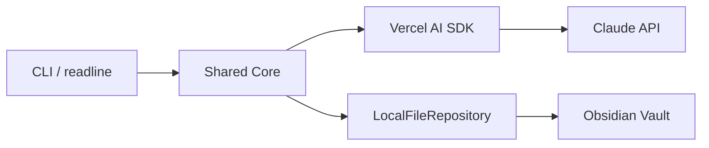
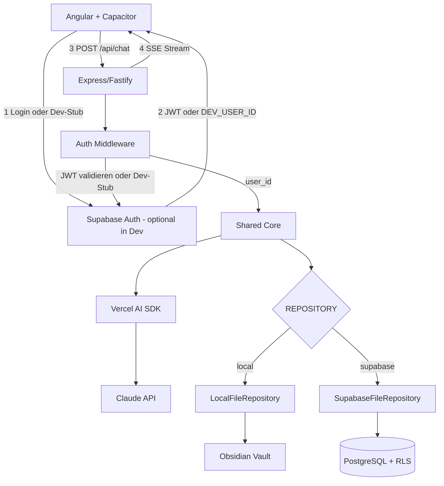
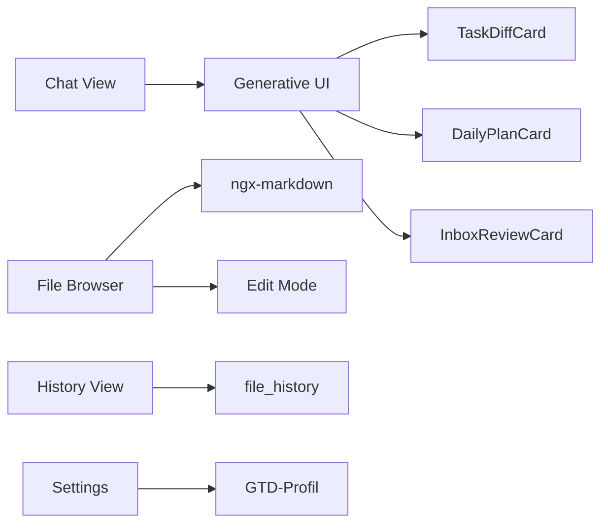
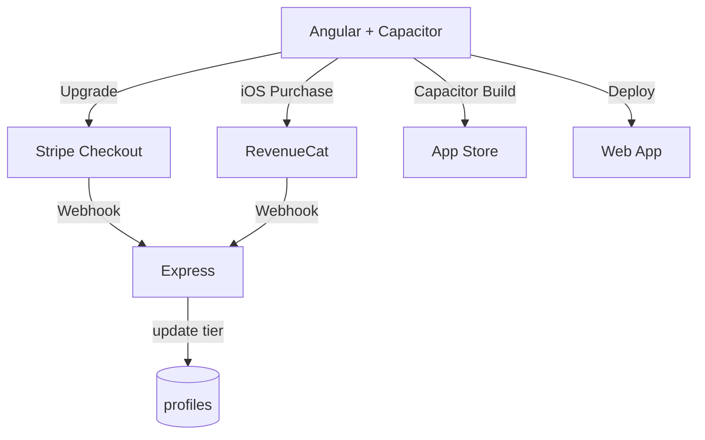
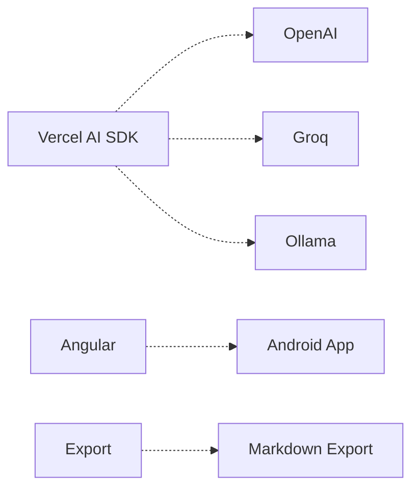
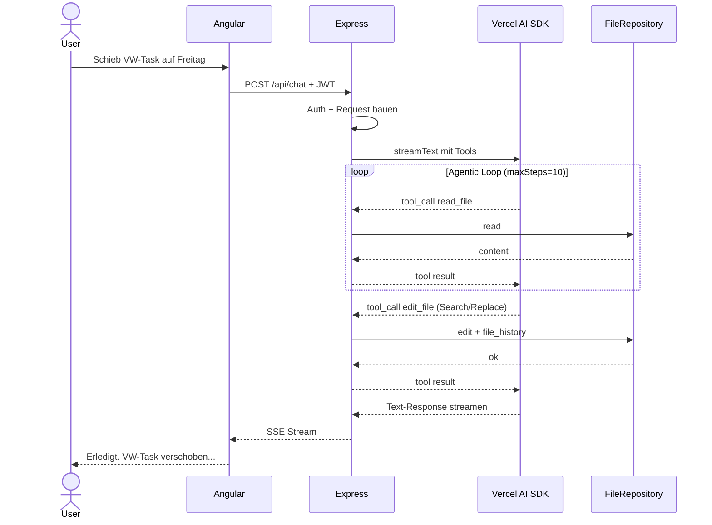

# GTD Companion — Architecture & Design Spec

> Product Vision & Requirements: [[GTD Companion]]

## Diagramme

### Phase 1: CLI (lokal, kein Server)



Alles in einem Prozess auf dem Dev-Rechner. Kein Server, kein Supabase, kein Auth.

### Phase 2a: Backend + Angular (Chat funktioniert)



Kein Payment, kein App Store. Chat funktioniert end-to-end — Dev primär gegen das Vault (`REPOSITORY=local`), Supabase-Checkpoint als zweiter Dev-Pfad (`REPOSITORY=supabase`). Siehe „Dev vs. Prod Setup".

### Phase 2b: Features + Trust (App ist komplett)



Alle Views, Generative UI Cards, File-Browser, History. Bereit für Beta-Tester.

### Phase 2c: Monetization + Distribution



Stripe + RevenueCat + Paywall + App Store Submission. Erst wenn die App validiert ist.

### Phase 3: Extensions



Zusätzliche Provider, Android, Daten-Export. Nur wenn Nachfrage es rechtfertigt.

### Request Flow: Agentic Loop



## Tech Stack

**Frontend**: Angular 19+ (standalone components, signals)
**Chat UI / Generative UI**: Hashbrown (by Manfred Steyer / angulararchitects.io)
**Native Shell**: Capacitor — gives native APIs for Voice (Speech Recognition plugin), Push Notifications, In-App Purchase (for subscriptions), and App Store deployment
**Backend-Service**: Node.js + Express/Fastify (eigener Prozess, kein Serverless/Edge Functions)
**LLM-Abstrahierung**: Vercel AI SDK (`ai` npm-Package) — provider-agnostisch (Anthropic, OpenAI, Google, Groq, Ollama)
**LLM-Modelle (MVP)**: Claude Haiku (simple ops) + Claude Sonnet (planning/review) — smart routing invisible to user
**Voice Input**: Capacitor Speech Recognition plugin (native iOS/Android speech-to-text) + Whisper API as fallback
**LLM Streaming**: SSE vom Backend-Service → Angular HttpClient mit `provideHttpClient(withFetch())` + Signals + RxJS
**Database**: Supabase (PostgreSQL + Auth + RLS)
**Deployment Backend**: Railway, Render oder ähnliche Container-Plattform
**Payments**: RevenueCat or native StoreKit via Capacitor plugin for App Store subscriptions

## Chat UI: Hashbrown + Generative UI

**Hashbrown** (by Manfred Steyer, angulararchitects.io) is the key UI enabler. It allows the LLM to not just respond with text, but to select and render Angular components directly in the chat — via Structured Output and Tool Calling.

**Why this matters for the GTD Companion:**

The LLM doesn't just say "Ich habe 3 Tasks verschoben" as text. It can render rich interactive cards in the chat:

- A **TaskDiffCard** showing what moved where, with checkmarks and before/after state
- A **DailyPlanCard** showing tomorrow's proposed schedule, with tap-to-confirm/reject buttons
- An **InboxReviewCard** listing items with swipe-to-categorize gestures
- A **ConsistencyReportCard** showing the cross-check results with expandable details

This is Generative UI — the LLM decides which component to show based on the conversation context. The user gets a visual, interactive response instead of a wall of text. This is the difference between a chatbot and a proper app experience.

**How it works technically:**

```typescript
chat = uiChatResource({
  model: 'claude-sonnet',
  system: `You are a GTD task assistant...`,
  tools: [
    moveTaskTool,
    checkOffTaskTool,
    planDayTool,
    reviewInboxTool,
  ],
  components: [
    taskDiffWidget,
    dailyPlanWidget,
    inboxReviewWidget,
    consistencyReportWidget,
    messageWidget,  // fallback for plain text responses
  ],
});
```

Each component is described via schema so the LLM knows when to use which widget. The LLM picks the component, provides the data, and Angular renders it in the chat stream.

**Strategic bonus:** Hashbrown is Manfred Steyer's project. The Manfred Steyer interview (April 2026) covers Native Federation at Siemens Energy and GenAI for Angular. Using Hashbrown in this app creates a direct narrative connection: "I interviewed Manfred about Generative UI for Angular, then I used his library to build a production app." Perfect for YouTube content, LinkedIn posts, and workshop storytelling.

## LLM Streaming in Angular

Angular 19+ with `provideHttpClient(withFetch())` supports Server-Sent Events natively. Combined with Signals for chat state management:

- User sends message → Angular-Client sendet POST an Backend-Service
- Backend-Service baut LLM-Request zusammen (System Prompt + Profile + Files + History)
- Backend-Service streamt LLM-Response per SSE an den Client
- Each chunk updates the assistant message Signal → UI re-renders progressively
- Bei Tool Calls: Backend führt Tool aus, sendet Ergebnis zurück ans LLM, streamt weiter (Agentic Loop)
- Stream completes → final message stored in Supabase `messages` table

No third-party streaming library needed. Angular's built-in HttpClient + Signals + RxJS handles the entire client-side flow. Die LLM-Orchestrierung (Agentic Loop, Tool Calls) läuft komplett serverseitig.

## Why Supabase

All-in-One-Paket — one service replaces five:

- **PostgreSQL** — SQL is king. The data is relational: users have files, files have versions, versions have summaries. Fits SQL perfectly.
- **Auth** — Login, Apple Sign-In, Google Sign-In out of the box. No custom auth system.
- **Row-Level Security** — User A can never see User B's files. Enforced at the database level, not in app logic. One policy, done.
- **Realtime Subscriptions** — if we later want live-sync between devices, it's already there.
- **Free tier** — generous enough to build and test with real users before spending money.
- **Open Source** — no vendor lock-in. Can migrate to self-hosted PostgreSQL anytime.
- **Supabase JS client** — works in Angular, works in Capacitor, works on web. One SDK everywhere.

Why not MongoDB/NoSQL: the data is relational, not document-shaped. Users → Files → Versions is a natural SQL schema. And Row-Level Security in Supabase gives us user isolation for free — in MongoDB, you'd enforce that in application code.

Why not Firebase: proprietary Google lock-in, NoSQL (Firestore), pricing gets expensive with many reads, and the data model is a poor fit for versioned text files.

## Authentication: Supabase Auth → JWT → Express

**Kein eigener OAuth2/OpenID-Flow.** Supabase Auth übernimmt die gesamte Authentifizierung — wir pflegen keinen eigenen Identity Provider.

### Auth-Flow

```
1. User öffnet App → Angular Client zeigt Login-Screen
2. User wählt Login-Methode (Apple, Google, Email/Password, Magic Link)
3. Angular Client → Supabase Auth SDK → OAuth2-Flow oder Email-Verification
4. Supabase Auth gibt JWT zurück → Client speichert Token
5. Bei jedem Request: Client schickt JWT als Bearer Token an Express-Server
6. Express Auth Middleware → validiert JWT gegen Supabase → extrahiert user_id
7. user_id fließt in SupabaseFileRepository → RLS greift automatisch
```

**Warum kein eigener Auth-Server:**
Supabase Auth unterstützt out of the box: Apple Sign-In (Pflicht für iOS App Store), Google Sign-In, Email/Password, Magic Links. Alles was wir für MVP und darüber hinaus brauchen. Einen eigenen OAuth2/OIDC-Flow zu pflegen wäre reiner Overhead.

**JWT-Validierung im Express-Server:**
Der Supabase JWT enthält die `user_id` als `sub` Claim. Der Express-Server validiert das Token mit dem Supabase-JWT-Secret (Umgebungsvariable, nie im Client) und extrahiert die `user_id`. Keine eigene User-Tabelle nötig für die Identifikation — `auth.users` ist Supabase-managed.

```typescript
// Auth Middleware (Express)
import { createClient } from '@supabase/supabase-js';

const supabase = createClient(SUPABASE_URL, SUPABASE_SERVICE_KEY);

async function authMiddleware(req, res, next) {
  const token = req.headers.authorization?.replace('Bearer ', '');
  if (!token) return res.status(401).json({ error: 'No token' });

  const { data: { user }, error } = await supabase.auth.getUser(token);
  if (error || !user) return res.status(401).json({ error: 'Invalid token' });

  // user.id ist die user_id für RLS + Usage Tracking
  req.userId = user.id;
  req.userEmail = user.email;
  next();
}
```

### Login-Methoden (MVP)

| Methode | Plattform | Warum |
|---------|-----------|-------|
| **Apple Sign-In** | iOS | Pflicht für App Store wenn andere Social Logins angeboten werden |
| **Google Sign-In** | Android + Web | Größte Reichweite |
| **Email / Password** | Alle | Fallback für User ohne Social Accounts |
| **Magic Link** | Alle | Passwordless, geringere Hürde als Email/Password |

Alle Methoden werden von Supabase Auth nativ unterstützt. Im Angular Client: `supabase.auth.signInWithOAuth({ provider: 'apple' })` etc.

## Payment & Subscription Management

### Architektur

**Zwei Payment-Provider für zwei Plattformen:**
- **RevenueCat** für App Store Subscriptions (iOS/Android) — wickelt StoreKit/Google Play Billing ab, normalisiert die APIs
- **Stripe** für Web Subscriptions — der Standard für SaaS-Payments im Web

RevenueCat kann Stripe als Backend nutzen, d.h. es gibt **einen** zentralen Ort für Subscription-Status: Stripe. RevenueCat synct App Store Purchases nach Stripe.

### Subscription-Status im System

Der Express-Server braucht den aktuellen Tier des Users für:
- **Model-Routing:** Free → nur Haiku, Premium → Sonnet für Planning
- **Rate Limiting:** Free 5/Tag, Standard 100/Tag, Premium 300/Tag
- **Feature-Gating:** Free kein Crosscheck, Standard Basic, Premium Full

**Wo lebt der Subscription-Status?** In der `profiles`-Tabelle (existiert bereits im Schema):

```sql
-- Erweiterung der profiles-Tabelle
ALTER TABLE profiles ADD COLUMN subscription_tier text DEFAULT 'free'
  CHECK (subscription_tier IN ('free', 'standard', 'premium'));
ALTER TABLE profiles ADD COLUMN stripe_customer_id text;
ALTER TABLE profiles ADD COLUMN subscription_valid_until timestamptz;
```

**Webhook-Flow (Stripe Events die der Server verarbeitet):**

| Stripe Event | Aktion im Server |
|---|---|
| `checkout.session.completed` | Neuer Kunde: `stripe_customer_id` + `subscription_tier` in profiles setzen |
| `customer.subscription.updated` | Upgrade/Downgrade: `subscription_tier` anpassen, `subscription_valid_until` aktualisieren |
| `customer.subscription.deleted` | Abo abgelaufen: `subscription_tier = 'free'` setzen |
| `invoice.payment_failed` | Zahlung fehlgeschlagen: User informieren (In-App-Hinweis), Tier noch nicht ändern (Stripe hat Retry-Logik) |
| `invoice.paid` | Verlängerung erfolgreich: `subscription_valid_until` auf neues Periodenende setzen |

**Kündigung im Detail:**
Stripe setzt bei Kündigung `cancel_at_period_end: true` — das Abo läuft bis zum bezahlten Periodenende weiter. Der Server ändert den Tier erst beim Event `customer.subscription.deleted` (am Periodenende). Keine eigene Countdown-Logik nötig.

**Proration bei Upgrade/Downgrade:**
Stripe berechnet automatisch den anteiligen Preis. Beispiel: User ist am 15. des Monats bei Standard ($7/Monat) und upgraded auf Premium ($15/Monat) → Stripe berechnet den Restbetrag für die verbleibenden 15 Tage. Der Server reagiert nur auf den Webhook und aktualisiert den Tier.

**Kein Echtzeit-Check bei jedem Request:** Der Tier wird aus `profiles` gelesen (gecacht für die Session), nicht bei jedem Request gegen Stripe geprüft. Webhooks halten den Status aktuell genug — eine Verzögerung von Sekunden ist akzeptabel.

**Webhook-Sicherheit:** Stripe signiert jeden Webhook mit einem Secret. Der Express-Server validiert die Signatur bevor er den Event verarbeitet — verhindert gefälschte Webhooks.

```typescript
// Webhook-Handler (Express)
import Stripe from 'stripe';
const stripe = new Stripe(STRIPE_SECRET_KEY);

app.post('/api/webhooks/stripe', express.raw({ type: 'application/json' }), async (req, res) => {
  const sig = req.headers['stripe-signature'];
  const event = stripe.webhooks.constructEvent(req.body, sig, WEBHOOK_SECRET);

  switch (event.type) {
    case 'checkout.session.completed':
      const session = event.data.object;
      await updateProfile(session.client_reference_id, {
        stripe_customer_id: session.customer,
        subscription_tier: 'standard', // oder aus metadata
        subscription_valid_until: new Date(session.subscription.current_period_end * 1000),
      });
      break;
    case 'customer.subscription.deleted':
      await updateProfile(customerId, { subscription_tier: 'free' });
      break;
    // ... weitere Events
  }
  res.json({ received: true });
});
```

### Warum keine eigene User-Tabelle

`auth.users` (Supabase-managed) + `profiles` (app-managed) reichen aus:
- `auth.users` → Identität, Email, Auth-Provider (managed by Supabase, read-only für uns)
- `profiles` → Subscription Tier, Stripe Customer ID, Ziele, Präferenzen, Kontext (managed by our app)
- Verknüpfung: `profiles.user_id REFERENCES auth.users(id)`, 1:1-Beziehung

Eine separate `users`-Tabelle wäre redundant zu `auth.users` + `profiles`.

## LLM API Key Strategy & Usage Tracking

### Shared API Key (MVP)

**Ein API Key für alle User.** Alle LLM-Calls gehen über unseren Anthropic API Key. Das ist der Standard für AI-SaaS-Apps (gleich wie ChatGPT, Notion AI, Cursor).

**Risiko bei Skalierung:** Anthropic hat Rate Limits pro API Key (Requests/Minute, Tokens/Minute). Bei wenigen Hundert Usern kein Problem. Bei Tausenden gleichzeitigen Usern wird es eng.

### Skalierungsstufen

| User-Anzahl | Strategie |
|-------------|-----------|
| **< 500** | Ein API Key reicht |
| **500 - 5.000** | Mehrere API Keys mit Round-Robin-Rotation im Express-Server |
| **> 5.000** | Anthropic Enterprise Tier (höhere Limits) oder Multi-Provider-Routing (Overflow auf OpenAI/Groq) |

### Per-User Usage Tracking

Jeder LLM-Call wird dem User zugeordnet — **bevor** der Call rausgeht, nicht nachträglich. Der Express-Server:

1. Prüft vor dem LLM-Call: Hat der User sein Tages-Budget noch nicht aufgebraucht?
2. Führt den Call aus
3. Schreibt Input-Tokens + Output-Tokens in die `usage`-Tabelle (existiert bereits im Schema)

```typescript
// Vereinfachter Flow im Express-Server
async function handleChat(req, res) {
  const userId = req.userId; // aus Auth Middleware
  const tier = await getSubscriptionTier(userId); // aus profiles

  // 1. Budget prüfen
  const todayUsage = await getUsage(userId, today());
  if (todayUsage.request_count >= TIER_LIMITS[tier].maxRequestsPerDay) {
    return res.status(429).json({ error: 'Tageslimit erreicht' });
  }

  // 2. Model routing basierend auf Tier
  const model = routeModel(tier, classifyIntent(req.body.message));

  // 3. LLM-Call mit Vercel AI SDK
  const result = streamText({ model, ... });

  // 4. Usage tracken (nach Completion)
  result.onFinish(({ usage }) => {
    trackUsage(userId, usage.promptTokens, usage.completionTokens);
  });

  // 5. Stream an Client
  result.pipeDataStreamToResponse(res);
}
```

### Cost Attribution

Die `usage`-Tabelle ermöglicht:
- **Per-User-Kostenanalyse:** Was kostet User X pro Tag/Monat?
- **Tier-Profitabilitäts-Check:** Sind Standard-User im Schnitt profitabel?
- **Anomalie-Erkennung:** Welcher User verbraucht 10x den Durchschnitt?
- **Billing-Grundlage:** Falls später Usage-Based Pricing gewünscht ist

## Backend-Architektur: Eigener Node.js-Service

**Kein Serverless, kein Edge Functions.** Die LLM-Orchestrierung ist zu komplex für Serverless-Constraints (Execution-Time-Limits, Cold Starts, begrenztes Debugging). Stattdessen: ein eigener Node.js-Prozess als Container auf Railway, Render oder ähnlichem.

### Warum ein eigener Server

- **Agentic Loop:** Ein LLM-Request kann mehrere Tool Calls auslösen (Crosscheck = read_file × 5-6, dann edit_file × 2-3, ggf. mit Retry bei Search-Ambiguität). Das ist eine Multi-Step-Loop mit 30-60s Laufzeit — Serverless-Limits (typisch 10-60s) werden schnell eng.
- **Streaming:** SSE-Streams müssen offen gehalten werden, während Tool Calls im Hintergrund ausgeführt werden. Ein persistenter Prozess handhabt das natürlich.
- **Shared Core mit CLI:** CLI (Phase 1) und Server (Phase 2) teilen dieselbe Core-Logik — nur der Entrypoint unterscheidet sich. Bei Serverless wäre das Deployment-Modell inkompatibel.
- **Volle Kontrolle:** Timeouts, Connection Pooling, Caching, Logging — alles konfigurierbar.

### Tech Stack Backend

```
Express/Fastify (HTTP-Layer)
    ↓
Vercel AI SDK (LLM-Abstrahierung + Streaming + Tool Calls)
    ↓
Shared Core (Request-Builder, Tool-Handler, FileRepository)
    ↓
Supabase Client (DB + Auth-Validierung)
```

**Express oder Fastify** als HTTP-Layer. Der Service hat wenige Endpoints — die Wahl ist nicht kritisch. Fastify ist etwas moderner (eingebaute Schema-Validierung, Plugin-System), Express hat mehr Community-Support. Beides funktioniert.

**Kein NestJS, kein .NET:** NestJS bringt zu viel Overhead für 3-4 Endpoints (Module, Guards, Pipes, Dekorator-System). .NET würde eine zweite Sprache in den Stack bringen — der Core (LLMService, FileRepository, Request-Builder, Tool-Handler) müsste in C# neu geschrieben werden statt als Shared Package im TypeScript-Monorepo zu leben.

### Vercel AI SDK als LLM-Layer

Das Vercel AI SDK (`ai` npm-Package) ersetzt die manuelle `LLMService`-Abstraktion. Es bietet provider-agnostische LLM-Aufrufe mit eingebautem Streaming und Tool-Call-Handling:

```typescript
import { streamText } from 'ai';
import { anthropic } from '@ai-sdk/anthropic';
import { openai } from '@ai-sdk/openai';

// Provider-Wechsel = ein Import-Swap
const model = tier === 'premium'
  ? anthropic('claude-sonnet-4-20250514')
  : anthropic('claude-haiku-4-5-20251001');

const result = streamText({
  model,
  system: buildSystemPrompt(currentDate),
  messages: prunePastToolResults(conversationHistory),  // Tool-Result-Pruning
  tools: {
    read_file: readFileTool,
    edit_file: editFileTool,    // primary write path (Search/Replace)
    write_file: writeFileTool,  // fallback für Create / Full-Rewrite
    list_files: listFilesTool,
    search_files: searchFilesTool,
  },
  maxSteps: 10,  // Agentic Loop: bis zu 10 Tool Calls pro Request
});

// SSE-Stream an den Client weiterleiten
result.pipeDataStreamToResponse(res);
```

**Unterstützte Provider (via Vercel AI SDK):**
- `@ai-sdk/anthropic` — Claude (MVP)
- `@ai-sdk/openai` — OpenAI / GPT (v2)
- `@ai-sdk/google` — Gemini (v2)
- `@ai-sdk/groq` — Open-Source-Modelle via Groq (v2, Budget-Tier)
- Community-Provider für Ollama (v3, Self-Hosted)

Provider-Wechsel erfordert keinen Code-Umbau — nur einen neuen Import und ggf. Prompt-Anpassungen.

### Agentic Loop (Server-seitig)

Der kritischste Teil des Backends. Ein einzelner User-Request kann eine Multi-Step-Conversation mit dem LLM auslösen:

```
User: "Schieb den VW-Task auf Freitag"
  ↓
LLM: tool_call → read_file("tasks/next-actions.md")
  ↓ Server führt aus, sendet Ergebnis zurück
LLM: tool_call → read_file("tasks/focus.md")
  ↓ Server führt aus, sendet Ergebnis zurück
LLM: tool_call → read_file("daily/2026-04-18.md")
  ↓ Server führt aus, sendet Ergebnis zurück
LLM: tool_call → edit_file("tasks/next-actions.md",
                   [{ search: "- [ ] VW Angebot schreiben",
                      replace: "- [ ] VW Angebot schreiben (Fr 18.4.)" }],
                   "VW-Task auf Fr verschoben")
  ↓ Server führt aus (Search trifft genau 1×), sendet ok zurück
LLM: tool_call → edit_file("daily/2026-04-18.md",
                   [{ search: "## Plan\n",
                      replace: "## Plan\n- [ ] VW Angebot schreiben\n" }],
                   "VW-Task in Freitagsplan aufgenommen")
  ↓ Server führt aus, sendet ok zurück
LLM: text → "Erledigt. VW-Task auf Freitag verschoben. ⚠️ VW Followup-Call seit 8 Tagen in Waiting..."
  ↓ Wird per SSE an den Client gestreamt
```

Das Vercel AI SDK handhabt diese Loop mit `maxSteps` — jeder Tool Call ist ein Step, nach jedem Step entscheidet das LLM ob es weitermacht oder eine Text-Response gibt.

**Während der Agentic Loop:** Der SSE-Stream bleibt offen. Der Client sieht optional Zwischenstatus (Tool Calls als UI-Events), die finale Text-Response wird progressiv gestreamt.

### Shared Core: CLI + Server aus einer Codebase

```
packages/
├── core/                    # Shared Core (CLI + Server importieren das)
│   ├── request-builder.ts   # System Prompt + Profile + Files + History → LLM Request
│   ├── tool-handlers.ts     # read_file, edit_file, write_file, list_files, search_files Implementierung
│   ├── file-repository.ts   # FileRepository Interface + Implementierungen
│   ├── system-prompt.ts     # System Prompt Template (R1-R13)
│   └── model-router.ts      # Haiku vs. Sonnet Routing-Logik
├── server/                  # Express/Fastify Entrypoint (Phase 2)
│   ├── index.ts             # HTTP Server + SSE Endpoints
│   ├── auth-middleware.ts   # Supabase Auth Token Validierung
│   └── rate-limiter.ts      # Per-User Rate Limiting
└── cli/                     # CLI Entrypoint (Phase 1)
    └── index.ts             # readline + Core-Logic
```

**Phase 1 (CLI):** `cli/index.ts` importiert Core, nutzt `LocalFileRepository`, readline als UI.
**Phase 2 (Server):** `server/index.ts` importiert denselben Core, Express als HTTP-Layer. Die konkrete `FileRepository`-Implementierung wird per Config/DI gewählt (`REPOSITORY=local|supabase`) — nicht fest an „Server = Supabase" gekoppelt. Dev läuft primär gegen `LocalFileRepository` (Vault), Prod gegen `SupabaseFileRepository`, Self-Hosted wieder gegen `LocalFileRepository`.
**Tests:** Importieren Core, nutzen `InMemoryFileRepository` + Mock-LLM-Provider.

Eine Änderung am System Prompt, an der Tool-Logik oder am Crosscheck → einmal im Core ändern, CLI und Server profitieren beide.

### Dev vs. Prod Setup

`FileRepository` ist austauschbar per Config/DI — nicht per Deployment-Target. Der Server kann genauso gut gegen `LocalFileRepository` (Obsidian Vault als Storage) laufen wie gegen `SupabaseFileRepository`. Das nutzen wir konsequent: **in der Dev-Phase läuft der Server primär gegen das echte Dogfooding-Vault**, der Wechsel auf Supabase ist dann eine bewusste späte Entscheidung, nicht an eine Projekt-Phase gekoppelt.

| Aspekt | Dev (Phase 1 / CLI) | Dev (Phase 2a / Server — primärer Pfad) | Dev (Phase 2a / Server — Supabase-Checkpoint) | Prod |
|--------|---------------------|------------------------------------------|-----------------------------------------------|------|
| **FileRepository** | `LocalFileRepository` (Obsidian Vault) | `LocalFileRepository` gegen dasselbe Obsidian Vault | `SupabaseFileRepository` gegen lokale oder Dev-Supabase | `SupabaseFileRepository` (gehostete Supabase + RLS) |
| **Zweck** | Prompt-Hypothese validieren | Den echten HTTP/SSE/Agentic-Loop-Code-Pfad + Angular-Client testen, weiterhin gegen Dogfooding-Daten | Supabase-Integration + RLS + Migration validieren, bevor es in Prod geht | Live-Betrieb |
| **LLM Provider** | Echte Claude API (Haiku) | Echte Claude API (Haiku + Sonnet) | Echte Claude API (Haiku + Sonnet) | Echte Claude API (Haiku + Sonnet) |
| **Auth** | Keine (Single User) | Gestubbt (fixer Dev-`user_id`, den `LocalFileRepository` ignoriert) — oder Supabase Auth lokal | Supabase Auth (lokale Instanz) | Supabase Auth (gehostet) |
| **Subscription Tier** | Nicht relevant | Nicht relevant (kein Tier-Check in diesem Dev-Pfad) | `'unlimited'` in eigener `profiles`-Zeile | Stripe/RevenueCat Webhooks |
| **Payment (Stripe)** | Nicht nötig | Nicht nötig | Nicht nötig (Tier hardcoded) | Stripe Checkout + Webhooks |
| **History** | JSON-Log-Datei | JSON-Log-Datei (gleich wie CLI) | lokale `file_history`-Tabelle | Supabase `file_history`-Tabelle |
| **Tests** | `InMemoryFileRepository` + Mock-LLM | Gleich | Gleich | Gleich |

**Warum zwei Dev-Varianten in Phase 2a:**
- Der **primäre Dev-Pfad** (Server + `LocalFileRepository`) ist die Standard-Umgebung während Phase-2a-Entwicklung. Du testest realen HTTP-Server-Code, realen SSE-Stream, realen Agentic-Loop, reale Angular-Integration — aber die Persistenzschicht bleibt das echte Vault. Das heißt: Dogfooding läuft weiter, jeder Tag produziert reale Daten, keine Migration nötig solange du diesen Pfad nutzt.
- Der **Supabase-Checkpoint** ist ein bewusster, zeitlich definierter Validierungsschritt: einmalig aufsetzen, RLS-Policies testen, Auth-Flow durchspielen, Migration verifizieren. Muss **nicht** Phase-2a-langes Dauer-Setup sein.

**Migration Vault → Supabase — kein echter Schmerz:**
Die Files sind als Blobs im Repo. Ein ~20-Zeilen-Script liest die 5–10 `*.md`-Files aus dem Vault und `INSERT`et sie in die `files`-Tabelle. `file_history` kann leer bleiben oder optional mit einem einzigen „Initial import from local vault"-Seed-Eintrag pro File befüllt werden. Keine Schema-Transformation, kein Datenverlust-Risiko. Der Moment des Wechsels ist deshalb trivial und kann spät fallen — wenn Auth + RLS + Rate-Limiting ernsthaft getestet werden müssen oder die App tatsächlich deployed werden soll.

**Auth-Handling beim `LocalFileRepository`-Dev-Pfad:**
Die Auth-Middleware läuft weiterhin, aber in Dev wird ein fixer `user_id` injiziert (Umgebungsvariable `DEV_USER_ID`). `LocalFileRepository` ignoriert den `user_id` oder mappt ihn auf einen Vault-Subfolder (für Multi-User-Tests). Keine Multi-Tenancy-Testabdeckung auf diesem Pfad — dafür gibt's den Supabase-Checkpoint.

**Dev-Bypass für Subscription:**
In Phase 1 (CLI) gibt es keinen Tier-Check — alles ist erlaubt. In Phase 2 (Server-Entwicklung) wird der eigene Supabase-Account bei der Seed-Migration auf `subscription_tier = 'unlimited'` gesetzt. Kein Stripe-Setup nötig fürs Entwickeln.

```sql
-- Seed-Migration: Dev-Account als unlimited
INSERT INTO profiles (user_id, subscription_tier, content)
VALUES ('deine-supabase-user-id', 'unlimited', 'Dev Account');
```

Der Tier-Check im Server behandelt `'unlimited'` wie Premium ohne jegliche Limits:

```typescript
const TIER_LIMITS = {
  trial:     { maxPerDay: 300, models: ['haiku', 'sonnet'] },
  free:      { maxPerDay: 3,   models: ['haiku'] },
  standard:  { maxPerDay: 100, models: ['haiku'] },
  premium:   { maxPerDay: 300, models: ['haiku', 'sonnet'] },
  unlimited: { maxPerDay: Infinity, models: ['haiku', 'sonnet'] }, // Dev only
};
```

**Kein LLM-Mocking in der Entwicklung.** Die API-Kosten sind mit Haiku vernachlässigbar (~$0.001-0.002 pro Interaction). Mocking für Dev wäre mehr Aufwand als Nutzen. Nur in Unit-/Integrationstests wird der LLM-Provider gemockt, um deterministische Tool-Call-Chains zu testen.

### Endpoints (MVP)

```
# Core (alle authentifiziert via Auth Middleware)
POST /api/chat              # User Message → SSE Stream (Agentic Loop)
GET  /api/files/:path       # Direkter File-Zugriff (für Markdown-Editor im Client)
PUT  /api/files/:path       # Manuelles File-Edit (User editiert direkt, nicht via LLM)
GET  /api/history            # file_history für Changelog-View

# Auth & Profile
GET  /api/profile            # User-Profil + Subscription Tier lesen
PUT  /api/profile            # Profil aktualisieren (Ziele, Präferenzen)

# Billing
GET  /api/billing/portal     # Stripe Customer Portal Link generieren (→ Redirect)
POST /api/billing/checkout   # Stripe Checkout Session erstellen (→ Redirect)

# Webhooks (nicht via JWT, sondern via Webhook-Secret validiert)
POST /api/webhooks/stripe    # Stripe Subscription Events (tier changed, cancelled)
POST /api/webhooks/revenuecat # RevenueCat App Store Events

# Infra
GET  /api/health             # Health Check für Railway/Render
```

### Settings-Screen (Angular Client)

Minimaler Screen, keine eigene Billing-UI — Stripe Customer Portal übernimmt die Abo-Verwaltung.

**Sektionen:**

**Account**
- Email + Login-Provider anzeigen (read-only, aus Supabase Auth)
- Profilbild (Gravatar oder Provider-Avatar)

**Subscription**
- Aktueller Tier als Badge anzeigen ("Trial — noch 8 Tage" / "Standard" / "Premium")
- Trial-User: "Upgrade"-Button → `POST /api/billing/checkout` → Redirect zu Stripe Checkout
- Zahlende User: "Abo verwalten"-Button → `GET /api/billing/portal` → Redirect zu Stripe Customer Portal (dort: kündigen, Zahlungsmethode ändern, Rechnungen einsehen)
- Free-User (Trial abgelaufen): "Jetzt abonnieren"-Button → Stripe Checkout

**GTD-Profil**
- Ziele und Kontext bearbeiten (das `profiles.content`-Feld, das im LLM-Context mitgeschickt wird)
- "Erzähl mir von deinen Zielen" — Freitext oder Voice-Input, wird vom LLM strukturiert

**Daten (v2)**
- Daten exportieren (ZIP mit allen Markdown-Files)
- Account löschen

**Kein eigenes Billing-UI:**
Keine Kreditkartenformulare, keine Rechnungsliste, keine Kündigungs-Flows im Client. Stripe Customer Portal macht das alles — gehostet, PCI-compliant, mehrsprachig, maintained. Der Client generiert nur den Portal-Link und leitet weiter.

```typescript
// Angular Client: Abo verwalten
async manageBilling() {
  const { url } = await this.http.get('/api/billing/portal').toPromise();
  window.location.href = url; // Redirect zu Stripe Customer Portal
}

// Angular Client: Upgrade starten
async startCheckout(tier: 'standard' | 'premium') {
  const { url } = await this.http.post('/api/billing/checkout', { tier }).toPromise();
  window.location.href = url; // Redirect zu Stripe Checkout
}
```

Der `/api/chat`-Endpoint ist der Kern — er nimmt die User Message, baut den LLM-Request, führt die Agentic Loop aus, und streamt die Response zurück. Die Webhook-Endpoints werden von Stripe/RevenueCat aufgerufen und aktualisieren den Subscription-Tier in der `profiles`-Tabelle.

## Database Schema

```sql
-- User's GTD files (current state)
files
  id          uuid PRIMARY KEY
  user_id     uuid REFERENCES auth.users
  file_path   text        -- e.g. "tasks/inbox.md", "daily/2026-04-15.md"
  content     text        -- full Markdown content
  updated_at  timestamptz
  UNIQUE(user_id, file_path)

-- Append-only version history (every change is recorded)
file_history
  id              uuid PRIMARY KEY
  user_id         uuid REFERENCES auth.users  -- redundant zu files.user_id, aber nötig für eigenständige RLS
  file_id         uuid REFERENCES files
  content         text        -- full content at this point in time
  change_summary  text        -- LLM-generated: "Moved 'VW Angebot' from Inbox to Next Actions"
  changed_at      timestamptz
  changed_by      text        -- 'llm' or 'user' (for future manual edits)

-- Chat sessions (one per day, auto-created)
sessions
  id          uuid PRIMARY KEY
  user_id     uuid REFERENCES auth.users
  date        date            -- one session per day
  created_at  timestamptz
  updated_at  timestamptz
  UNIQUE(user_id, date)
  -- Hinweis: kein summary-Feld mehr. Tool-Result-Pruning ersetzt Summary-Compaction
  -- (siehe "Context Management: Tool-Result Pruning").

-- Chat messages within sessions
messages
  id          uuid PRIMARY KEY
  user_id     uuid REFERENCES auth.users  -- redundant zu sessions.user_id, aber nötig für eigenständige RLS
  session_id  uuid REFERENCES sessions
  role        text        -- 'user' or 'assistant'
  content     text        -- enthält Text-Blocks, Tool-Calls, Tool-Results (AI-SDK message format)
  in_context  boolean     -- true = normal im Context; false = außerhalb Hard-Limit (>100 msgs) → gar nicht im Request
                          -- Tool-Result-Pruning (Stub-Ersetzung) passiert on-the-fly im Request-Builder,
                          -- nicht als persistente Zustandsänderung in dieser Tabelle.
  created_at  timestamptz

-- User profile (goals, context, preferences)
profiles
  id                      uuid PRIMARY KEY
  user_id                 uuid REFERENCES auth.users UNIQUE
  content                 text          -- Markdown: Ziele, Kontext, Präferenzen (im LLM-Context)
  subscription_tier       text DEFAULT 'trial'  -- 'trial', 'free', 'standard', 'premium', 'unlimited' (dev)
  stripe_customer_id      text          -- Stripe Customer ID (nullable, gesetzt nach erstem Kauf)
  revenuecat_app_user_id  text          -- RevenueCat User ID (nullable, für App Store Subs)
  subscription_valid_until timestamptz  -- Ablaufdatum der aktiven Subscription
  updated_at              timestamptz
```

## Multi-Tenancy: User-Isolation durch alle Schichten

Die App ist mandantenfähig — jeder User hat seinen eigenen, vollständig isolierten GTD-State. Die Isolation wird auf **Datenbankebene** erzwungen (Supabase Row-Level Security), nicht in der App-Logik. Selbst ein Bug im Code kann keine Cross-User-Leaks verursachen.

**Wie der `userId` durch die Schichten fließt:**

| Schicht | Isolation | Mechanismus |
|---------|-----------|-------------|
| **Supabase RLS** | Jede Query wird automatisch auf `auth.uid() = user_id` gefiltert | RLS Policy auf `files`, `sessions`, `profiles`, `usage` |
| **FileRepository** | `SupabaseFileRepository` nutzt den Supabase-Client, der den authentifizierten User-Token trägt → RLS greift automatisch | Kein manuelles `WHERE user_id = ?` im App-Code nötig |
| **LLM Tools** | `read_file`, `edit_file`, `write_file` etc. delegieren an `FileRepository` → Isolation ist transitiv | Tools selbst sind user-agnostisch |
| **LLM Context** | System Prompt ist für alle User identisch. Files im Context kommen aus dem user-scoped `FileRepository` | Request-Builder lädt nur Files des authentifizierten Users |
| **Sessions/Messages** | Beide Tabellen haben eigene `user_id`-Spalte + eigene RLS Policy | `auth.uid() = user_id` auf `sessions` UND `messages` separat |
| **file_history** | Eigene `user_id`-Spalte + eigene RLS Policy (nicht transitiv über `file_id`) | `auth.uid() = user_id` direkt auf `file_history` |
| **Usage/Rate Limiting** | `usage.user_id` + RLS | Jeder User hat sein eigenes Token-Budget |

**Sonderfall LocalFileRepository (Dev + Self-Hosted):**
Beim Filesystem-Backend gibt es keine Multi-Tenancy — ein Vault, ein User. Der `userId` wird ignoriert oder optional auf einen Vault-Subfolder gemappt. Das ist akzeptabel in Dev (Phase 1 und Phase 2a primärer Pfad) und im offiziellen Self-Hosted-Deployment-Mode (siehe Phase 3): Wer selbst hostet, betreibt typischerweise eine Einzel-User-Installation und braucht keine Multi-Tenancy. Für Multi-User-Prod ist weiterhin `SupabaseFileRepository` + RLS der einzige Pfad.

**Sonderfall Profil:**
Jeder User hat genau ein `profiles`-Eintrag. Das Profil wird im LLM-Context mitgeschickt (Ziele, Präferenzen, Kontext). Kein User kann das Profil eines anderen Users lesen oder beeinflussen.

**Kein Sharing, keine Teams (MVP):**
Die App ist ein Single-User-Tool. Keine geteilten Listen, keine Team-Features, keine Delegation. Das vereinfacht die Isolation erheblich — jeder User ist eine komplett unabhängige Instanz. Team-Features wären ein v3-Thema und würden ein explizites Permission-Modell erfordern.

### RLS-Architekturregeln

**Regel 1: `user_id` als Pflichtfeld in jeder Tabelle.**
Jede Tabelle trägt eine eigene `user_id`-Spalte — auch wenn die Zugehörigkeit theoretisch über JOINs ableitbar wäre (z.B. `messages` → `sessions` → `user_id`). Die Redundanz ist beabsichtigt: Jede Tabelle schützt sich selbst, unabhängig von Relationen. Ein fehlender JOIN oder ein Bug in einer Relation kann keine Cross-User-Leaks verursachen.

**Warum kein zusammengesetzter Primärschlüssel:**
`user_id` ist keine PK-Komponente, sondern eine normale Spalte mit Index + RLS-Policy. Ein zusammengesetzter PK aus `(id, user_id)` wäre nur nötig, wenn die `id` nicht global eindeutig wäre (z.B. fortlaufende Nummern pro Mandant). Bei UUIDs (`gen_random_uuid()`) ist globale Eindeutigkeit gegeben — der PK bleibt `id` allein. Die fachliche Eindeutigkeit (z.B. ein User hat keine zwei Files mit demselben Pfad) wird über `UNIQUE`-Constraints gelöst: `UNIQUE(user_id, file_path)`.

**Regel 2: Einheitliches RLS-Policy-Muster pro Tabelle.**

```sql
-- Schema-Muster (angewendet auf jede Tabelle)
ALTER TABLE {table} ENABLE ROW LEVEL SECURITY;

CREATE POLICY "user_isolation" ON {table}
  FOR ALL USING (auth.uid() = user_id);

CREATE INDEX idx_{table}_user_id ON {table}(user_id);
```

Konkret für alle Tabellen:

```sql
-- files
ALTER TABLE files ENABLE ROW LEVEL SECURITY;
CREATE POLICY "user_isolation" ON files FOR ALL USING (auth.uid() = user_id);
CREATE INDEX idx_files_user_id ON files(user_id);

-- file_history
ALTER TABLE file_history ENABLE ROW LEVEL SECURITY;
CREATE POLICY "user_isolation" ON file_history FOR ALL USING (auth.uid() = user_id);
CREATE INDEX idx_file_history_user_id ON file_history(user_id);

-- sessions
ALTER TABLE sessions ENABLE ROW LEVEL SECURITY;
CREATE POLICY "user_isolation" ON sessions FOR ALL USING (auth.uid() = user_id);
CREATE INDEX idx_sessions_user_id ON sessions(user_id);

-- messages
ALTER TABLE messages ENABLE ROW LEVEL SECURITY;
CREATE POLICY "user_isolation" ON messages FOR ALL USING (auth.uid() = user_id);
CREATE INDEX idx_messages_user_id ON messages(user_id);

-- profiles
ALTER TABLE profiles ENABLE ROW LEVEL SECURITY;
CREATE POLICY "user_isolation" ON profiles FOR ALL USING (auth.uid() = user_id);

-- usage
ALTER TABLE usage ENABLE ROW LEVEL SECURITY;
CREATE POLICY "user_isolation" ON usage FOR ALL USING (auth.uid() = user_id);
CREATE INDEX idx_usage_user_id ON usage(user_id);
```

**Regel 3: Keine JOIN-basierten Policies.**
RLS-Policies dürfen sich **nicht** auf JOINs oder Subqueries zu anderen Tabellen stützen. Jede Policy prüft ausschließlich `auth.uid() = user_id` auf der eigenen Tabelle. Das ist schneller (kein JOIN pro Row-Check), sicherer (kein Fehlerpotenzial durch vergessene Relationen) und einfacher zu auditen.

**Regel 4: Defense in Depth — RLS als letzte Verteidigungslinie.**
Die App-Logik (FileRepository, LLM Tools) operiert bereits im User-Scope. RLS ist die zusätzliche Sicherheitsschicht, die greift wenn ein Bug in der App-Logik den Scope verliert. Gerade bei LLM-Agents, die SQL oder Tool-Calls generieren, ist diese Redundanz essenziell.

## Archive Layout & Lifecycle

„Archiv" bedeutet in dieser App: **außerhalb des aktiven LLM-Routine-Context, aber on-demand zugänglich**. Nichts wird gelöscht (außer erledigte Tasks — siehe unten), aber es wird aus dem aktiven Pfad in ein Archiv-Verzeichnis verschoben, damit der tägliche Context schlank bleibt.

### Drei Lifecycle-Klassen

**1. Task-Listen (Inbox, Focus, Next Actions, Waiting, Someday/Maybe)** — **kein Archiv, nur Löschen.**
Erledigte Tasks werden beim Crosscheck / Weekly Review aus den Listen entfernt. Kein separates Archive-File. Der vollständige Audit-Trail lebt in **zwei Quellen**:
- `file_history` (DB) — jeder Write zu `tasks/*.md` schreibt einen Snapshot mit `change_summary`. Damit ist rekonstruierbar, wann ein Task erledigt/gelöscht wurde.
- Daily-Note-Log des jeweiligen Tages — hier wird der menschliche Kontext festgehalten („14:32 VW Angebot geschickt").
Doppelte Buchhaltung (separater Archive-Folder für erledigte Tasks) wird bewusst vermieden — `file_history` ist der Trail.

**2. Daily Notes** — **beim Tageswechsel automatisch ins Archiv verschoben.**
Zu jedem Zeitpunkt existiert genau **eine aktive Daily Note**: die heutige unter `daily/YYYY-MM-DD.md`. Wenn der User die App an einem neuen Tag öffnet und noch keine heutige Note existiert, passiert folgendes atomar:
- Alle vorhandenen Files unter `daily/` (also die Note vom Vortag, falls nicht schon verschoben) werden nach `archive/daily/YYYY-MM-DD.md` verschoben.
- Eine neue leere Note `daily/YYYY-MM-DD.md` für heute wird angelegt.
- Der Move wird als `file_history`-Eintrag mit `change_summary = "Archived daily note YYYY-MM-DD"` festgehalten.

Dadurch muss das LLM nicht rätseln, welche Daily Note „aktiv" ist — in `daily/` liegt immer genau eine Datei, und die ist heute. Archivierte Notes liegen in `archive/daily/` und werden nur on-demand gelesen (z.B. „Was hab ich letzten Dienstag gemacht?" → `read_file("archive/daily/2026-04-14.md")`).

**3. Chat Sessions** — **pro Tag genau eine, alte Sessions bleiben zugänglich und weiterbeschreibbar.**
Sessions leben in der DB, nicht als Files. Bei Tageswechsel wird automatisch eine neue `sessions`-Zeile für den neuen Tag angelegt; die alte Session wird **nicht** gelöscht und **nicht** verschoben — sie bleibt exakt wo sie ist. „Archiviert" bedeutet hier nur: Standard-Context ist ab jetzt die heutige Session; die alte ist on-demand erreichbar.

**Session-Switching:** Der User kann aus der History-View eine vergangene Session öffnen und dort **weiterchatten** — neue Messages werden an die damalige Session angehängt, nicht an die heutige. Das ist unproblematisch, weil die Files (Source of Truth) immer frisch geladen werden: Auch wenn der User in der Session vom 10. April weiterchattet, operiert das LLM auf dem State vom heutigen Tag. Die Session ist nur der Konversationsfaden, nicht der Daten-State.

### File-Layout (pro User)

```
tasks/
  inbox.md
  focus.md
  next-actions.md
  waiting.md
  someday-maybe.md
daily/
  2026-04-17.md              ← immer genau eine Datei: heute
archive/
  daily/
    2026-04-16.md
    2026-04-15.md
    ... (alle vergangenen Daily Notes)
```

**Was es bewusst nicht gibt:**
- Kein `projects/`-Verzeichnis. Projekte sind **keine** separaten Files. Die Struktur von Next Actions ist zweistufig in **einer** Datei `tasks/next-actions.md`: Top-Level-Kategorien (Work, Haus & Garten, Finanzen, Persönlich) und darunter optional Subheadings für Gruppen/Projekt-Blöcke. Siehe R6.
- Kein `archive/tasks/`. Erledigte Tasks werden gelöscht (siehe oben), nicht verschoben.
- Kein `archive/sessions/`. Chat Sessions bleiben in der DB, Archivierung ist implizit über `sessions.date`.

### Scope-Regeln für das LLM

| Bereich | Im Routine-Context? | On-Demand zugänglich? |
|---------|---------------------|-----------------------|
| `tasks/*.md` | Ja, immer | — |
| `daily/*.md` (heute) | Ja | — |
| `archive/daily/*.md` | Nein | Ja, via `read_file` oder `search_files(scope: "archive")` |
| `sessions` heutige + `messages` der heutigen Session | Ja | — |
| `sessions` vergangene + deren `messages` | Nein (nur wenn User explizit hinwechselt) | Ja, via Session-Switching in der UI |
| `file_history` | Nein | Ja, via `search_files` oder History-View |

**`search_files(scope)`-Verhalten:**
- `"active"` (default) → nur `tasks/*.md` + aktuelle `daily/*.md`
- `"archive"` → `archive/daily/*.md`
- `"all"` → alles zusammen

### Durchsetzung der Scope-Regeln (Zwei-Schichten-Modell)

Die Scope-Regeln werden bewusst **nicht** im `FileRepository` erzwungen, sondern in der **LLM-Tool-Schicht** (siehe „LLM Tool Definitions"). Grund: das Repository wird nicht nur vom LLM genutzt, sondern auch vom Server-Side-Lifecycle (Tageswechsel/Archive-Move, siehe nächster Abschnitt). Eine repository-seitige Whitelist der GTD-Pfade würde den Lifecycle blockieren, weil dieser gerade Schreibzugriff auf `archive/daily/` benötigt.

**Schicht 1 — `FileRepository` (low-level):**
- Akzeptiert beliebige Pfade innerhalb des `basePath` / `user_id`-Scopes.
- Einzige Prüfung: **Pfad-Sicherheit** (keine `..`-Segmente, keine absoluten Pfade, keine Symlink-Escapes). Verletzung ist ein Bug, kein User-Fehler → Exception.
- Keine Kenntnis der GTD-Struktur (`tasks/`, `daily/`, `archive/`).

**Schicht 2 — LLM-Tool-Schicht (die 5 Tools):**
- Setzt die Scope-Regeln aus der Tabelle oben durch. Konkret:
  - `read_file`: `tasks/*.md`, `daily/YYYY-MM-DD.md` (beliebiges Datum), `archive/daily/*.md`
  - `write_file` / `edit_file`: `tasks/*.md`, `daily/${today}.md` — **nicht** `archive/daily/` (Lifecycle-verwaltet)
  - `list_files`: Prefix muss `tasks/`, `daily/` oder `archive/daily/` sein
  - `search_files`: Scope-Parameter wie in der Tabelle
- Verletzung → strukturierter Error als Tool-Result (wie `EditResult { ok: false, ... }`), kein Throw. Das LLM bekommt Feedback und kann im nächsten Step reagieren.

So bleibt die Repository-Abstraktion sauber austauschbar (Local/Supabase/InMemory) und die GTD-Semantik liegt dort wo sie hingehört: an der Grenze zum LLM.

### Automatischer Tageswechsel (Server-Side)

Der Archive-Move der Daily Note und das Anlegen einer neuen Session sind **Server-Side-Lifecycle-Operationen**, kein LLM-Tool-Call. Sie passieren beim ersten Request des Users an einem neuen Kalendertag (`current_date != latest_session.date`), bevor der LLM-Request gebaut wird:

1. Finde alle `daily/*.md`-Files des Users. Für jeden, dessen Datum < heute ist: Move zu `archive/daily/{date}.md` (`INSERT INTO file_history` + `UPDATE files SET file_path = ...` in einer Transaktion).
2. `INSERT INTO sessions (user_id, date = today)` — neue Session.
3. Request mit der neuen Session und der (jetzt leeren, vom LLM gleich zu befüllenden) heutigen Daily Note weiterverarbeiten.

So bleibt das LLM raus aus der Archivierungs-Mechanik — es sieht einfach immer einen sauberen Tages-State.

## How File Versioning Works (No Git Needed)

**On every LLM file operation:**

1. LLM reads current content from `files`
2. LLM generates new content
3. Old content is copied to `file_history` with a change_summary
4. New content is written to `files`
5. LLM reports the diff in the chat response

**Rollback:** Load any previous version from `file_history`, write it back to `files`, log the rollback as a new history entry. Simple.

**Diff display (v2 feature):** Compare two `file_history` entries, render diff in the UI. Standard text-diff algorithm, no Git plumbing needed.

**Storage cost:** Markdown files are tiny. Even a heavy user with 50 files × 100 versions = 5,000 rows of text. PostgreSQL handles millions of rows without breaking a sweat. This will never be a scaling problem.

**What Capacitor gives us for free:**

- One Angular codebase → iOS app, Android app, and Web app (Phase 1-3 from one source)
- Native app performance and App Store presence
- Access to native device APIs (microphone, haptics, notifications)
- No Swift/Kotlin knowledge needed
- Hot reload during development

## LLM Tool Definitions

Das LLM interagiert mit den Daten **ausschließlich** über 5 Tools. Kein Dateisystem, kein Bash, keine Shell. Die Tools operieren auf einem **`FileRepository`-Interface** — die Implementierung dahinter ist austauschbar.

### FileRepository Interface (Open-Closed Principle)

Selbes Pattern wie `LLMService` und `SpeechService`: Ein abstraktes Interface definiert den Datenzugriff. Die konkrete Implementierung entscheidet, woher die Daten kommen.

```typescript
// User-Scope kommt NICHT als Parameter, sondern aus dem Auth-Layer.
// SupabaseFileRepository bekommt den authentifizierten Supabase-Client
// injected → RLS erzwingt user_id automatisch.
// LocalFileRepository bekommt den basePath injected → ein Vault, ein User.

interface FileRepository {
  read(filePath: string): Promise<string>;
  write(filePath: string, content: string, changeSummary: string): Promise<void>;
  edit(filePath: string, edits: SearchReplaceEdit[], changeSummary: string): Promise<EditResult>;
  list(prefix?: string): Promise<string[]>;
  search(query: string, scope?: 'active' | 'archive' | 'all'): Promise<SearchResult[]>;
}

interface SearchReplaceEdit {
  search: string;   // exakter Textblock der ersetzt werden soll
  replace: string;  // neuer Textblock
}

interface EditResult {
  ok: boolean;
  // bei Fehler: welches Search-Pattern war nicht eindeutig (0 oder >1 Treffer)
  // und der aktuelle File-Content als Feedback fürs LLM
  error?: {
    failedSearch: string;
    matchCount: number;  // 0 = nicht gefunden, >1 = mehrdeutig
    currentContent: string;
  };
}

interface SearchResult {
  filePath: string;
  snippet: string;
  line: number;
}
```

**Implementierungen:**

```typescript
// Phase 1 (CLI / Dev): lokales Dateisystem (Obsidian Vault)
class LocalFileRepository implements FileRepository {
  // read() → fs.readFile(basePath + filePath)
  // write() → fs.writeFile() + JSON-Log als file_history-Ersatz
  // edit() → read + Search/Replace-Application (atomar alle Edits oder keiner) + write
  // list() → fs.readdir() mit optionalem Prefix-Filter
  // search() → ripgrep oder simple string-search über lokale Files
  // Basis-Pfad konfigurierbar: z.B. ~/Obsidian/Vault/
}

// Produktion: Supabase
class SupabaseFileRepository implements FileRepository {
  // read() → SELECT content FROM files WHERE file_path = ? AND user_id = ?
  // write() → INSERT INTO file_history + UPDATE files
  // edit() → SELECT content → Search/Replace in Transaktion → INSERT file_history + UPDATE files
  // list() → SELECT file_path FROM files WHERE file_path LIKE prefix%
  // search() → PostgreSQL Full-Text Search (to_tsvector / to_tsquery)
}
```

**Warum das wichtig ist:**
- **Dev/Dogfooding:** In Phase 1 testest du die CLI gegen dein echtes Obsidian Vault. Kein Supabase-Setup nötig, echte Daten ab Tag 1.
- **Produktion:** Switch zu Supabase = eine neue Klasse, kein Rewrite. DI-Token in Angular (`provide: FileRepository, useClass: SupabaseFileRepository`).
- **Tests:** Eine `InMemoryFileRepository`-Implementierung für Unit-Tests — kein I/O, deterministisch, schnell.
- **Späterer Export:** Eine `ExportFileRepository`-Implementierung die nach Obsidian-kompatiblem Dateisystem schreibt (v2/v3 Feature).

### LLM Tool Definitions

Die 5 Tools die das LLM aufruft. Jedes Tool delegiert intern an das `FileRepository`-Interface.

**`read_file(file_path: string): string`**
Liest den aktuellen Inhalt einer Datei. Gibt den Markdown-Content zurück. Fehlt die Datei, gibt es einen definierten Fehler (nicht null/empty).
- Beispiel: `read_file("tasks/next-actions.md")` → Markdown-Content
- Wird bei jedem Request für die aktiven GTD-Files aufgerufen (kein Caching zwischen Requests)
- Intern: `fileRepository.read(filePath)`

**`edit_file(file_path: string, edits: SearchReplaceEdit[], change_summary: string): EditResult`** *(default für Änderungen)*
Primäres Write-Tool. Wendet ein oder mehrere Search/Replace-Edits auf eine existierende Datei an. Inspiriert von Aiders SEARCH/REPLACE-Edit-Format (nicht Unified-Diff mit Line-Numbers — LLMs generieren die notorisch falsch; Content-basierte Blöcke sind robuster).
- Beispiel (einzelner Edit):
  ```
  edit_file(
    file_path: "tasks/next-actions.md",
    edits: [{ search: "- [ ] VW Angebot schreiben", replace: "- [x] VW Angebot schreiben" }],
    change_summary: "VW Angebot als erledigt markiert"
  )
  ```
- Beispiel (Multi-Edit, atomar — alle oder keiner): Weekly-Review-Cleanup, der gleichzeitig 20 `[x]`-Einträge aus `next-actions.md` entfernt, läuft als ein einziger `edit_file`-Call mit 20 Search/Replace-Paaren.
- **Eindeutigkeit ist Pflicht:** Jedes `search` muss **genau einmal** im aktuellen File-Content vorkommen. Server-Seite:
  - 1 Treffer → `replace` wird angewendet.
  - 0 Treffer oder >1 Treffer → definierter Error zurück ans LLM mit dem aktuellen File-Content + welches `search` failed. Das LLM erweitert dann das Search-Block um ein paar Zeilen Kontext davor/danach und versucht erneut. Genau wie Aider.
- **Atomar:** Alle Edits werden transaktional appliziert. Wenn ein Search-Block in einem Multi-Edit fehlschlägt, wird keiner der Edits geschrieben.
- Erstellt automatisch einen History-Eintrag (Supabase: `file_history`-Tabelle, Lokal: JSON-Log).
- Intern: `fileRepository.edit(filePath, edits, changeSummary)`

**`write_file(file_path: string, content: string, change_summary: string): void`** *(Fallback für Create / Full-Rewrite)*
Schreibt den kompletten Inhalt einer Datei. Wird **nur** benutzt wenn `edit_file` nicht passt:
- Neue Datei anlegen, die noch nicht existiert (z.B. eine frische `daily/YYYY-MM-DD.md` beim Tageswechsel — in der Regel macht das aber der Server-Side-Lifecycle, nicht das LLM).
- Kompletter Rewrite, der eh die ganze Datei ersetzt (z.B. Weekly-Review-Cleanup einer sehr kleinen Datei, Struktur-Umbau eines Files).
- Beispiel: `write_file("daily/2026-04-18.md", "...", "Daily Note für 2026-04-18 angelegt")`
- Für Inkremental-Änderungen an existierenden Files → `edit_file` verwenden.
- Intern: `fileRepository.write(filePath, content, changeSummary)`

**`list_files(prefix?: string): string[]`**
Listet alle Datei-Pfade des Users auf, optional gefiltert nach Prefix.
- Beispiel: `list_files("tasks/")` → `["tasks/inbox.md", "tasks/focus.md", "tasks/next-actions.md", ...]`
- Beispiel: `list_files("daily/")` → `["daily/2026-04-16.md", "daily/2026-04-15.md", ...]`
- Intern: `fileRepository.list(prefix)`

**`search_files(query: string, scope?: "active" | "archive" | "all"): SearchResult[]`**
Volltextsuche über Datei-Inhalte. Default-Scope: `"active"` (nur `tasks/*.md` + aktuelle `daily/YYYY-MM-DD.md`). Für Archiv-Anfragen ("Was hab ich letzte Woche gemacht?") → `scope: "archive"` (nur `archive/daily/*.md`) oder `"all"` (beides). Siehe „Archive Layout & Lifecycle".
- Beispiel: `search_files("VW Angebot")` → `[{ filePath: "tasks/next-actions.md", snippet: "...", line: 42 }]`
- Beispiel: `search_files("DB Followup", scope: "archive")` → durchsucht nur vergangene Daily Notes unter `archive/daily/`
- Intern: `fileRepository.search(query, scope)` — Supabase nutzt PostgreSQL Full-Text Search, lokal reicht String-Search / ripgrep

**Warum `edit_file` das Default-Write-Tool ist (statt Volltext-`write_file`):**
- **Token-Kosten kollabieren.** Ein Abhaken geht von "2000 Zeilen Output" auf "~50 Tokens Search/Replace". Bei $3/MTok Haiku-Output ist der Unterschied ~Faktor 30 ($0.006 → $0.0002). Direkt relevant für das Pricing-Modell — jede Task-Operation wird dramatisch billiger, Crosscheck-Schreibvorgänge werden erst wirtschaftlich tragbar.
- **Silent-Drift-Risiko verschwindet.** Das LLM kann beim Volltext-Write versehentlich eine Task-Formulierung umformulieren, ein Zeichen ändern, die Reihenfolge kippen — unbemerkt. Bei `edit_file` fließt der unveränderte Teil des Files **nie** durch LLM-Output. Massiv für die Trust-These ("conservative bookkeeper").
- **Diff-Reporting ist gratis.** Das Search/Replace-Paar **ist** der Diff. Keine zusätzliche Diff-Berechnung nötig für die Chat-Response oder die History-View.
- **Kosten:** Search-Ambiguität muss sauber gehandelt werden (siehe oben). Die Retry-Loop erhöht die durchschnittlichen Steps minimal, bleibt aber um Größenordnungen günstiger als Volltext.

**Warum `write_file` trotzdem bleibt:** Für "Datei existiert noch nicht" und "Struktur wird komplett umgebaut" ist Search/Replace unpassend — da ist Volltext-Write klarer. Aber: **90%+ der Operationen gehen über `edit_file`**, nicht mehr über `write_file`.

**Warum genau 5 Tools:**
- Jedes Tool ist ein Function Call = Latenz + Tokens. Weniger Tools = schnellere Responses.
- `read_file` + `edit_file` decken 95% aller Operationen ab.
- `write_file` ist die Ausnahme für Create/Full-Rewrite.
- `list_files` wird selten gebraucht (System kennt die GTD-Struktur), aber nötig für dynamische Inhalte (Archiv-Browse).
- `search_files` ist der Ersatz für `grep` / Bash-Suche — essenziell für "Wo steht X?" und Archiv-Anfragen.
- **Kein delete_file Tool.** Dateien werden nicht gelöscht, sondern geleert oder archiviert. Verhindert Datenverlust durch LLM-Fehler.

## Context-Aware Session Start (Onboarding + Daily Suggestion = ein System)

Beim Öffnen der App / Start eines neuen Tages liest das System den aktuellen State und generiert **eine** kontextabhängige Suggestion-Card (Generative UI via Hashbrown). Onboarding ist kein separater Flow — es ist der Spezialfall "State ist leer".

**Entscheidungslogik (vom System Prompt gesteuert):**

| State | Suggestion |
|-------|------------|
| **Erster Start, leerer State** | *"Hi! Sag mir einfach, was dich gerade beschäftigt — ich kümmere mich um den Rest."* Kein Tutorial, kein GTD-Erklär-Text. User tippt/spricht → System sortiert. |
| **Zweiter Tag, Inbox gefüllt** | *"Du hast 5 Dinge in der Inbox. Sollen wir sortieren?"* |
| **Nach 2–3 Tagen (optional)** | *"Willst du mir kurz erzählen, was deine wichtigsten Ziele gerade sind? Dann kann ich besser priorisieren."* (Profil-Angebot, kein Zwang) |
| **Normaler Morgen, Plan existiert** | *"Guten Morgen. Dein Plan für heute: X, Y, Z. Passt das?"* |
| **Normaler Morgen, kein Plan** | *"Heute ist nichts geplant. Aus Focus wären X und Y dran — soll ich einen Tagesplan vorschlagen?"* |
| **Freitag** | *"Weekly Review steht an. In der Inbox liegen 4 Einträge, 2 Waiting-Items sind überfällig. Sollen wir durchgehen?"* |
| **Montag, Focus bestückt** | *"Neue Woche. In Focus stehen X, Y, Z. Plan für heute?"* |
| **Mehrere Tage Pause** | *"Du warst 4 Tage nicht da. Soll ich zusammenfassen was offen ist?"* |
| **Waiting-Items überfällig** | *"3 Waiting-Items seit >7 Tagen offen. Willst du nachhaken?"* |

**Prinzipien:**
- Immer genau **eine** Suggestion, nicht drei. Kein Overload.
- Der User kann reagieren (bestätigen, anpassen) oder ignorieren und einfach lostippen.
- Kein Modal, kein Blocker, kein Zwang.
- Die Suggestion-Card ist ein Generative-UI-Element (Hashbrown), kein statischer UI-Block.

**Implementierung:** Beim Session-Start ein automatischer LLM-Call mit dem aktuellen State (aktive Files + Metadaten wie Wochentag, letzte Session, Inbox-Größe, Waiting-Alter). Die Response wird als `SessionStartCard` gerendert.

## Session Architecture: One Chat Per Day (+ Switchable History)

**Core concept:** Each day gets exactly one session. Auto-created beim Tageswechsel. Der Standard-Einstieg ist immer die heutige Session — keine Session-Verwaltung, keine „welche Session war das?"-Verwirrung im Normalfall.

**Session-Switching in die Vergangenheit:** Der User kann aus der History-View in eine **vergangene** Session wechseln und dort weiterchatten. Neue Messages werden an diese alte Session angehängt, nicht an die heutige.

**Warum das unproblematisch ist:** Die Files sind die Source of Truth und werden bei jedem Request frisch geladen (R4 Schritt 1). Auch wenn der User in der Session vom 10. April weiterchattet, operiert das LLM auf dem State vom heutigen Tag. Die Session ist nur der **Konversationsfaden**, nicht der Daten-State. Ein „nachträgliches Ergänzen" der Konversation vom 10. April ändert nichts am GTD-Zustand — es fügt nur Messages zu einer alten DB-Zeile hinzu.

**Why this works for GTD:**

- GTD has a natural daily rhythm: morning review, tasks throughout the day, evening planning
- The daily session maps 1:1 to the daily note — today's session IS today's conversation
- Yesterday is yesterday, today is today. Natural boundary, no user decision needed im Default-Flow
- History is scrollable, searchable und — wenn gewünscht — weiter-beschreibbar

**User experience:**

- Open the app → landest in today's session, always
- Scroll up → see earlier messages from today
- Tap "History" → browse previous days' sessions (default read-only view)
- Tap "In dieser Session weiterchatten" → der Input-Focus springt in diese Session; neue Messages gehen an diese `session_id`
- Zurück zu heute → ein Button oder App-Neustart → automatisch wieder in der heutigen Session
- Sage "Was hab ich letzte Woche zum VW-Call gemacht?" → LLM liest Daily Notes und `file_history`, nicht die alten Chat-Logs

**Auto-creation:** Beim ersten Request eines neuen Kalendertags wird automatisch eine neue Session angelegt (und die vorherige Daily Note ins Archiv verschoben — siehe „Archive Layout & Lifecycle"). Kein Button, kein Prompt, keine User-Entscheidung.

**Implikation fürs Context-Loading:** Der Server lädt immer die Messages der **aktuell aktiven Session** (die, in der der User gerade schreibt) — egal ob das die heutige oder eine vergangene ist. Tool-Result-Pruning (siehe „Context Management") gilt gleichermaßen.

## Request Architecture: How Each Message Is Built

Every user message triggers a fresh LLM request with this structure:

```
┌─────────────────────────────────────────────┐
│ System Prompt (~1K tokens)                  │
│ - GTD logic, rules, persona                 │
│ - Consistency engine instructions           │
│ - Tool definitions (read/edit/write/list/   │
│   search)                                   │
├─────────────────────────────────────────────┤
│ User Profile (~500 tokens)                  │
│ - Goals, context, preferences               │
├─────────────────────────────────────────────┤
│ Current GTD Files (~2-3K tokens)            │
│ - tasks/inbox.md                            │
│ - tasks/focus.md                            │
│ - tasks/next-actions.md                     │
│ - tasks/waiting.md                          │
│ - tasks/someday-maybe.md                    │
│ - daily/YYYY-MM-DD.md (heutige Note)        │
│ (frisch geladen pro Request — R4)          │
│ Archive (on-demand, nicht im Routine-Load): │
│ - archive/daily/*.md                        │
├─────────────────────────────────────────────┤
│ Conversation History (all text messages,    │
│ old tool-results pruned to stubs)          │
│ - "Soll ich auf Freitag oder Montag?"       │
│ - "Freitag" ← must know context            │
│ - [pruned read_file result — re-read]       │
│ - recent tool-results (last K msgs) intact  │
├─────────────────────────────────────────────┤
│ New User Message                            │
└─────────────────────────────────────────────┘
Total: ~6-8K input tokens (predictable, constant)
```

**Key insight:** The GTD files are the real state, not the chat history. The files are re-read from Supabase on every request, so the LLM always operates on the current truth. The chat history is only needed for conversational context (rückfragen, confirmations, follow-ups). Old tool-results are pruned to stubs (see "Context Management: Tool-Result Pruning") — text messages are preserved verbatim.

## Context Management: Tool-Result Pruning (statt Compaction)

**Problem mit LLM-Summary-Compaction:** Klassische Compaction lässt einen LLM-Call die ersten N Messages zu einer Summary zusammenfassen. Das killt Trust: Wenn der User später fragt "Was hatte ich vorhin zum VW-Call gesagt?", liegt die Antwort in einer LLM-generierten Zusammenfassung statt im Originalwortlaut. Genau das "silent reinterpretation"-Risiko, das die Trust-These der App untergraben würde.

**Gleichzeitig:** Files als Source of Truth sind bereits etabliert — die GTD-Files werden bei **jedem** Request frisch aus Supabase gelesen (R4 Schritt 1). Daher: Die historischen File-Snapshots im Context sind doppelt vorhanden und obendrein potenziell veraltet. Das LLM darf nicht auf alten Snapshots operieren.

**Lösung: Tool-Result Pruning.** Anstatt Messages zu summarizen, werden alte **Tool-Result-Blocks** durch Stubs ersetzt. Text-Messages bleiben 1:1 erhalten — der Konversationskontext ist vollständig.

**Mechanik (beim Request-Build im Shared Core):**

1. Iteriere über die Message-Historie.
2. Für jeden Tool-Result-Block älter als die letzten `K` Messages (MVP: K=5, tunable):
   - Ersetze den konkreten Result durch einen Stub: `[Previous read_file("tasks/next-actions.md") result — superseded by current state; re-read if needed]`
   - Das LLM weiß: dieser Read ist passiert, aber der Content ist nicht mehr aktuell.
3. Recent Tool-Results (letzte K Messages) bleiben vollständig — für die laufende Multi-Step-Operation relevant.
4. Aktive Files werden wie bisher am Anfang jedes Requests frisch geladen (impliziert durch R4).

**Was bleibt unangetastet:**
- Alle `user`- und `assistant`-Text-Messages — egal wie alt.
- `tool_call`-Blocks (dass ein Call passiert ist, bleibt sichtbar — nur das Result wird gestubbt).
- Rückfrage-Kontext ("Soll ich auf Freitag oder Montag?" → "Freitag") bleibt 100% erhalten, weil das Assistant- und User-Text-Messages sind.

**Wichtige Invariante:** Nur Tool-Result-Blocks werden gestubbt, niemals Text-Messages.

**Implementierung:** Message-Transformer im Shared Core, läuft vor dem `streamText`-Call. Mit dem Vercel AI SDK ist das eine Funktion die über die `messages`-Array iteriert und Tool-Result-Content-Parts ersetzt. Kein Architektur-Umbau.

**Warum das die alte Compaction-Strategie ersetzt:**
- **Kein Trust-Killer:** Keine LLM-generierten Summaries im Context. Chat-History bleibt wörtlich lesbar.
- **Billiger:** Kein zusätzlicher LLM-Summary-Call pro 30 Messages. Purer String-Operation.
- **Kleinerer Context:** File-Contents (die die teuersten Tokens in der History sind) werden durch ~30-Token-Stubs ersetzt. Context bleibt klein auch nach 100+ Messages.
- **Sicherer:** Das LLM kann nicht auf einem veralteten File-Snapshot operieren — der Stub signalisiert explizit "re-read if needed".

**Messages-Tabelle:**
Das `in_context`-Feld wird umgedeutet: `false` bedeutet nicht mehr "wurde wegsummary'd", sondern "liegt so weit zurück, dass nicht mal mehr der Tool-Call/Text im Context ist" (Hard-Limit bei z.B. 100 Messages als harte Obergrenze). `sessions.summary` entfällt im MVP.

**Archiv-Zugriff unverändert:** Wenn der User fragt "Was hab ich letzte Woche zum VW-Call gemacht?", triggert das `search_files(..., scope: "archive")` oder `read_file("archive/daily/2026-04-08.md")` — die archivierten Daily Notes und `file_history` sind die Quelle, nicht die Chat-Messages.

## LLM Provider Architecture: Vercel AI SDK

**MVP: Claude only. Architecture: provider-agnostisch via Vercel AI SDK.**

Kein eigenes `LLMService`-Interface nötig — das Vercel AI SDK (`ai` npm-Package) **ist** die Abstraktion. Provider-Wechsel = Import-Swap, kein Code-Umbau. Details zur Integration und Code-Beispiele: siehe "Backend-Architektur: Eigener Node.js-Service" weiter oben.

**Why Claude for MVP:**

- Best instruction-following for structured operations (task management needs precision, not creativity)
- Haiku is cheap enough for the Standard tier (~$0.001-0.002 per interaction)
- Sonnet for Premium tier planning/review sessions
- One provider = one prompt set = one test surface = manageable quality

**Provider-Roadmap:**
- **MVP:** `@ai-sdk/anthropic` (Claude Haiku + Sonnet)
- **v2:** `@ai-sdk/openai`, `@ai-sdk/google`, `@ai-sdk/groq` — für Budget-Tier, Alternative-Provider, "Bring your own API key"
- **v3:** Community-Provider für Ollama (Self-Hosted / lokale Modelle)

Kein Model-Picker in der UI. Der User wählt nie einen Provider — das Routing passiert intern.

**Smart routing (internal, invisible to user):**

- "Hak den LinkedIn-Post ab" → Haiku (simple CRUD operation)
- "Plan meinen morgigen Tag" → Sonnet (needs reasoning about priorities)
- "Räum meine Inbox auf" → Sonnet (needs judgment for categorization)
- "Neuer Task: Milch kaufen" → Haiku (trivial insert)
- (Compaction-Summary-Call entfällt — siehe "Context Management: Tool-Result Pruning")

Routing decision is based on message classification, not user choice. A simple keyword/intent classifier (could even be rule-based for MVP) determines which model handles the request. Die Routing-Logik lebt im Shared Core (`packages/core/model-router.ts`).

## Cost Model: Cross-Subsidization

**No per-user Claude subscriptions.** All LLM calls go through our API key. The business model relies on cross-subsidization: light users (5-10 interactions/day) are profitable, heavy users (50+/day) might cost more than they pay. The blend must be net-positive.

This is the standard SaaS model for AI-powered apps (same as ChatGPT, Notion AI, etc.): pricing is set so that the average user generates margin, even if individual power users are a cost center.

**Implications for pricing:**

- Free tier must be tightly capped (5 interactions/day) — enough to experience the value, not enough to cost real money
- Standard tier uses Haiku only — per-interaction costs **nur dank `edit_file`** realistisch unter $0.002. Mit Volltext-Writes wären Crosscheck-Operationen (mehrere Writes pro User-Message) strukturell unprofitabel gewesen (~$0.005-0.01 pro Interaction mit wachsenden Files). `edit_file` drückt Output-Tokens um Faktor ~30 und macht das Pricing-Modell überhaupt erst tragbar — siehe "LLM Tool Definitions" weiter oben.
- Premium tier uses Sonnet for planning/review — higher cost, but premium pricing ($12-15/mo) covers it
- Monitor cost-per-user closely from day one. If heavy users blow up costs, introduce soft throttling (e.g., "Du hast heute schon 80 Interaktionen — morgen geht's weiter mit voller Power" for Standard tier)
- **Context-Größe stabil trotz langer Sessions:** Tool-Result-Pruning (siehe "Context Management") hält den Input-Token-Count auch nach 100+ Messages nahezu konstant. Keine Input-Token-Explosion bei Power-Usern.

## Abuse Protection & Rate Limiting

The app pays for every LLM call. One user pasting code, essays, or entire documents and using the system as a free Claude proxy can blow up costs. This must be prevented from day one.

**Input Validation (before the request hits the LLM):**

- **Max input length**: Hard cap at ~2000 characters per message. A normal task command is 10-50 words. Nobody needs 2000 characters to say "verschieb den Task auf morgen." Anything beyond that is likely abuse or misuse.
- **Content heuristic**: If the input looks like code (brackets, semicolons, indentation patterns), a full document, or a long paste — reject with a friendly message: "Das sieht nicht nach einer Task-Anfrage aus. Ich bin dein GTD-Assistent — was kann ich für deine Aufgaben tun?"
- **File content stays server-side**: The LLM reads the user's GTD files from Supabase. The user never needs to paste file content into the chat.

**Rate Limiting (per user, per tier):**

|Tier|Messages/Day|Messages/Hour|Max Input Length|
|---|---|---|---|
|Free|5|5|500 chars|
|Standard|100|30|1500 chars|
|Premium|300|60|2000 chars|

**Escalation ladder when limits are hit:**

1. **Soft warning**: "Du hast heute schon 80 von 100 Nachrichten verbraucht. Tipp: Fasse mehrere Aufgaben in einer Nachricht zusammen."
2. **Tier downgrade**: When daily limit is reached, route remaining requests to Haiku only (even for Premium users). Cheap, still functional, but no expensive Sonnet calls.
3. **Hard stop**: After 2x the daily limit (emergency buffer), no more LLM calls until next day. "Für heute ist Schluss. Morgen geht's weiter!"
4. **Account flagging**: Users who consistently hit 2x limits get flagged for review. Patterns like "pastes 2000 chars every request" trigger automatic investigation.

**Token budget per request (server-side enforcement):**

- Max output tokens capped at 2000 per response (a normal task operation response is 200-500 tokens)
- If the LLM somehow generates a novel instead of moving a task, the response is truncated
- Total token budget per user per day tracked in a `usage` table:

```sql
usage
  id          uuid PRIMARY KEY
  user_id     uuid REFERENCES auth.users
  date        date
  input_tokens    int DEFAULT 0
  output_tokens   int DEFAULT 0
  request_count   int DEFAULT 0
  UNIQUE(user_id, date)
```

**Cost alerting (internal, for the operator):**

- Daily job checks if any user's token usage exceeds 3x the average for their tier
- Alert via email/Slack when total daily API costs exceed budget threshold
- Dashboard showing cost-per-user distribution — identify whales early

**Philosophy:** Be generous with legitimate use, ruthless with abuse. A user who does 80 task operations in a productive day is a power user to celebrate. A user who pastes 2000 characters of Python code 50 times is an abuser to block.

## Voice Input Quality

Voice is the primary interface — if the transcription is bad, the whole product is broken. This is a critical dependency.

**MVP approach:**

- **Capacitor Speech Recognition plugin** — uses native iOS speech-to-text (Apple's on-device recognition). Free, fast, good quality for short commands. Works offline.
- Quality is sufficient for "Schieb den VW-Task auf Freitag" style commands

**v2 upgrade path:**

- **Whisper API** (OpenAI) or **Deepgram** for higher accuracy, especially for longer voice inputs (evening planning sessions, brain dumps)
- These cost per minute of audio but deliver significantly better transcription
- Could be a Premium-tier feature: "Enhanced voice recognition"

**Architecture:** Voice input is abstracted behind a `SpeechService` interface (same Open-Closed principle as the LLM layer). MVP uses native iOS STT, later swappable for Whisper/Deepgram without UI changes.

```typescript
interface SpeechService {
  startListening(): Observable<string>;
  stopListening(): void;
}

class NativeSpeechService implements SpeechService { ... }  // MVP: Capacitor plugin
class WhisperSpeechService implements SpeechService { ... } // v2: Whisper API
```

## History View: Changelog

A simple, read-only chronological view of all file changes. Not a diff viewer (that's v2), just a timeline.

**Data source:** The `file_history` table already stores every change with timestamps and LLM-generated summaries. The History View is just a paginated query on that table.

**UI concept:**

```
📅 15. April 2026
  14:32  ✅ "VW Angebot schreiben" → completed (was in Next Actions)
  14:30  📥 "Steuererklärung" → moved from Inbox to Next Actions
  09:15  📝 Daily plan created: 4 tasks scheduled
  09:12  📥 "Milch kaufen" → added to Inbox via voice

📅 14. April 2026
  21:05  📋 Tomorrow planned: 3 tasks from Next Actions
  18:30  ⏩ "DB Followup" → deferred to next week
  ...
```

**Architecture:** Already possible with current schema — no additional tables needed. Just a view component that reads `file_history` ordered by `changed_at DESC`.

**MVP or v2?** Could be MVP — it's architecturally free (data already exists) and adds significant trust value. The user can always verify what the system did. Lean toward including it.

## Markdown File Editing

The user should be able to view and edit their GTD files directly — not just through the chat.

**MVP approach: Toggle between View and Edit mode.**

- **View mode (default):** Rendered Markdown using `ngx-markdown` (MIT, actively maintained, 1.8K stars, updated weekly). Tasks are displayed as formatted lists with checkboxes.
- **Edit mode:** Simple textarea where the user sees and edits the raw Markdown. Tap "Save" → content is written to Supabase, a `file_history` entry is created.
- Toggle button switches between the two views.

**v2 upgrade: CodeMirror 6 as editor.**

Obsidian's editor is proprietary, but it's built on top of **CodeMirror 6**, which is MIT-licensed and open source. CodeMirror 6 is the gold standard for in-browser text editing — syntax highlighting, mobile-friendly, extensible, excellent performance. It can render Markdown with live preview (similar to Obsidian's "live preview" mode where formatting is applied as you type).

For the MVP, the textarea toggle is sufficient and zero effort. CodeMirror 6 is the natural upgrade path when users want a richer editing experience.

**Important:** Direct edits by the user create a `file_history` entry with `changed_by = 'user'`. The LLM's next read will pick up the changes automatically (since it re-reads files on every request). No sync conflict possible because the LLM never writes without a user-initiated request.

## Build Milestones

### Phase 1: CLI — "It works in the terminal"

Die Kernhypothese validieren: Funktionieren die Prompts? Ist das GTD-System per Chat bedienbar? Alles lokal, kein Server, kein Supabase.

**1.1: Monorepo + Shared Core**

- Nx oder Turborepo Monorepo aufsetzen (`apps/cli`, `packages/core`)
- `LocalFileRepository` implementieren (liest/schreibt gegen Obsidian Vault)
- JSON-Log als lokaler file_history-Ersatz
- Dev-Account: kein Auth, kein Tier-Check

**1.2: LLM Integration + System Prompt**

- Vercel AI SDK mit `@ai-sdk/anthropic` (Haiku + Sonnet Routing)
- System Prompt mit GTD-Regeln R1-R13
- Tool-Handler: `read_file`, `edit_file` (primary, Search/Replace), `write_file` (fallback), `list_files`, `search_files` → delegieren an FileRepository
- `edit_file`-Server-Logik: Search-Eindeutigkeits-Check (genau 1 Treffer), Retry-Loop bei Ambiguität mit aktuellem File-Content zurück ans LLM, atomare Multi-Edits
- Request-Builder: System Prompt + Profile + aktive Files + User Message
- Tool-Result-Pruning: alte Tool-Result-Blocks (>K Messages zurück) durch Stubs ersetzen, Text-Messages unverändert lassen
- Agentic Loop mit `maxSteps` für Multi-Tool-Call-Requests

**1.3: CLI Chat Interface**

- Terminal-Chat (readline oder Ink)
- Streaming-Output im Terminal
- Session-Management: eine Session pro Tag, auto-creation
- Context-Management: Tool-Result-Pruning (Stubs für alte Tool-Results, Text-Messages bleiben erhalten)

**1.4: GTD-Kernlogik**

- Crosscheck-Engine (R4: nach jeder Operation, Diff-Reporting im Chat)
- Daily Note Lifecycle (R5: aktiv vs. Archiv, Cleanup vergangener Notes)
- Tagesplan-Generierung
- Input-Validierung (Content-Heuristik gegen Missbrauch)

**Deliverable:** Eine CLI die alles kann was die spätere App kann, minus UI. Tägliches Dogfooding gegen das eigene Obsidian Vault.

**Validation Checkpoint:** Wenn die Prompts in der CLI nicht zuverlässig funktionieren, hilft kein UI. Diese Phase beweist oder killt die Produktthese.

---

### Phase 2a: Backend + Angular — "Es chattet in der App"

Der Shared Core wandert in einen Express-Server. Angular-Client kommuniziert per SSE. Supabase als Datenbank + Auth. **Kein Payment, kein App Store** — das Ziel ist ein funktionierender Chat mit Persistence.

**2a.1: Express Backend-Service — gegen das Vault**

Der Shared Core bekommt einen HTTP-Layer. Persistenz bleibt das echte Obsidian Vault (`LocalFileRepository`). Kein Supabase nötig für diesen Schritt — Ziel ist den HTTP/SSE/Agentic-Loop-Pfad gangbar zu machen, ohne Dogfooding zu unterbrechen.

- Express/Fastify Server mit Shared Core aus Phase 1
- `LocalFileRepository` weiterbenutzen (exakt dieselbe Instanz wie die CLI — Server liest/schreibt gegen dein Vault)
- Auth Middleware in Stub-Modus: fixer `DEV_USER_ID` aus Umgebungsvariable, kein JWT-Check
- `POST /api/chat` — Kern-Endpoint: User Message → Agentic Loop → SSE Stream
- `GET/PUT /api/files/:path` — Direkter File-Zugriff
- `GET /api/profile`, `PUT /api/profile` (Profil als lokale `profile.md` oder JSON, solange wir noch nicht auf Supabase sind)
- **Kein Rate Limiting / Usage Tracking / Tier-Check in diesem Pfad** — alles unlimited, es geht nur um den Code-Pfad

**2a.2: Supabase-Checkpoint**

Bewusst zeitlich definierter Schritt, um die Supabase-Integration zu validieren, bevor sie für Prod genutzt wird. Keine Abkehr vom Vault-Pfad — beide laufen parallel weiter, per Config-Switch wählbar.

- Supabase-Projekt: Tabellen (files, file_history, sessions, messages, profiles, usage)
- Row-Level Security Policies auf allen Tabellen (siehe „Multi-Tenancy")
- `SupabaseFileRepository` implementieren (parallel zu `LocalFileRepository`, selbes Interface)
- Migration-Script Vault → Supabase: liest Markdown-Files, `INSERT` in `files`-Table (~20 Zeilen, kein echter Schmerz — siehe „Dev vs. Prod Setup")
- Supabase Auth aktivieren: JWT-Validierung in der Middleware (Stub-Mode fällt weg wenn `REPOSITORY=supabase`)
- Seed-Migration: Dev-Account mit `subscription_tier = 'unlimited'`
- Rate Limiting + Usage Tracking (per-user, per-day) auf diesem Pfad testen
- Deployment-Target Railway/Render vorbereiten

**2a.3: Angular + Capacitor Shell**

- Angular 19+ Projekt mit Capacitor
- Supabase Auth Integration (Apple Sign-In, Google, Email)
- Chat-View: Message-Liste, Eingabefeld, Senden-Button
- SSE-Streaming: `provideHttpClient(withFetch())` + Signals + RxJS
- Session-Anzeige: heutiger Chat, scrollbare History vergangener Tage

**2a.4: Voice Input**

- Capacitor Speech Recognition Plugin (native iOS/Android STT)
- Tap-to-speak, Release-to-send
- Transkription → normaler Chat-Input

**Deliverable:** Eine App in der man chatten kann, die Daten in Supabase persistiert, und die sich mit Supabase Auth anmelden lässt. Man kann sie lokal auf dem Gerät testen (Capacitor Live Reload). Kein App Store, kein Payment.

**Validation Checkpoint:** Funktioniert der Chat-Flow end-to-end? Ist die Latenz akzeptabel? Fühlt sich Voice Input brauchbar an?

---

### Phase 2b: Features + Trust — "Die App ist komplett"

Die App bekommt alle Features die sie von einem simplen Chatbot unterscheiden. Hashbrown Generative UI, File-Browser, History, Settings.

**2b.1: Generative UI (Hashbrown)**

- Hashbrown Integration für Tool-Cards im Chat
- `TaskDiffCard` — zeigt was verschoben/erledigt wurde
- `DailyPlanCard` — Tagesplan-Vorschlag mit Bestätigen/Anpassen
- `InboxReviewCard` — Inbox-Items mit Kategorisierungs-Vorschlägen
- `ConsistencyReportCard` — Crosscheck-Ergebnisse mit Details
- `SessionStartCard` — Context-Aware Suggestion beim App-Start (R12)

**2b.2: File Views + Editing**

- GTD File-Browser (Inbox, Focus, Next Actions, Waiting, Someday/Maybe)
- Rendered Markdown View (ngx-markdown)
- Edit-Mode Toggle (Textarea für MVP)
- Archiv-Browser (read-only, vergangene Daily Notes)

**2b.3: History + Trust**

- History/Changelog View (liest `file_history`-Tabelle)
- User-Profil View + Edit (Ziele, Kontext, Präferenzen)

**2b.4: Settings-Screen**

- Account-Info (Email, Provider)
- Subscription-Badge (Tier anzeigen — in dieser Phase noch hardcoded)
- GTD-Profil bearbeiten

**Deliverable:** Feature-complete App. Bereit für Beta-Tester. Alle GTD-Flows funktionieren, Generative UI zeigt interaktive Cards statt Textwänden, History schafft Vertrauen.

**Validation Checkpoint:** Testen mit 5-10 Beta-Usern. Ist das Vertrauen da? Funktioniert die Consistency Engine? Verstehen nicht-technische User die App?

---

### Phase 2c: Monetization + Distribution — "Es ist ein Produkt"

Erst wenn die App feature-complete und beta-getestet ist, kommt Payment und App Store dazu.

**2c.1: Stripe Integration (Web)**

- Stripe Account + Products/Prices anlegen (Standard, Premium)
- `POST /api/billing/checkout` — Checkout Session erstellen
- `GET /api/billing/portal` — Customer Portal Link generieren
- `POST /api/webhooks/stripe` — Webhook Handler für alle Subscription Events
- Webhook-Sicherheit: Stripe Signatur-Validierung
- `profiles`-Tabelle: `subscription_tier` + `stripe_customer_id` + `subscription_valid_until`

**2c.2: RevenueCat Integration (App Store)**

- RevenueCat SDK in Capacitor einbinden
- App Store Connect: In-App Purchases anlegen (Standard, Premium Abo)
- RevenueCat → Stripe Sync (ein Ort für Subscription-Status)
- `POST /api/webhooks/revenuecat` — Webhook Handler

**2c.3: Paywall + Trial-Logik**

- Trial-Timer: 14 Tage ab Registrierung, danach Paywall
- Tier-basiertes Feature-Gating im Backend (Model-Routing, Rate Limits)
- Upgrade/Downgrade-Flow im Settings-Screen
- Freundliche Hinweise bei Trial-Ablauf ("Noch 3 Tage...")

**2c.4: Abuse Protection (Production-Grade)**

- Input-Validierung (Content-Heuristik, max. Zeichenlänge)
- Per-User Rate Limiting (Tier-basiert)
- Token-Budget Tracking + Alerting
- Anomalie-Erkennung (User verbraucht 10x Durchschnitt)

**2c.5: App Store Submission**

- App Store Review Guidelines einhalten
- Apple Sign-In (Pflicht für iOS)
- Privacy Policy, Terms of Service
- App Store Screenshots, Beschreibung, Keywords
- iOS first, Android later

**2c.6: Web App**

- Selbe Angular-Codebase als PWA oder gehostete Web-App deployen
- Desktop Use Case (Weekly Reviews, längere Planning-Sessions)
- Stripe Checkout (statt App Store) für Web-User

**Deliverable:** Native iOS App im App Store + Web App für Desktop. Das Produkt ist live und monetarisiert.

---

### Phase 3: Extensions (wenn Nachfrage es rechtfertigt)

- Android App (selbe Codebase, Capacitor Build)
- CodeMirror 6 Upgrade für Rich Markdown Editing
- Visual Diff UI für File History
- Daten-Export (ZIP mit allen Markdown-Files)
- Zusätzliche LLM Provider (OpenAI, Groq, Ollama via Vercel AI SDK)
- "Bring your own API key" für Power User
- MCPs, Kalender-Integration, Email-Sync
- Team-Features (v3+, erfordert Permission-Modell)
- **Self-Hosted Deployment mit Filesystem-Backend:** Da der Server bereits in Phase 2a gegen `LocalFileRepository` läuft, ist das keine neue Architektur, sondern ein offiziell unterstützter Deployment-Mode. Wer den Server selbst hostet und keinen Supabase-Account möchte, konfiguriert `REPOSITORY=local` + einen Vault-Pfad; der Server speichert Files dort und hält seine eigene lokale History-Datei statt `file_history`-Tabelle. Kein Auth-Provider nötig (oder optional lokale Auth). Das passt zur AGPL-Community und zum Open-Source-Narrativ — und kostet fast nichts, weil der Pfad sowieso in Dev genutzt wird.

**Explizit nie: Native Desktop App**

- Kein Electron, kein Tauri. Die Web App ist der Desktop-Client.
- The web app IS the desktop client

## MVP Scope (Deliberately Minimal)

- Chat UI with voice input (tap to speak, release to send)
- Streaming LLM responses
- Markdown file read/write per user account (read + write only, no other tools)
- Session persistence (one session per day, continue throughout the day)
- User profile (voice onboarding or manual)
- Paywall with subscription (RevenueCat)
- Basic daily note generation
- GTD folder structure (Inbox, Focus, Next Actions, Waiting, Someday/Maybe — **no Projects folder**, projects live as subheadings inside `next-actions.md`)
- **Archive policy** (siehe „Archive Layout & Lifecycle"):
  - Completed tasks → **gelöscht** (kein separates Archiv; Trail in `file_history` + Daily-Note-Log)
  - Past daily notes → automatisch beim Tageswechsel nach `archive/daily/` verschoben
  - Past chat sessions → bleiben in-place in der DB, on-demand weiter-beschreibbar via Session-Switching
- Archive excluded from routine LLM context (only accessed on explicit user request)
- History view (changelog from file_history table)
- Abuse protection (input validation, rate limiting, token budgets)

## MVP Scope Cuts (Explicitly Not in v1)

- **No import/export** — no ZIP download, no Obsidian sync, no data migration tools
- **No rollback UI** — file_history stores versions, but no UI to browse/restore (v2)
- **No web fetch, no external tools** — the LLM can only read and write the user's Markdown files. Nothing else. No web search, no URL fetching, no MCPs.
- No visual diff UI (LLM reports changes in chat text)
- No multiple LLM provider selection (one provider, smart model routing internal)
- No session switching during active streaming (stream finishes, then switch)
- No calendar integration, no email sync
- **Principle: Read + Write. That's it.**

## System Prompt Rules (R1-R13)

### R1: Datenmodell — Fünf Listen + Daily Notes

| Liste | Zweck | Im Crosscheck? |
|-------|-------|----------------|
| **Inbox** | Unverarbeitete Aufgaben, Rohgedanken | Nein |
| **Focus** | 3–5 Wochenprioritäten (konkrete Tasks, nicht nur Projekte) | Ja |
| **Next Actions** | Alle konkreten nächsten Schritte, gruppiert nach Kategorien und Projekt-Blöcken | Ja |
| **Waiting** | Blockierte Tasks (warten auf andere Personen/Rückmeldungen) | Ja |
| **Someday Maybe** | Ideen ohne Zeitdruck | Nur beim Weekly Review |
| **Daily Note** | Tagesplan + Protokoll (Plan, Log, Notizen). Nur die heutige Note ist im Crosscheck. | Ja (nur heute) |

### R2: Single-Location-Invariante

Ein Task existiert **immer an genau einem Ort**. Verschieben, nicht kopieren.

**Ausnahme:** Focus und Next Actions dürfen denselben Task enthalten — Focus ist die Wochenpriorisierung von Next-Actions-Tasks. Aber: Wenn ein Task in einem der beiden Orte erledigt/verschoben wird, muss er im anderen synchronisiert werden.

**Flow:**
- Neuer Task → Inbox
- Verarbeitet → Next Actions (aus Inbox entfernen)
- Priorisiert → Focus (bleibt auch in Next Actions)
- Blockiert → Waiting (aus Focus UND Next Actions entfernen)
- Kein Zeitdruck → Someday Maybe (aus Next Actions entfernen)
- Erledigt → aus allen Listen entfernen/abhaken

### R3: Daily Note ↔ Task-System Beziehung

- **Single Source of Truth** für Tasks = Focus / Next Actions / Waiting. Daily Notes sind Tagespläne und Protokolle, keine Task-Verwaltung.
- **Tagesplanung:** Tasks aus Focus/Next Actions in den Daily-Note-Plan kopieren. Der Task bleibt in Focus/Next Actions stehen.
- **Transiente Tasks:** Flüchtige Tages-Tasks dürfen direkt in der Daily Note entstehen und dort bleiben, ohne ins Tasksystem aufgenommen zu werden.
- **Sync:** User löst Sync aus → System gleicht Daily-Note-Plan mit Tasksystem ab:
  - Erledigte Tasks → in Focus/Next Actions abhaken/entfernen
  - Nicht erledigte Tasks → bleiben in Focus/Next Actions (kein Handlungsbedarf)
  - Neue Tasks aus dem Log → ggf. in Inbox/Next Actions aufnehmen

### R4: Crosscheck-Protokoll (bei JEDER Task-Operation)

Wird bei jeder Task-Operation ausgeführt: neuer Task, erledigt, verschoben, Status-Update, Waiting-Änderung.

**Schritt 1 — Kontext laden:**
Heutige Daily Note + alle betroffenen Task-Listen (Focus, Next Actions, Waiting) lesen. Nicht aus Cache/Memory arbeiten, sondern aktuellen Stand laden.

**Schritt 2 — Änderung durchführen:**
Die eigentliche Task-Operation ausführen.

**Schritt 3 — Kreuz-Check (Focus ↔ Next Actions ↔ Waiting ↔ Daily Note):**
- Ist der Task an genau einem Ort? (Keine Duplikate, kein Waisenkind — Ausnahme: Focus ↔ Next Actions Dopplung erlaubt)
- Task → Waiting: aus Focus + Next Actions entfernen
- Task erledigt: aus Focus + Next Actions + Waiting entfernen
- Task in Next Actions geändert → auch in Focus prüfen und aktualisieren
- Task in Focus geändert → auch in Next Actions prüfen und aktualisieren
- Neuer dringender Task → gehört er in den heutigen Daily-Note-Plan?
- Task aus Focus entfernt → heutigen Plan prüfen
- **Nicht geprüft:** Someday Maybe (nur Weekly Review), Inbox (nur Unverarbeitetes)

**Schritt 4 — Daily Note synchron halten:**
- Heutige Daily Note vorhanden + Plan existiert → Prüfen ob Änderungen den Plan betreffen
- Tasks im Plan die im Tasksystem nicht mehr existieren → User informieren
- Tasks in Focus die NICHT im heutigen Plan stehen → User darauf hinweisen

**Schritt 5 — Abweichungen melden:**
System meldet Inkonsistenzen aktiv. Beispiele:
- "Task X steht in der Daily Note, ist aber jetzt in Waiting — im Plan vermerken?"
- "In Focus steht Y, taucht im heutigen Plan nicht auf — ergänzen?"
- "Erledigter Task Z steht noch in Next Actions — wird entfernt."
- "Task X in Focus erledigt, steht noch offen in Next Actions — wird abgeglichen."

**Grundregel:** Lieber einmal zu viel prüfen als eine Inkonsistenz still durchgehen lassen.

### R5: Daily-Note-Lifecycle

- **Aktive Note (heute):** Liegt unter `daily/YYYY-MM-DD.md`. Zu jedem Zeitpunkt existiert genau **eine** aktive Daily Note. Wird beim Crosscheck gelesen und aktualisiert.
- **Automatisches Archivieren beim Tageswechsel:** Beim ersten User-Request eines neuen Kalendertags wird die Daily Note des Vortags (und alle anderen Files in `daily/`) **server-seitig** nach `archive/daily/YYYY-MM-DD.md` verschoben, bevor der LLM-Request gebaut wird. Eine neue leere `daily/YYYY-MM-DD.md` für heute wird angelegt. Details: siehe „Archive Layout & Lifecycle" in der Architektur.
- **Bei diesem Archive-Move aufräumen:** Offene Checkboxen werden rausgelöscht (nicht durchgestrichen). Im Log wird ein Verschoben-Vermerk eingetragen (z.B. „Session-Prep → Sa 18.4."). Erledigte Tasks `[x]` bleiben stehen.
- **Vergangene Notes sind Archiv:** In `archive/daily/` abgelegt. Werden beim täglichen Crosscheck NICHT gelesen.
- **On-Demand-Zugriff:** User kann jederzeit nach vergangenen Tagen fragen — System liest gezielt via `read_file("archive/daily/YYYY-MM-DD.md")` oder `search_files(scope: "archive")`.

### R6: Next-Actions-Struktur — Zweistufig in einer Datei

Alles lebt in **einer** Datei: `tasks/next-actions.md`. Keine separaten Projekt-Files, kein `projects/`-Verzeichnis.

**Stufe 1 — Top-Level-Kategorien** als Markdown-Headings: Work, Haus & Garten, Finanzen, Persönlich.

**Stufe 2 — Gruppen-/Projekt-Blöcke** als Subheadings **innerhalb** einer Kategorie, wenn diese viele unzusammenhängende Tasks enthält.

Beispiel für Work:
- **Praxis-Session 21.4.** (zeitgebunden, wird nach Abschluss entfernt)
- **Positionierung & Sichtbarkeit** (LinkedIn, Website, YouTube, Netzwerk, Content)
- **Produkte & Prototypen** (Spec Review Tool, OnPush-Migration)
- **Sonstiges**

Kategorien die überschaubar bleiben brauchen keine Subheadings. Einzelaufgaben ohne Gruppe können lose direkt unter der Kategorie stehen. Subheadings dürfen jederzeit hinzukommen, umbenannt oder entfernt werden — es gibt keine „Projekt-Entität" im Datenmodell, nur Struktur innerhalb einer Datei.

### R7: Weekly Review (Freitags)

Wird beim Weekly Review zusätzlich geprüft (über den täglichen Crosscheck hinaus):
- **Abgehakte Tasks aufräumen:** Alle `[x]`-Einträge aus Focus, Next Actions und Waiting löschen. Kein separates Archiv — die History lebt in den Daily Notes (Log) und in der App zusätzlich in der `file_history`-Tabelle. Doppelte Buchhaltung vermeiden.
- **Someday Maybe** durchsehen — etwas reaktivieren?
- **Inbox** vollständig verarbeiten
- **Focus** neu bestücken für die kommende Woche
- **Next Actions** aufräumen — veraltete Tasks entfernen, Projekt-Blöcke aktualisieren
- **Waiting** durchgehen — überfällige Rückmeldungen identifizieren, ggf. nachhaken
- **Daily Notes** der nächsten Woche vorbereiten (soweit sinnvoll)

**Review-Marker (Persistenz über Sessions hinweg):** Nach jedem abgeschlossenen Weekly Review schreibt das System oben in `Focus.md` einen Header-Marker im Format `**Letztes Weekly Review: YYYY-MM-DD (Wochentag)**`. Der Marker dient als Single Source of Truth, *wann* der letzte Review stattfand — keine separate DB-Spalte, kein zusätzliches State-File, die Info lebt sichtbar im Vault. Die Review-Suggestion-Logik (siehe R11 / R12) liest diesen Marker, parst das Datum und vergleicht datumsbasiert:
- Marker-Datum fällt in die laufende ISO-KW (Mo–So) → Review bereits durchgeführt, nicht erneut vorschlagen.
- Marker-Datum > 8 Tage alt oder Marker fehlt → aktiv vorschlagen.

Der Marker enthält **keine** KW-Nummer im String — ISO-KW wird zur Laufzeit aus dem Datum berechnet. Grund: Manche Kalender/Nutzer verwenden abweichende KW-Zählungen; die Vergleichslogik bleibt davon unberührt, solange sie das Datum parst.

Damit bleibt die Review-Erinnerung auch über parallele Sessions / Geräte hinweg idempotent.

### R8: Task-Format

Tasks als Markdown-Checkboxen:
- `- [ ] Task-Beschreibung` (offen)
- `- [x] Task-Beschreibung` (erledigt)
- Sub-Tasks eingerückt mit Tab
- Optional mit Links/Referenzen: `- [ ] Rechnung schreiben [[Robinienwelt]]`

### R9: Daily-Note-Format

Drei Bereiche pro Daily Note:
- **Plan** — Was heute vorgenommen wird (Tasks aus Focus/Next Actions + transiente Tages-Tasks)
- **Log** — Was tatsächlich passiert ist (chronologisch, mit Zeitstempeln)
- **Notizen** — Freie Notizen zum Tag

### R10: Chat-Interface-Kommandos (natürliche Sprache)

Das System erkennt Intent aus natürlicher Sprache. Keine starren Kommandos, aber typische Muster:
- "Neuer Task: X" → Inbox
- "Was steht an?" / "Was steht heute an?" → Focus + heutige Daily Note zeigen
- "Task erledigt: X" → Abhaken + Crosscheck
- "Verschieb X nach [Ziel]" → Umsortieren + Crosscheck
- "Sync meine Daily Note" → Daily Note ↔ Tasksystem abgleichen
- "Weekly Review" → Alle Listen systematisch durchgehen
- "Was ist in meiner Inbox?" → Inbox zeigen
- "Worauf warte ich?" → Waiting zeigen

### R11: Proaktive Hinweise

Das System gibt situative Hinweise (nicht als Scheduled Tasks, sondern kontextbasiert):
- **Freitags** bei Task-Anfragen: Weekly Review vorschlagen — **aber nur, wenn der Review-Marker im Focus.md-Header nicht in der laufenden KW liegt** (siehe R7). Sonst: kein Vorschlag, optional kurz erwähnen dass der Review schon durch ist.
- **Stale Tasks:** Tasks die seit >2 Wochen in Next Actions unberührt sind → Someday Maybe vorschlagen
- **Überfällige Waiting-Items:** Bei Waiting-Durchsicht auf Alter hinweisen
- **Tagesplanung:** Wenn kein Plan für heute existiert, proaktiv anbieten

### R12: Context-Aware Session Start (Onboarding + Daily Suggestion vereint)

Beim App-Start / Session-Start generiert das System **eine** kontextabhängige Suggestion-Card basierend auf dem aktuellen State. Onboarding ist kein separater Flow, sondern der Spezialfall "State ist leer".

**Entscheidungslogik (Inputs: Wochentag, State der GTD-Files, letzte Session, Inbox-Größe, Waiting-Alter):**
- Erster Start → Willkommen, erster Task erfassen
- Freitag → Weekly Review vorschlagen
- Inbox voll → Sortieren anbieten
- Kein Tagesplan → Plan vorschlagen
- Waiting überfällig → Nachhaken anbieten
- Mehrere Tage Pause → Zusammenfassung anbieten

**Prinzipien:** Immer genau eine Suggestion (kein Overload). User kann reagieren oder ignorieren. Kein Modal, kein Blocker. Generative UI via Hashbrown (`SessionStartCard`).

Details und vollständige State-Tabelle: siehe "Context-Aware Session Start" in der Architektur-Sektion oben.

### R13: Aktuelles Datum im System Prompt

Jeder LLM-Request enthält im System Prompt das aktuelle Datum + Wochentag als Klartext:

```
Heute ist Freitag, 18. April 2026.
```

**Warum:** Das System muss den Wochentag kennen für kontextabhängige Logik (Freitag → Weekly Review, Wochenende → keine Work-Tasks vorschlagen, Überfälligkeits-Berechnung für Waiting-Items). Ohne Datum im Prompt müsste das System einen Tool-Call machen um das Datum zu ermitteln — verschwendete Latenz und Tokens.

---

_Architecture Spec: Erstellt am 16. April 2026. Basiert auf Praxis-Erprobung (Obsidian + Claude/Cowork)._
